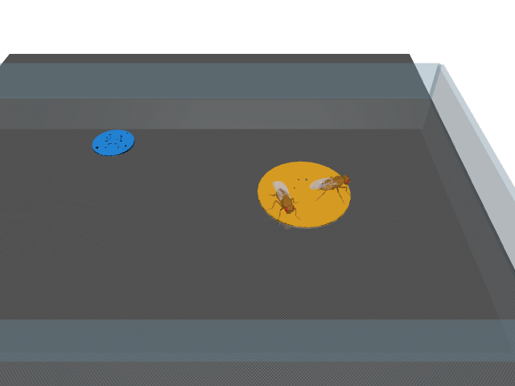

# Embodied digital Drosophila

A research workspace for two adult *Drosophila melanogaster* with sex-specific neural models, bodies, sensory inputs, internal state, and reproductive behavior in a shared 3D environment.

**Current status:** sourced research and an executed two-body MuJoCo/sensory prototype. A whole-brain/whole-CNS controller, sex-specific body geometry, biological feeding, and reproduction have **not** been implemented. Prototype movement uses a documented CPG/reflex controller.

Start with the [research overview](research/README.md), then the [system architecture](research/04-system-architecture.md) and [implementation/validation roadmap](research/05-build-roadmap-and-validation.md). [Candidate insights](research/06-hypotheses-and-open-questions.md) distinguish hypotheses from established findings. [Paper access and downloads](research/09-access-and-downloads.md) records what is available without institutional access.

## Run the existing prototype

The local `.venv` is installed. From this directory:

```sh
.venv/bin/python prototype/arena_smoke.py --seconds 1
.venv/bin/python prototype/stimulus_smoke.py --seconds 1
```

The second command adds a food patch, a water marker, bilateral odor sampling and tarsal food-contact sensing. It saves a rendered arena, sensory traces and metrics in `prototype/output/`. It does not connect those sensory signals to a neural controller or consume food.

See [prototype setup and limitations](prototype/README.md) for clean installation, pinned dependencies, physical units and measured results.



The image shows two copies of female-derived NeuroMechFly anatomy, not a validated male/female pair. Yellow marks food geometry; blue marks water geometry. Odor is sampled numerically and is not visible in the scene.

## Research provenance

Checked on 2026-09-04 (America/Los_Angeles). The supplied 2024/2026 PDFs are retained unchanged; [metadata and hashes](research/provided-papers.json) identify the exact files. Domain-specific JSON source registries preserve access/review depth, data versions, commit IDs and known contradictions. The survey is broad and targeted, not an exhaustive systematic review of every fly system.
