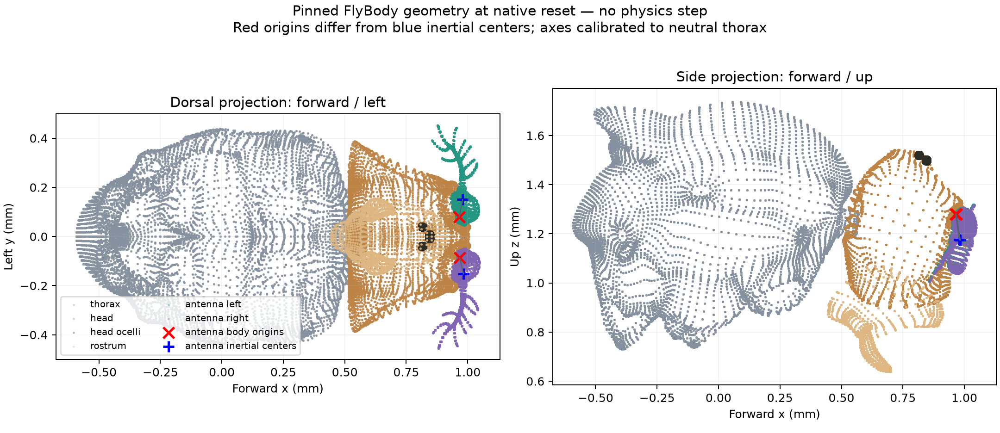

# FlyBody head and antenna airflow geometry

The pinned FlyBody body supports an engineering head-relative airflow observation at its two antenna body origins. The anatomical **signs** are resolved using actual source geometry, and point velocities pass independent kinematic checks. **The runtime remains unchanged and this observation remains disabled.** This audit applies no aerodynamic force, empirical arista response, or neural input.

The [audit script](../scripts/audit_flybody_airflow.py), [plan](../validation/flybody-airflow-plan.json), [results](../validation/flybody-airflow-geometry.json), and [mesh diagnostic](../validation/flybody-airflow-geometry.png) preserve the calculations. All **41 amended checks pass**. The source body is FlyBody commit `d015e9bfe441bd90ae431bac24c55cb74bdbce26`; the worker and existing airflow convention are loaded from exact Git revision `f433f4f`. The frozen worker SHA256 is `e7f698c602aef693207ed04ed209f36047a81c41797674dc090bf6792e0f6c09`. Later edits to the live worker cannot silently change this audit.

## Frame and sampling locations

The compiled native head is body ID **3**, thorax ID **2**, and left/right antennae IDs **8/9**. They are real, distinct bodies in this FlyBody model; the older FlyGym fused-head workaround must not be copied by assumption. All locations below are millimeters at the native zero-time reset:

| Sampling body | Body origin x/y/z | Inertial center x/y/z |
|---|---|---|
| Left antenna | 0.965055, 0.079504, 1.280322 | 0.979643, 0.150510, 1.176735 |
| Right antenna | 0.966994, −0.086096, 1.279834 | 0.982863, −0.152465, 1.174861 |

These body origins coincide with the proximal hinge anchors. They are explicit sampling proxies, not identified olfactory sensilla, arista centers, or distal receptor locations. Inertial centers come from MuJoCo's compiled mass model, independently of the geometric vertex means used below.

The raw head body's local axes are not forward/left/up. At reset, raw head +x points toward the fly's right; raw +y points forward and downward by about 14.1°. The audit defines an operational head basis by aligning it to the neutral thorax's +x forward, +y left, and +z up, then retaining that calibration as the head articulates.

The following independent source landmarks establish the signs of this choice:

- The head origin is anterior to the abdomen origin: abdomen-to-head displacement is approximately `(1.014, 0.005554, −0.0733)` mm, dominated by +x.
- Left-minus-right antenna-origin displacement is approximately `(−0.001939, 0.165600, 0.000488)` mm, dominated by +y.
- The ocelli mesh lies above the head's vertex mean, while the rostrum mesh lies below it. Rostrum-to-ocelli mean displacement is approximately `(0.18919, 0.000025, 0.70548)` mm, dominated by +z.

These checks resolve anterior/left/dorsal signs. They do not measure an exact anatomical pitch axis, a receptor acceptance frame, or a sex-specific head posture. Mesh vertex averages are mesh-dependent landmarks, not mass centers or experimental anatomical measurements.

If `H` maps raw head-body coordinates into world coordinates, the constant calibration matrix `B` below maps operational forward/left/up into raw head-body coordinates. The current head-to-world matrix is `R = H B`:

```text
B = [[0,        -1,  0       ],
     [0.969747,   0, -0.244114],
     [0.244114,   0,  0.969747]]
```

The script computes the full-precision matrix from the neutral compiled thorax and head rotations; it does not hard-code these rounded numbers. Sign checks, orthogonality, and positive determinant must pass before describing the basis as resolved for engineering geometry. It should remain unavailable if those checks fail for another source revision.



## Point velocity and source direction

For each actual antenna origin `p`, the translational Jacobian gives `v_origin = J(p) qvel`. The audit obtains `J` with `mj_jac` using the antenna's body ID and its current world position. The result is in cm/s in the source model and is multiplied by ten before combining with arena wind in mm/s. This includes base translation/rotation and articulated head motion. [MuJoCo 3.2.7 Jacobian API](https://mujoco.readthedocs.io/en/3.2.7/APIreference/APIfunctions.html#mj-jac)

Using the linear part of `mj_objectVelocity(..., mjOBJ_BODY, antenna_id, ..., 0)` directly at the body origin would be wrong: that quantity is evaluated at the body's inertial center. The independent rigid-body correction is

```text
v_origin = v_inertial_center + omega_world × (p_origin − p_inertial_center)
```

This correction agrees with the origin Jacobian to at most **1.67e−16 cm/s** across the audit probes. The center/origin velocity discrepancy reaches **0.8943 mm/s** in the combined-motion probe. Thus the distinction is significant relative to the simulator's slow background wind, even though the two points are only a fraction of a millimeter apart.

Relative airflow uses the antenna point's own motion, then rotates into the current head frame. With row vectors:

```text
relative_head = (air_world_mm_s − v_origin_world_mm_s) @ R
source_azimuth_deg = degrees(atan2(relative_head_y, −relative_head_x))
```

The angle describes where wind comes **from**: anterior 0°, left −90°, right +90°. The air-velocity vector points in the opposite direction. Tests cover −90°, −45°, 0°, +45°, +90°, and 180°. Zero horizontal relative flow returns a null azimuth; vertical flow remains in the 3-D vector. This matches the separately recorded Suver source-angle convention in [the wind calibration notes](wind-calibration.md), without applying its measured deflection curve.

## Passive antenna joints remain present

The [source walking construction](https://github.com/TuragaLab/flybody/blob/d015e9bfe441bd90ae431bac24c55cb74bdbce26/flybody/fruitfly/fruitfly.py) removes antenna actuators and direct antenna joint observations when `use_antennae=False`, but **does not remove the six hinge joints**. Each antenna retains three hinges sharing the body-origin pivot, zero stiffness, and damping 0.0003 in source-native units. The original policy still controls the three head joints. None of these parameters is changed by this audit.

Rotating an antenna about its own pivot therefore produces zero translational velocity at the sampled body origin. Its inertial center and distal surfaces do move. In the antenna-only probe, origin velocities are exactly zero while inertial-center speeds are about 0.6872 mm/s left and 0.4476 mm/s right. This is not a Jacobian failure; it exposes the limitation of sampling at the hinge. A future distal sensor requires a justified local receptor/segment point and the Jacobian at that point. The present geometry does not identify that location or establish the physical fidelity of the source's passive antenna dynamics.

## What was verified

Four zero-time kinematic probes cover rest, root translation, antenna-only rotation, and simultaneous translated/rotated root plus articulated head/antenna motion. They run on detached data copies. Central position finite differences use `mj_integratePos` with `h = 1e−5, 1e−6, 1e−7` seconds followed by `mj_forward`; no physics integration step or policy-controlled body step occurs. Maximum antenna-origin velocity error across all finite differences is **2.97e−10 cm/s**, below the declared `2e−8` tolerance.

For every probe, a second actual model copy receives a common arbitrary spatial rotation, translation, and velocity boost, with the wind transformed consistently. MuJoCo's free-joint angular velocity remains in its local representation; translational velocity is rotated and boosted. The resulting relative head-frame air vectors agree to at most **7.11e−15 mm/s**. This checks the complete model/frame calculation rather than only a matrix identity.

The live worker retains identical native-backed data/model arrays, complete collected state, and cached actor observations. Its native time and tick count remain zero. Source physics/control timesteps remain 0.2/2 ms. The policy is loaded and performs its unchanged reset-time evaluation, but receives no new applied control step. No trained weights, body parameters, gains, action channels, or runtime defaults change.

## Retained failed hash check

The original audit passed 40/41 checks, with only an overbroad data-array hash check failing. The [initial plan](../validation/flybody-airflow-hash-v0-plan.json), [script](../validation/flybody-airflow-hash-v0-script.py), and [failed result](../validation/flybody-airflow-hash-v0-result.json) are retained. The failed receipt records a broad data-hash mismatch while physical state, model arrays, cached observations, and clock matched. A diagnostic tool inspection identified `efc_island` and `island_efcind` as differing fields, but that field-level diff was not retained as a versioned receipt.

Constraint-island discovery is disabled in this source (`enableflags=0`, `nisland=0`). The MuJoCo headers mark the island arrays as produced by `mj_island`. In this configuration, repeated Python getters for unallocated arrays return distinct owning NumPy allocations with `base=None`, rather than views into native data. Their uninitialized contents are not valid state to compare. The audit records array ownership and repeated-address behavior without inspecting those raw values. [MuJoCo 3.2.7 island flag and data fields](https://mujoco.readthedocs.io/en/3.2.7/APIreference/APItypes.html)

The amendment compares only native-backed array views: **119 data arrays and 246 model arrays**. It excludes 25 owning data arrays, including five nonempty unallocated island arrays and twenty empty fields; owning model arrays are also excluded. The receipt does not enumerate those excluded model fields, so their individual allocation sizes cannot be independently established from this receipt alone. This changes the side-effect verifier, not the geometry calculation, model, probes, or numerical tolerances. The amended plan was saved before rerunning, and all 41 checks then pass. It also cautions against interpreting earlier broad counts of exposed MuJoCo arrays as counts of meaningful native state fields.

## Boundary for a future opt-in observation

The geometry is ready for review as an explicit proximal-antenna airflow proxy. A subsequent implementation should expose its exact point locations, point velocities, calibrated head rotation, relative 3-D wind, azimuth validity, and provenance. It should use the origin Jacobian and retain the distinction between source direction and flow velocity. Source failures or missing frames should make the observation unavailable rather than substitute a thorax velocity or a guessed body ID.

This does not justify enabling passive arista deflection or JON firing rates. The existing female Suver dataset is a separate, tethered-preparation, speed/angle-limited reference; no male transfer, wind-speed scaling, mechanical coefficient, or neural transducer was inferred here. No raw wind archive or blocked download was requested.

Reproduce from the repository root with source and walking weights already materialized:

```sh
tmp/flybody-env/bin/python -m scripts.audit_flybody_airflow --run
.venv/bin/python -m scripts.audit_flybody_airflow --plot
```

The script verifies its frozen plan hash and obtains the bounded worker/airflow module from Git `f433f4f` into ignored local data. Preserve result receipts before reproducing. The derived mesh subset and figure retain [source attribution and license](../validation/flybody-airflow-ASSET-NOTICE.md).
