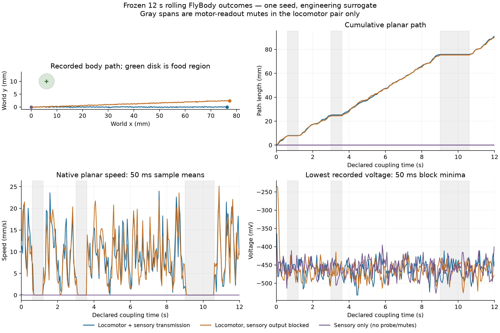

# Rolling full-neural FlyBody outcomes

This is a descriptive analysis of the frozen recorded trials, not a new behavioral success test. No simulation was run for this analysis. One seed and one 12 s attempt per condition do not support population estimates or biological validation.

Plan SHA-256: `3e5ca3ca6c91bbd240ff2530d351fd010dc5001e19078e2270a95022449c2498`. The recorded overall gate result is **True**. Numerical and interface correctness are reviewed separately; these notes preserve the observed outcomes.

## Whole records

| Condition | Returned physical time (s) | Planar path (mm) | Mean native planar speed (mm/s) | Motor command counts | Sampled voltage range (mV) |
| --- | ---: | ---: | ---: | --- | --- |
| `locomotor_feedback` | 12.000 | 91.075 | 7.632 | {"rest": 1753, "walk": 4247} | -532.581 to 21.025 |
| `locomotor_sensory_block` | 12.000 | 90.243 | 7.563 | {"rest": 1700, "walk": 4300} | -526.619 to 20.152 |
| `sensory_only` | 12.000 | 0.015 | 0.001 | {"rest": 6000} | -527.963 to 20.925 |

Path sums planar displacement between successive returned 2 ms body poses. Native speed is the norm of the separately recorded world-frame root-body linear velocity at each physical return. Their averages can differ. The voltage range uses all-neuron extrema sampled at the end of each 2 ms neural batch; it is not a continuous-time extreme. The figure uses 50 ms means for speed and minima of these sampled voltage minima. All unsmoothed window statistics remain in the JSON summary.

## Motion during and after the imposed mutes

| Condition | Mute (s) | Path during mute (mm) | Mean speed (mm/s) | Last 100 ms mean speed (mm/s) | Neural spikes during mute | First later policy command delay (s) |
| --- | --- | ---: | ---: | ---: | ---: | ---: |
| `locomotor_feedback` | 0.6–1.2 | 0.379 | 0.629 | 0.010 | 524,219 | 0.000 |
| `locomotor_feedback` | 3.0–3.6 | 0.234 | 0.405 | 0.001 | 526,174 | 0.000 |
| `locomotor_feedback` | 9.0–10.6 | 0.095 | 0.057 | 0.001 | 1,406,633 | 0.000 |
| `locomotor_sensory_block` | 0.6–1.2 | 0.100 | 0.145 | 0.008 | 526,843 | 0.000 |
| `locomotor_sensory_block` | 3.0–3.6 | 0.231 | 0.386 | 0.003 | 527,433 | 0.000 |
| `locomotor_sensory_block` | 9.0–10.6 | 0.155 | 0.093 | 0.001 | 1,402,890 | 0.000 |

A muted rest/zero motor command is not a statement that all physical motion stops immediately. The source body can continue to move or settle under its unchanged physics and engineering adhesion/posture hold. The delay column locates the first later native command with the learned policy enabled; it does not use a fitted speed threshold or claim biological recovery. Neural execution continues through the mute. Windows with no returned states are reported as unavailable.

## Food and resources

| Condition | Food-contact samples | Positive sweet-input intervals | Food ingested | Energy change | Hydration change | Feeding time (s) |
| --- | ---: | ---: | ---: | ---: | ---: | ---: |
| `locomotor_feedback` | 0 | 0 | 0.000000 | -0.013326 | -0.007263 | 0.000 |
| `locomotor_sensory_block` | 0 | 0 | 0.000000 | -0.013261 | -0.007230 | 0.000 |
| `sensory_only` | 0 | 0 | 0.000000 | -0.006001 | -0.003601 | 0.000 |

Resources use normalized, uncalibrated engineering units. Body-center distance from food is retained as geometry only; actual tarsal contact is the relevant recorded taste gate. Positive encoder rates refer to the observation before its neural interval, while the contact count above samples physical returns, so these counts can differ at a boundary. The abstract intake mechanism requires tarsal contact, sufficiently low physical speed and a feed command; no proboscis or ingestion apparatus is simulated.

## Final-checkpoint voltage attribution

These are endpoint measurements from the saved brain checkpoints before cleanup. They are distinct from the sampled trajectory extrema above. Fractions use all neurons in the stated group as denominator and strict `< −100` / `< −200` mV comparisons; nonfinite counts and linear-interpolated quantiles are explicit in the JSON.

| Condition | Endpoint (s) | 0.1% quantile (mV) | 1% quantile (mV) | Median (mV) | Below −100 mV | Below −200 mV |
| --- | ---: | ---: | ---: | ---: | ---: | ---: |
| `locomotor_feedback` | 12.000 | -126.343 | -77.778 | -52.072 | 0.259% | 0.021% |
| `locomotor_sensory_block` | 12.000 | -129.568 | -77.211 | -52.076 | 0.271% | 0.022% |
| `sensory_only` | 12.000 | -127.999 | -76.900 | -52.073 | 0.269% | 0.017% |

| Condition | Cell ID | Recorded type | Consensus output NT | Endpoint voltage (mV) | Actual input role |
| --- | ---: | --- | --- | ---: | --- |
| `locomotor_feedback` | 67052 | lLN2T_b | acetylcholine | -445.294 | Other neuron |
| `locomotor_feedback` | 13314 | M_vPNml50 | gaba | -376.278 | Other neuron |
| `locomotor_feedback` | 11123 | ALBN1 | unclear | -352.652 | Other neuron |
| `locomotor_sensory_block` | 67052 | lLN2T_b | acetylcholine | -453.451 | Other neuron |
| `locomotor_sensory_block` | 13314 | M_vPNml50 | gaba | -429.309 | Other neuron |
| `locomotor_sensory_block` | 11123 | ALBN1 | unclear | -347.816 | Other neuron |
| `sensory_only` | 67052 | lLN2T_b | acetylcholine | -336.918 | Other neuron |
| `sensory_only` | 13314 | M_vPNml50 | gaba | -333.662 | Other neuron |
| `sensory_only` | 519624 | DNa03 | acetylcholine | -308.299 | Other neuron |

The JSON retains ten most negative cells and five most negative actual source cells per condition, plus separate distributions for all actual listed input cells, other neurons, each sensory group and the probe. Input membership comes from the actual ordered neural-drive records, including zero-rate members; the sensory-only trial's nominal probe identities are not classified as probe inputs. Hash-verified graph ID arrays and annotation row order provide the join. Consensus neurotransmitter labels describe each neuron's predicted output transmitter; they do not identify the incoming currents responsible for its voltage. This attribution identifies candidate cells for later calibration work without claiming a physiological mechanism or fitting a parameter.

## Interpretation and limits

The locomotor pair receives direct 40 Hz descending-neuron excitation. Blocking sensory outgoing transmission retains source-cell dynamics and the direct-input mechanism; recurrence and physical feedback can change actual source spikes and later inputs. Downstream differences do not establish natural sensorimotor behavior. The retained paired-mechanism result identifies initial downstream divergence under matched ordered input history. Later inputs depend on each moving body's trajectory and are not assumed equal.

The sensory-only trial had no descending-neuron probe or imposed mutes. Its recorded motor command counts were `{"rest": 6000}` over 12.000 returned seconds, with 0.015 mm of physical path. These command labels and physical displacement are separate observations; neither is automatically evidence of natural walking or foraging.

The learned walking policy, female-derived body surrogate, idealized body feedback, generated command preview, neutral posture hold and unbounded source floor remain engineering assumptions. The food position and radius were fixed; the arena and target were not adjusted to cause a result. Final Follow frames keep the fly inspectable outside the fixed overview. The large negative sampled Shiu voltages, when present, remain a physiological mismatch even if numerically finite. Wind neural input, compound-eye neural input, grooming and flight remain disabled. Twelve seconds cannot establish indefinite stability.

Failures and pending state are copied into the JSON outcome summary rather than dropped. A completed neural batch can precede a failed physical return; separate completed-neural/returned-physical counts and the retained checkpoint preserve that distinction.

## Evidence

- [Frozen plan](../validation/flybody-rolling-loop/plan.json), [recorded results](../validation/flybody-rolling-loop/results.json), and [descriptive outcome JSON](../validation/flybody-rolling-loop/outcome-summary.json).
- [Analysis implementation](../scripts/summarize_flybody_rolling_loop.py) and [experiment methods](flybody-rolling-loop.md).
- Each closed gzip journal is checked against its recorded compressed/decompressed hashes and record count. Raw paths, spike-artifact receipts, stage-aware retained states and final image receipts are in the outcome JSON.
- This post-run analysis reports existing records; it does not add behavioral pass thresholds or rerun any model.
