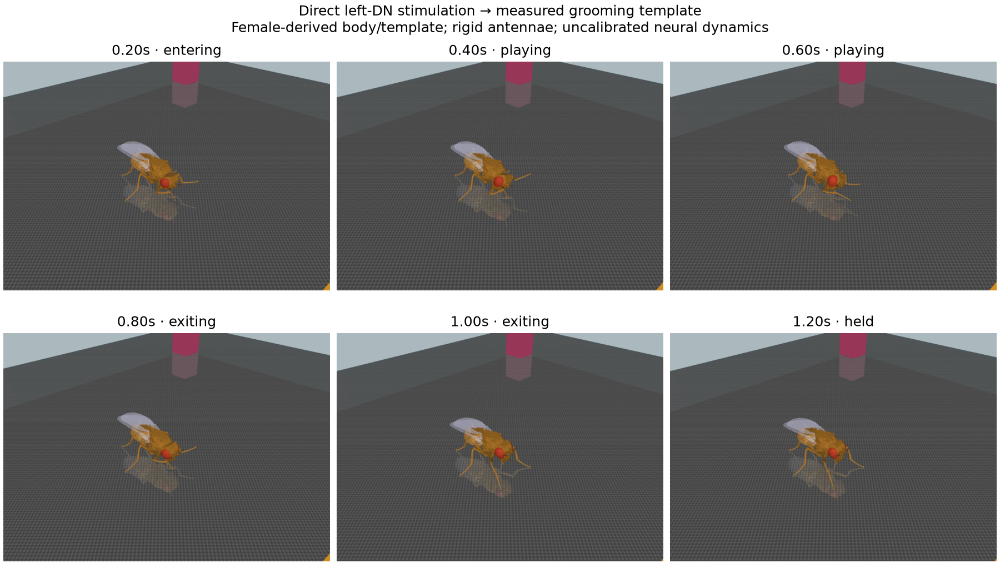

# Full-graph grooming calibration

The actual 166,700-neuron MaleCNS model can gate a measured grooming motor template through its left DNg62/DNge078 readouts. The physical body executes one traversal and contacts antennal structures. This establishes a causal neural-to-motor interface under **direct descending-neuron stimulation**, not spontaneous grooming or a calibrated sensory pathway.

Run the controlled assay with:

```sh
.venv/bin/python scripts/validate_grooming_loop.py
.venv/bin/python -m fruitfly.viewer --config configs/male-grooming-probe.json --port 8768
```

The [recorded results](../validation/grooming-loop/results.json) retain all four configurations, exact probe IDs, full graph hash, 10 ms state samples, neural counts, resource balances and final states. Each condition ran for 1.4 simulated seconds with seed 11, 0.1 ms neural/physics integration and 5 ms coupling. Odor and taste drive were disabled. The input order contains the 105 bilateral runtime ORNs at zero event rate, followed by left DNg62 ID 13624 and DNge078 ID 14537. The separate [gate diagnostic](grooming-gate-diagnostic.md) checks the same input ordering in two seeds.

| Condition | Completed traversals | Cancelled | Time with physical antennal contact |
|---|---:|---:|---:|
| No external input | 0 | 0 | 0 s |
| Direct left-DN 40 Hz input events | 1 | 0 | 0.4080 s |
| Same input, motor readout muted throughout | 0 | 0 | 0 s |
| Same input, motor readout muted at 0.4 s | 0 | 1 | 0.2148 s |

All six protocol checks passed. The muted brain remained active; muting changes the motor readout, not the connectome or neural input. Tonic stimulation completed one 0.5 s measured traversal, blended back to standing, and entered the disarmed `held` state without looping. Withdrawal cancelled an in-progress traversal. Physical and neural clocks agreed, numerical states remained finite, and normalized resource residuals stayed below 1e-8.

During the direct-DN measured interval, the 16 mapped joint channels tracked targets with RMS 2.151° and maximum absolute error 10.707° over 5,000 physics samples. Contact time includes entry and exit; different geometry-pair durations overlap and cannot be summed. Both antennal sides receive contact, so the left source label does not establish selective left-antenna grooming in this rig.



The decoder uses a 50 ms rate filter and an engineering threshold of 10 Hz on the mean left readout. Its selected behavior has priority over other motor modes when enabled. The body uses a measured female trajectory with position actuators, rigid antennae and engineered supporting-leg adhesion. [The source, axis conversion and physical limitations](grooming-replay.md) are explicit. These choices are not inferred muscle physiology.

The transferred current-based neural model still produces implausible hyperpolarization and strong recurrent amplification. In the two-seed gate diagnostic, 40 Hz external events produced roughly 148–202 Hz output firing in the stimulated cells, with network voltage minima below −470 mV. Passing this motor-interface check does not validate those dynamics. A source-backed peripheral mechanosensory assay and a physiological neural calibration remain separate requirements.

The viewer displays actual body mode separately from requested neural mode. In `held`, the fly is standing even if the neural request remains high. Reset rearms the one-shot assay; motor mute during playback cancels it smoothly.
