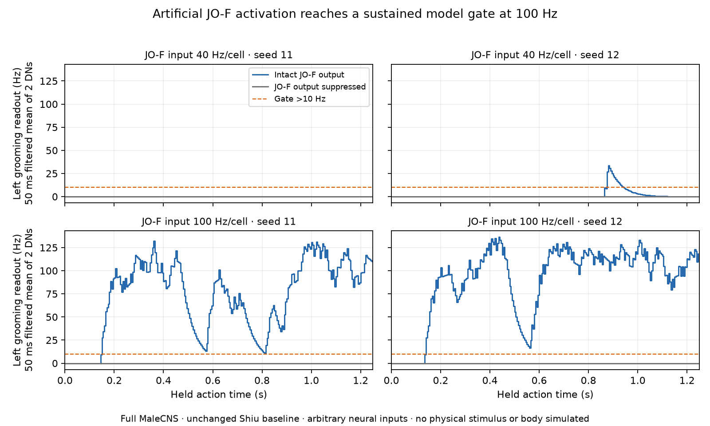

# JO-F afferents to the retained male grooming readout

Audited 2026-09-05. **An indirect causal route is demonstrable in the current model without driving descending neurons.** Imposing 100 Hz Poisson inputs on the 42 annotated left JO-F afferents opens the existing left grooming gate for 1.10–1.11 s in both tested seeds. Suppressing only those afferents' outgoing connections preserves their exact spike trains and eliminates every downstream spike. The result is an artificial activation diagnostic. It does not validate a mechanical stimulus, natural grooming, side specificity, or physical movement. The unchanged Shiu model also produces implausibly negative voltages in these trials.

The [executable assay](../scripts/check_grooming_sensory_route.py) and [complete results](../validation/grooming-sensory-route.json) preserve the exact cell IDs, input ordering, spikes, sampled voltages, parameters, source hashes, graph manifest, anatomical contacts and paired controls. No runtime configuration, neural weights or body controller was changed by this diagnostic.

## Primary evidence and identity limits

Hampel et al. identified sensory aJO, brain aBN1/aBN2 and descending aDN1/aDN2 elements of a functionally connected antennal-grooming circuit. Artificial activation at multiple levels elicited grooming with different durations. Silencing the identified aDNs did not abolish sensory-evoked grooming, so these two readouts are not an exhaustive or uniquely necessary motor pathway. A combined two-cell rate threshold and one measured body template are our engineering choices. The study's staining used males aged 5–8 days except specified stochastic-labeling preparations; its amputation experiments used males. Those experimental labels do not make every modern connectome correspondence exact. [Hampel et al., 2015](https://doi.org/10.7554/eLife.08758), [read full text](https://www.ebi.ac.uk/europepmc/webservices/rest/PMC4599031/fullTextXML).

Hampel et al. explicitly renamed aJO as **JO-F**, defined by ventral zone-F projections. Their JO-F drivers also weakly label JO-EVP neurons. Five older JO-F morphological names do not supply a verified one-to-one mapping onto the present male FD1/FD2/FV labels. Thus our F-only anatomical union is not the exact driver population. Most experimental animals were male, 5–8 days; EM reconstructions used female FAFB. In the immobilized calcium preparation, JO-F did not respond to the tested push/pull or 40/200/400/800 Hz vibrations despite a KCl response. Differences from earlier moving-ball displacement experiments remain unresolved. This evidence supports artificial activation, but provides no justified conversion from dust, touch force or antenna angle into JO-F firing rate. [Hampel et al., 2020](https://elifesciences.org/articles/59976).

Shiu et al. modelled 147 female JONs spanning C/E/F/mz and recovered several known grooming elements. Their model and calcium measurements found strong aBN1 activation from JO-CE but weak activation from JO-F despite direct contacts. Removing three candidate inhibitory cells rescued the simulated JO-F response; that proposed mechanism was not experimentally verified. This is a reason to retain inhibition and accept a failed response, not to copy an inhibition-removal intervention into default physiology. The present assay neither reproduces their 30-trial protocol nor transfers female body IDs to the male graph. [Shiu et al., 2024, Fig. 5 and Extended Data Fig. 4](https://doi.org/10.1038/s41586-024-07763-9), [read full text](https://www.ebi.ac.uk/europepmc/webservices/rest/PMC11446845/fullTextXML).

## Exact MaleCNS selection

The input is `graph.select(["JO-FD1", "JO-FD2", "JO-FV"], side="L", nerve="AN")`. Sensory side comes from `rootSide`; nerve must be `AN`. The selector returns graph-index order, equivalent to ascending body ID in this import. All selected cells have acetylcholine consensus. The anatomical union deliberately retains two FD2 cells annotated `wind_gravity`; omitting them merely because another subclass says `grooming` would silently redefine the population.

| Male type | Left input count | Male annotation subclass | Right inventory, not stimulated |
|---|---:|---|---:|
| JO-FD1 | 4 | grooming | 0 |
| JO-FD2 | 2 | wind_gravity | 2 |
| JO-FV | 36 | grooming | 34: 24 grooming, 10 wind_gravity |

The 42 left body IDs, in input order, are:

```text
38160, 60335, 92767, 127912, 146314, 154152, 162166, 170014,
179637, 188780, 200259, 224261, 227655, 231936, 237833, 240644,
246484, 247028, 249842, 279391, 287167, 303968, 308970, 324453,
331081, 336332, 343346, 360461, 403040, 407092, 426803, 482280,
166331476, 197061019, 209837831, 238817349, 639242246, 793720445,
812830130, 906350022, 975904445, 987117568
```

The exact output correspondence comes from the male annotation's `synonyms`, with `somaSide`/`instance` resolving side where `rootSide` is missing:

| Published alias | Male type | Left ID, used by actual motor gate | Right ID, recorded only |
|---|---|---:|---:|
| Hampel 2015 aDN1 | DNg62 | 13624 | 15148 |
| Hampel 2015 aDN2 | DNge078 | 14537 | 36541 |

These rows have `status="Traced"` and `statusLabel="Prelim Roughly traced"`; the report preserves both fields. No exact aBN1/aBN2 alias was found in the inspected type, synonym, instance or cross-dataset type fields. Consequently no intermediate is assigned that historical name here. The unrelated AOTU103m `aDN` alias is excluded. All these are correspondences in the pinned [MaleCNS primary data](https://www.janelia.org/project-team/flyem/male-cns-connectome), not identities inferred from the assay's firing rates.

## Retained anatomical routes

The 42-cell union has 3,022 outgoing neuron pairs, containing 11,041 contacts, to 579 distinct retained cells. There are **no direct contacts to either left readout**. There are two-edge anatomical walks through 59 intermediate cells to left DNg62 and 36 to left DNge078. For comparison, each right readout receives one direct contact from the left union; their two-edge walks involve 85/62 intermediates.

Examples, ranked by the product of aggregated afferent contacts and intermediate→DN contacts, illustrate possible routes. This product is a descriptive anatomical score, not a conductance or functional contribution:

| Intermediate, exact ID | Consensus NT | Left JO-F→intermediate contacts | Intermediate→left output contacts |
|---|---|---:|---:|
| DNg84, 12386 | ACh | 464 | 6 to DNg62 |
| SAD093, 521358 | ACh | 72 | 38 to DNg62 |
| GNG300, 10263 | GABA | 95 | 5 to DNg62 |
| GNG611, 29976 | ACh | 65 | 10 to DNge078 |
| Unnamed cell, 29485 | ACh | 4 | 53 to DNge078 |
| GNG671, 10490 | unclear | 26 | 7 to DNg62; 6 to DNge078 |

The JSON includes every detected two-edge intermediate, including inhibitory, unknown-sign and recurrent/descending cases. This inventory cannot identify which walk caused the response. Many routes may operate simultaneously, and one-contact edges have not been filtered. Unknown-sign GNG671 contacts remain in the graph but carry zero model weight under the existing importer rule. No transmitter assignment was changed.

## Fixed protocol and results

The graph contains all **166,700 retained male neurons and 25,582,938 neuron pairs**. Ten conditions were specified before the first run: baseline 0 Hz plus 40/100 Hz per JO-F cell, intact versus source-output suppression for nonzero rates, seeds 11 and 12. Each trial starts at rest and runs continuously for 1.25 s with 0.1 ms neural steps and 5 ms decoder updates. There was no rate search after observing the outcomes.

The input list is the actual `SensoryEncoder`'s **105 zero-rate ORNs, 51 left then 54 right, followed by the 42 JO-F cells**. One additional annotated DM1/DM4 cell lacks a usable side and is absent from the runtime list. Zero-rate indices are preserved because they consume RNG draws and disable refractory time under the Shiu direct-input semantics. No DN is listed as an input, even at zero rate. Taste, proprioception and physical wind inputs are absent.

The large direct voltage events and disabled input-cell refractory period are the existing Shiu activation boundary; Poisson parameter Hz is not automatically the cell's measured output Hz. All DNs retain ordinary model refractory dynamics. The actual `MotorDecoder`, unchanged, exponentially filters the mean spike rate of the two left DNs with a 50 ms time constant and requests grooming at strictly greater than 10 Hz. Gates below refer to held-action time bins, matching the runner's scheduling convention.

| JO-F input Hz | Seed | Source spikes | Left DNg62 / DNge078 spikes | Right DNg62 / DNge078 spikes | Continuous grooming gate |
|---:|---:|---:|---:|---:|---|
| 0 | 11, 12 | 0 | 0 / 0 | 0 / 0 | none |
| 40 | 11 | 2,130 | 0 / 0 | 0 / 0 | none |
| 40 | 12 | 2,117 | 3 / 1 | 2 / 1 | 875–945 ms: 70 ms |
| 100 | 11 | 5,243 | 99 / 90 | 89 / 77 | 150–1250 ms: 1,100 ms |
| 100 | 12 | 5,246 | 127 / 107 | 102 / 95 | 140–1250 ms: 1,110 ms |

Each of the four nonzero trials has a matched outgoing-suppression control. **Every individual JO-F spike time is identical in the paired controls, and all non-source spike counts are zero after suppression.** All four output neurons remain silent; the grooming gate never opens. This rules out a bypassed DN drive or source-independent spontaneous activity for these initial states. It does not establish that a particular interneuron or short path is necessary.

After discarding the first 100 ms, gate fractions at 100 Hz are 95.65%/96.52%; the longest below-threshold gaps are 50/40 ms. A 750 ms continuous interval, needed to schedule the current 250 ms entry plus 500 ms motor template, is available in both 100 Hz trials. No body was simulated here, so contact, balance and successful completion require a separate body assay.



## What the result supports, and what remains unresolved

This establishes an afferent→full-network→identified-DN→software-gate causal chain under imposed input. It is stronger than the earlier direct-DN positive control, because both left outputs have no direct JO-F contacts and retain their intrinsic model refractory periods. It is not evidence of an innate, complete or accurately calibrated grooming program.

Both right readouts also fire strongly. There is no evidence here that this left afferent stimulus selectively commands a left-only trajectory. The motor interface currently uses a left template because that is the measured template available, not because the network assay proved unilateral coordination.

At 100 Hz, the whole network emits 145,843/153,913 spikes. The minimum voltage sampled every 5 ms is −483.97/−477.73 mV; even at 40 Hz it reaches −447.56/−452.43 mV. These violate plausible membrane ranges and expose limitations of the unchanged current-based LIF/sign approximation. The 5 ms extrema are samples, not guaranteed extrema across every 0.1 ms step. A strong gate in this regime cannot validate physiology or rescue the separate conductance model's calibration gaps.

No dust deposition model, antennal contact receptor transfer function, adaptation, body-dependent grooming feedback or cessation mechanism was tested. No inference about male/female equivalence follows from the correspondence between a male graph and mixed-source experimental anatomy. The defensible integration is a separately labelled **imposed JO-F sensory activation calibration**, with the source-output control retained. Natural sensory control requires additional measurements and uncertainty-aware transduction rather than reusing 100 Hz as a physical constant.

Reproduce the complete frozen assay and plot in the prepared workspace. It requires the acquired graph under `data/processed/malecns_v1` and the two downloaded primary XML files at `tmp/grooming-audit/hampel2015.xml` and `tmp/grooming-audit/shiu2024.xml`; these ignored source documents are available from the full-text links above and their observed checksums are in the JSON.

```sh
.venv/bin/python scripts/check_grooming_sensory_route.py
```

The script verifies all graph files, hashes the engine/decoder/importer/assay sources and downloaded primary XML, asserts no DN input, compares every paired source spike train, verifies zero downstream spikes in suppressed controls and checks that source files remained unchanged during execution. Two seeds are diagnostic repeats, not a population estimate or statistical validation.
