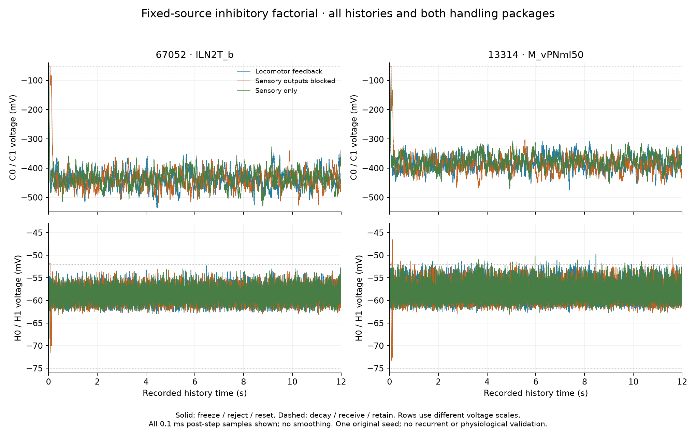
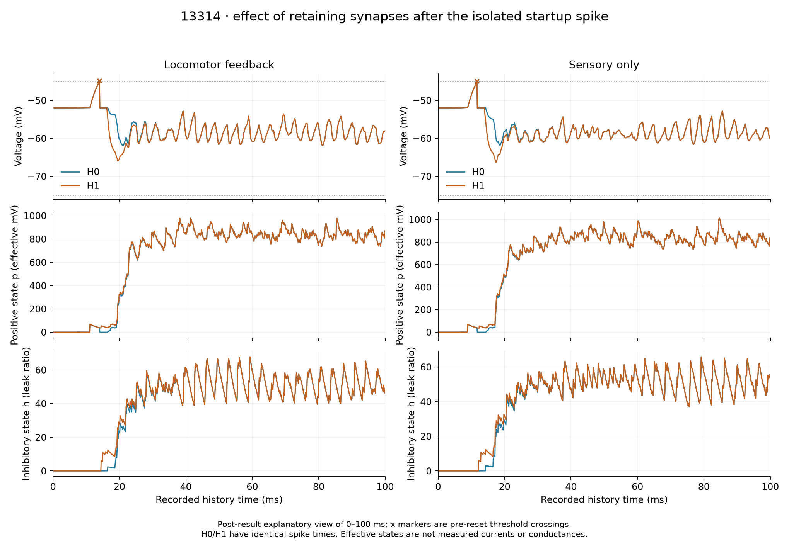

# Inhibitory factorial: fixed-source two-cell result

**The inhibition-only driving force corrects the extreme negative-voltage failure in this conditional replay, but neither handling package changes either target's spike train. H1 is not selected or promoted.** All 12 arm/history trials pass the frozen numerical and integrity checks. This experiment replaces the cancelled Eon body benchmark as the current scientific focus; no body, decoder or recurrent runtime was changed.

The [frozen plan](../validation/inhibitory-factorial-plan.json), SHA-256 `add6680e275f4540a3f21ff2d9422313a918fc63ca29bc5dbc59b4501cb1e9fc`, was prepared before execution. The [driver](../scripts/inhibitory_factorial_replay.py) is pinned to `05342f151a45a18235824c931633f627a6d9211b07b9fd37ae2bc0c4733ebbcb`; its [independent source review](inhibitory-factorial-driver-review.md) preceded the freeze. [Results and artifact hashes](../validation/inhibitory-factorial/results.json) retain all 12 traces and 3 complete event inventories, about 130 MB of compressed artifacts. The separate [input audit](inhibitory-factorial-input-audit.md) passed 258 checks and the [interval solver](inhibitory-factorial-solver.md) passed 1,282 synthetic checks.

## What changed and what was held fixed

| Arm | Negative-input mechanism | Synapse handling at firing/refractoriness |
|---|---|---|
| C0 | Original signed current-like state | Freeze, reject unavailable deliveries, reset |
| C1 | Same signed-current equation | Always decay, receive unblocked arrivals, retain |
| H0 | Inhibitory driving force; excitation remains current-like | Freeze, reject unavailable deliveries, reset |
| H1 | Same inhibition-only equation | Always decay, receive unblocked arrivals, retain |

All arms use the same three retained 12 s source histories and targets **67052 (lLN2T_b)** and **13314 (M_vPNml50)**. They retain exact graph float32 weights, source order, 18-tick delay, 22-tick refractory rule, 0.1 ms clock, strict −45 mV threshold, −52 mV rest/reset, and 20/5 ms membrane/synaptic time constants. H uses the predeclared −75 mV inhibitory reversal and negative jump `−w/23`, normalized to the original effect at rest. These are engineering priors, not measured per-contact conductances or target-specific reversal potentials.

Targets receive no direct stimulation or current and make no RNG draws. Their threshold and acceptance decisions are recomputed in each arm. Presynaptic spikes stay the original recordings even when the target equation changes. The three histories derive from **one original seed**, not three independent replicates. Source masks retain their documented provenance limitation: full membership was established from the original design, aggregate time-resolved journals and final complete mask, not an archived complete mask at every interval.

The second factor bundles three changes. It cannot identify decay, acceptance and reset effects separately. There is no global 0 mV upper bound in H because excitation remains current-like; the checked lower bound and event-free interval upper bound are different statements.

## Observed outcomes

Minimum post-step voltage over the full retained history, in mV:

| History | Target | C0 | C1 | H0 | H1 |
|---|---:|---:|---:|---:|---:|
| Locomotor feedback | 67052 | −536.739 | −536.739 | −68.474 | −68.474 |
| Locomotor feedback | 13314 | −472.706 | −472.706 | −62.708 | −65.960 |
| Sensory outputs blocked | 67052 | −526.929 | −526.929 | −71.521 | −71.521 |
| Sensory outputs blocked | 13314 | −466.860 | −466.860 | −73.273 | −73.273 |
| Sensory only | 67052 | −529.722 | −529.722 | −68.475 | −68.475 |
| Sensory only | 13314 | −471.550 | −471.550 | −63.078 | −66.325 |

Cell 67052 never spikes. Cell 13314 spikes once at **14.0 ms** in the feedback history and once at **11.7 ms** in sensory-only, with no spike in the sensory-blocked history. These exact tick stamps and counts are unchanged in all four arms. Neither cell emits a spike after 500 ms in any arm/history. Numerically bounded H voltages therefore do not restore ongoing target recruitment.



H0/H1 have mean voltages near −58 to −59 mV across these histories; the current arms remain near −378 to −438 mV. This large voltage difference follows the changed equation and is not evidence that the new voltage is a physiological fit. C1 alone leaves the extreme minima intact. For the silent cell and the nonspiking blocked history, package 0/1 traces coincide because there is no target reset/refractory episode to expose the difference.

For cell 13314, package 1 accepts **8 extra edge deliveries** in feedback and **6 in sensory-only**, retaining synaptic state through its isolated spike. H1 then has an approximately **3.25 mV deeper minimum** than H0 during startup. The effect on the full-history mean is small: H1−H0 is −0.003146 and −0.002973 mV respectively, while C1−C0 is −0.085525 and −0.080276 mV. Endpoints coincide within each equation family. This is an observed consequence of the handling package in this model, not evidence that stronger or weaker inhibition is biologically preferable.

The predeclared equation contrasts and interaction are retained for every target/history and metric. For feedback cell 13314's minimum, H0−C0 is **+409.998 mV**, H1−C1 **+406.747 mV**, and `(H1−C1)−(H0−C0)` **−3.251 mV**. Its full-history mean interaction is **+0.082379 mV**. All spike-count contrasts and interactions are zero. Do not substitute the confounded H1−C0 comparison for these two-factor results.



The second figure is explicitly a post-result explanatory view of 0–100 ms. It does not introduce a new success window or fitted metric. Both figures plot native samples without smoothing; their [script and presentation receipt](../validation/inhibitory-factorial-figures/receipt.json) are separate from the frozen experiment.

## Numerical and event evidence

All three C0 histories passed **before any altered recorded arm ran**. They match every original voltage/signed-state sample, emitted spike, accepted jump, ordered accepted tick/edge pair, final state/last-spike/mask and per-edge disposition bit for bit. The retained original replay supplies the independently established absence of direct target drive. No full spike archive was regenerated or decompressed for this factorial.

The experiment reports **137 checks**, plus **40 separate synthetic driver controls**. The latter cover no-input rest, analytical single impulses, excitation-only C/H equivalence, firing/refractory/release delivery, state retention/reset, blocked/zero-weight/pending arrivals, and a deliberately invalid synthetic input to verify failure-prefix retention. That expected invalid-input archive is clearly separated from the finite recorded trials. No recorded trial failed.

The [independent saved-data review](inhibitory-factorial-independent-review.md) passes **565 checks** over all **2,880,000 target intervals** and **14,685,016 expanded-event dispositions**. Without importing or rerunning the producer, it reconstructs all current-voltage transitions and all arms' synaptic, reset and event bookkeeping bit for bit. A separate direct time-domain integrating-factor quadrature agrees on all 1,488 retained H reference intervals within 1.42 × 10⁻¹⁴ mV. Its first attempt stopped on a reviewer JSON-key mismatch after 73 checks; that script and receipt are retained separately. No model data were changed and no data check failed in that attempt.

Every available H interval was compared against a 64-point quadrature update from the same preceding state. A frozen selection rule also chose **1,488 intervals** across H arms, histories and targets for independent adaptive quadrature, a second time-domain ODE solver and two internal subdivisions, preserving the original macro threshold clock.

| Numerical observation | Maximum |
|---|---:|
| 32-versus-64-point local difference | 1.42 × 10⁻¹⁴ mV |
| Production versus adaptive quadrature | 7.11 × 10⁻¹⁵ mV |
| ODE versus adaptive quadrature | 2.35 × 10⁻¹³ mV |
| Internal subdivision difference | 2.14 × 10⁻¹⁴ mV |
| Adaptive quadrature error estimate | 5.34 × 10⁻¹⁴ mV |
| Post-step inhibitory leak ratio h | 73.3964 |
| Preceding-state stiffness `(1+h)Δ/τm` | 0.371982 |
| Attenuation inversion iterations | 3 |

All recorded H pre-threshold and post-reset states respect the −75 mV bound, without clamping. No quadrature tail was truncated in these recorded intervals. Accuracy tolerances were fixed at 10⁻⁸ mV for production/reference and subdivision comparisons, 2 × 10⁻⁸ mV for ODE/reference, and 10⁻¹⁰ mV for bounds. Saved pre-threshold values prevent reset from concealing an overshoot or nonfinite intermediate. These checks establish numerical accuracy for this scope, not receptor kinetics.

## Decision and next evidence

**No candidate is promoted.** The lower bound and numerical accuracy pass; physiological amplitude/timing, independent seed robustness and full recurrent-network improvement remain untested or unresolved here. The retained startup stimulus contrast survives, but this two-cell fixed-source replay cannot establish meaningful whole-network odor discrimination or persistent-activity control. Three histories are not three seeds.

The result supports advancing an independently frozen **recurrent comparison of the factors**, without preferring H1 over H0 from these traces. Actual recurrent source spikes must then be generated under each equation and handling package. The [promotion gates](inhibitory-promotion-gates.md) retain physiological observations separately from engineering activity limits. BANC [type and circuit metadata](../research/17-banc-comparative-circuit-insights.md) can constrain anatomical correspondence and transmitter provenance; its unsigned influence scores cannot fill the missing current amplitudes or timing.

The parallel [Figure 6 extraction](ln-inhibitory-transfer-phase2.md) now supplies a separate population timing constraint: late-minus-early outward current is enclosed by +1.489 to +2.292 pA while source firing changes by −15.657 to −8.608 spikes/s. These are graphical ranges from different cohorts. They do not calibrate this replay's effective states, and no model-to-physiology match has yet been evaluated.

Reproduce the original commands only in a checkout with the output paths absent; the overwrite guards preserve existing evidence:

```sh
.venv/bin/python scripts/inhibitory_factorial_replay.py prepare
.venv/bin/python scripts/inhibitory_factorial_replay.py run
.venv/bin/python scripts/plot_inhibitory_factorial.py
```

Production defaults, the live viewer, original neural engine, decoder, body and graph weights were unchanged. The broad single-male simulation goal remains incomplete.
