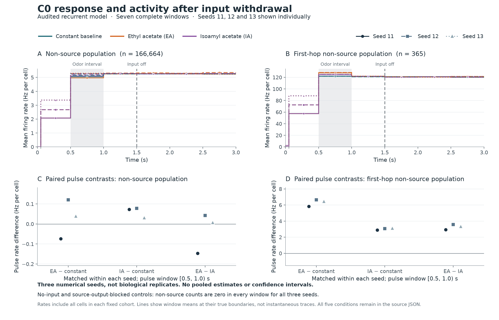

# Recurrent C0 controls: circuit contrasts and withdrawal

All fifteen original-model controls completed three seconds and reproduced their saved original 1.5-second prefixes exactly. The [independent C0 audit](inhibitory-recurrent-panel-c0-audit-summary.md) covers **21,546,618 ordered spikes**, with 571,017 component checks and 297 aggregate checks passing. Its [fixed summary](../validation/inhibitory-recurrent-panel-c0-audit-summary.json) retains every cohort, complete window and paired operand. These are the C0 control results; the altered-arm panel is still running.

The [vector figure](../validation/inhibitory-recurrent-panel-c0-figure.svg) and [rendering manifest](../validation/inhibitory-recurrent-panel-c0-figure.json) preserve the fixed summary input and output hashes. Time-course lines show full-window means at the true boundaries, not instantaneous rates.

## Odor contrast survives locally

The 365 first-hop nonsource cells retain a positive matched odor response and the EA > IA ordering in all three seeds. Mean rates below average over every cell in that fixed cohort, including silent cells.

| Seed | EA minus constant input, pulse | IA minus constant input, pulse | EA minus IA, pulse |
| --- | ---: | ---: | ---: |
| 11 | +5.825 Hz/cell | +2.888 Hz/cell | +2.937 Hz/cell |
| 12 | +6.647 Hz/cell | +3.063 Hz/cell | +3.584 Hz/cell |
| 13 | +6.471 Hz/cell | +3.123 Hz/cell | +3.348 Hz/cell |

These matched contrasts are much smaller than the odor trial's pulse-minus-own-baseline increase. For example, seed 11 rises from 57.3151 to 127.6548 Hz/cell in the first-hop cohort, but the matched constant-input control is already at 121.8301 Hz/cell during that pulse window. Startup recruitment accounts for much of that apparent within-trial increase. The constant-input comparison must remain an explicit control when assessing an inhibitory candidate.

The population-wide nonsource EA-minus-constant pulse effect is −0.073801 / +0.120638 / +0.039517 Hz/cell across seeds 11/12/13. EA-minus-IA also changes sign in that large cohort. Averaging the whole graph therefore obscures a consistent local contrast; neither the global mean nor a selected attractive trace should stand alone as a stimulus-discrimination criterion. Three numerical seeds are not biological replicates or a significance test.

## Activity persists after input withdrawal

Across the nine unblocked trials, nonsource population rates remain between **5.2353 and 5.3529 Hz/cell** in the three half-second off windows. No-input and source-output-blocked controls produce exactly zero nonsource spikes throughout, for every seed. The source-output mask therefore separates sensory-source activity from the downstream recurrent response in this fixed model. These observations cover 1.5 seconds after withdrawal and do not prove an asymptotic attractor, memory or indefinite stability.

Off-bin directions vary: seed-11 IA increases modestly through all three bins, whereas other trajectories fall or fluctuate. The data support continued activity through the observed interval, without assigning an arbitrary biological growth threshold. Persistence is already present in C0 and must be measured when comparing H0/H1; it is not evidence that an inhibitory variant created it.

All off-period candidate/applied external events are zero. Seed 12 nevertheless has one sensory-source spike at the exact cutoff tick in each stimulated condition, including output-blocked EA. The [aggregate evidence](../validation/inhibitory-recurrent-panel-c0-audit-summary.json) reconstructs body 167295's last pre-off direct increment at tick 14,999 and next-tick threshold detection at 15,000. That boundary event is retained separately from ongoing stimulation and from delayed synaptic delivery. Seeds 11/13 have no source spikes in any off bin.

## Readout consequences and limits

Both fixed replay targets (67052 and 13314), the forward pair, left-turn pair and escape pair emit zero spikes over all fifteen trials. Each unblocked trial has a single right-turn readout spike during the baseline window; later right-turn windows are silent. The feeding group remains active in the unblocked trials, including after withdrawal. No body, motor motion, ingestion or behavioral success was executed by this panel.

The [promotion gates](inhibitory-promotion-gates.md) remain open: physiological amplitude/timing, useful circuit contrasts, seed robustness and controlled recurrent dynamics must be assessed together. C0 is an exact reference model with known voltage failures, not a biological target merely because its reproduction passes. H0/H1 results and their numerical checks remain separate from these completed controls.
