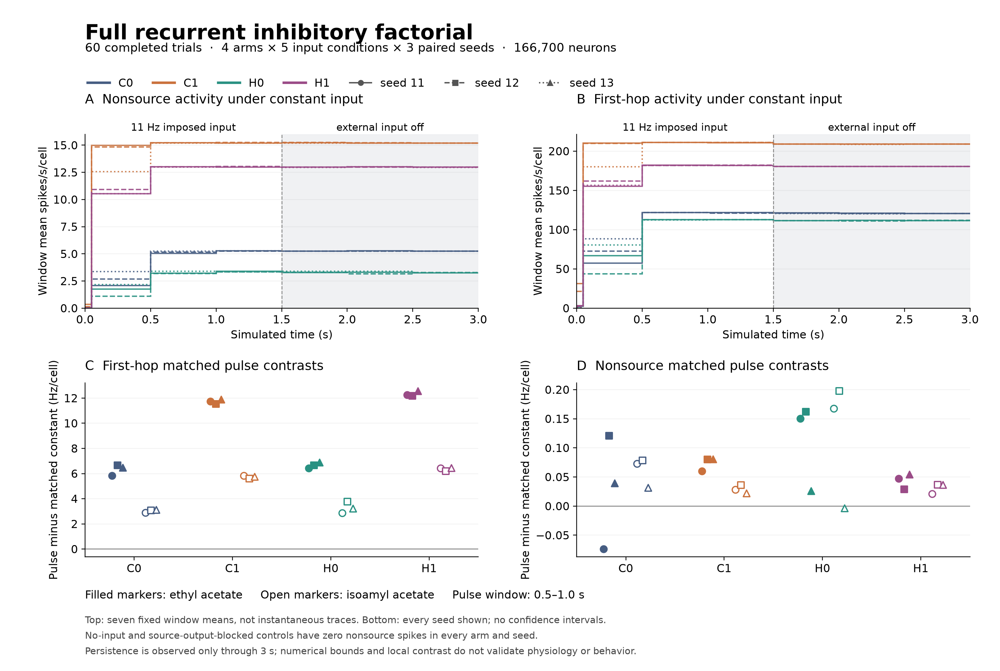

# Completed recurrent inhibitory factorial

**All 60 trials completed and passed independent saved-data review. H1 is not promoted.** It respects the declared inhibitory lower bound and retains local stimulus contrasts, but its active network continues firing after external input ends, with many first-hop cells close to the model's refractory ceiling. Physiological response amplitude and timing remain unvalidated. H0 also remains experimental.

The single frozen run began at 2026-09-05 06:05:46 UTC and finished at 10:58:42 UTC: about 4 h 53 min wall time for 180 simulated seconds. No trial failed, reached a resource limit, or was replaced. There are **157,832,582 retained spikes**. The user requested that remaining analysis wait until the whole panel finished; all missing reviews were then completed in three batches. The completion heartbeat is now paused.

## Evidence and scope

The [frozen plan](../validation/inhibitory-recurrent-panel-plan.json), committed before execution, specifies four arms, five conditions and seeds 11/12/13. Each trial uses a fresh 166,700-neuron MaleCNS graph for 3 s at 0.1 ms. C0 preserves current-like inhibition and the original freeze/reject/reset synapse handling. C1 changes handling to always decay/receive/retain. H0 and H1 use the corresponding handling packages with inhibition-only voltage dependence, `E_I = −75 mV`, and unchanged positive current-like drive. No gain was fitted.

All fifteen C0 trials reproduce their original 1.5 s prefixes exactly; the [admission audit](../validation/inhibitory-recurrent-panel-c0-admission.json) verifies that these gates precede altered-arm execution. The five conditions are no input, constant 11 Hz input, ethyl acetate (EA: 11→149→11 Hz), isoamyl acetate (IA: 11→57.679→11 Hz), and EA with source outputs blocked. These are imposed event rates on 36 VM7d cells, not measured afferent spike clamps or concentration calibration. External input ends at 1.5 s. Windows are startup 0–0.05 s, baseline 0.05–0.5 s, pulse 0.5–1 s, recovery 1–1.5 s, and three 0.5 s off windows.

The [combined analysis](../validation/inhibitory-recurrent-panel-combined-analysis.json), SHA-256 `bb42919231572491e2adbd4adfa67f53c1ce0b87bdd5a8f229628b0797488d29`, links **2,871,695 component audit checks** and passes **554,896 aggregate checks**. Its independent arithmetic recomputes all **12,564** producer contrasts, reduces all 36,000 chunk pairs, and verifies terminal-checkpoint count distributions against pinned artifacts. The [final integrity review](inhibitory-recurrent-panel-batch-integrity-review.md) separately verifies 109,952 manifest-listed files and 4,406,666,281 bytes, plus explicitly linked final publications. Final terminal output accounting is 4,446,494,931 bytes; the earlier manifest inventory has a different publication scope. Raw data remain in the ignored run directory, with results, code, receipts and notes tracked in Git.

The [C0](inhibitory-recurrent-panel-c0-audit-summary.md), [C1](inhibitory-recurrent-panel-batch-integrity-review.md), [H0](inhibitory-recurrent-panel-H0-batch-audit.md) and [H1](inhibitory-recurrent-panel-H1-batch-review.md) readers reconstruct raw spike counts, histories and selected events/states. Independent H integration covers the predeclared saved reference intervals. Global voltage extrema and below-bound counts are retained producer telemetry, independently reduced here; reviewers do not reconstruct unsaved all-cell voltage trajectories or certify the global optimality of every reference selection. Check counts describe scope and bookkeeping, not independent biological evidence units.

## Numerical result

| Arm | Spikes, all 15 trials | Lowest recorded phase voltage (mV) | Nonsource off mean rate range (Hz/cell) | First-hop off mean rate range (Hz/cell) |
| --- | ---: | ---: | ---: | ---: |
| C0 | 21,546,618 | −524.5825 | 5.2353–5.3529 | 119.8630–121.5562 |
| C1 | 66,637,628 | −1057.1569 | 15.1767–15.2518 | 208.7342–209.0301 |
| H0 | 13,686,614 | −74.0811 | 3.1675–3.4190 | 111.0356–112.0603 |
| H1 | 55,961,722 | −74.0579 | 12.9446–13.0389 | 180.3288–180.6740 |

Off-rate ranges include all three off bins in the nine unblocked driven trials per arm. Rates average all 166,664 nonsource or all 365 first-hop nonsource cells, including silent cells. No-input and source-output-blocked trials have **zero nonsource spikes throughout every arm and seed**.

Both H arms have zero reported below-reversal cell-ticks and zero nonfinite/invalid-state counters across all recorded phases. Their maximum production-versus-independent-quadrature discrepancies are `9.948e−14 mV` for H0 and `4.263e−14 mV` for H1. The largest independent ODE-versus-quadrature disagreement is `2.082e−12 mV`, below the frozen `2e−8 mV` tolerance. The 75,342 saved H reference rows include the quiet controls; no sampled threshold margin falls within its observed reference discrepancy. This does not certify every unsaved interval or establish biological accuracy.

The H lower bound is a successful engineering property, not an inferred reversal potential. Excitation remains current-like: H1 pre-threshold overshoot reaches **+180.3341 mV**, and C1 reaches +215.0093 mV before reset. These integrate-and-fire endpoints are not physiological action-potential waveforms. No zero-mV upper bound was specified or implied.

## Stimulus contrasts and seed consistency

The first-hop population retains positive EA and IA pulse contrasts against the matched constant-input trial in **every arm and seed**. EA exceeds IA in this population throughout. Each triple below is seeds 11 / 12 / 13, in mean spikes/s/cell.

| Arm | EA − constant, pulse | IA − constant, pulse |
| --- | --- | --- |
| C0 | 5.8247 / 6.6466 / 6.4712 | 2.8877 / 3.0630 / 3.1233 |
| C1 | 11.7534 / 11.5342 / 11.8959 | 5.8411 / 5.5945 / 5.7425 |
| H0 | 6.4384 / 6.6685 / 6.8822 | 2.8548 / 3.7753 / 3.2384 |
| H1 | 12.2521 / 12.1808 / 12.5753 | 6.4384 / 6.1863 / 6.4603 |

These are local model contrasts, not natural odor identification. Nonsource population-wide EA-minus-IA differences change sign across seeds in C0, H0 and H1. H1 gives `+0.025896 / −0.007416 / +0.017580 Hz/cell`. A larger first-hop effect therefore does not establish uniformly improved whole-network separation. The three seeds supply limited technical robustness evidence, not biological replicates or a population confidence interval.

Matched controls matter because the network is still recruiting during the initial baseline window. For example, H1/seed-11 first-hop baseline is 155.3425 Hz/cell, the EA pulse is 194.2575, and the contemporaneous constant-input pulse is 182.0055. The matched effect is +12.2521, while the within-trial increase is about +38.915. The latter includes startup changes. Complete per-window operands and contrasts are retained in the aggregate.

## Recurrent activity and factor attribution

All four arms continue nonsource firing across the full 1.5 s without external input. Across the nine unblocked trials, late-off nonsource rates relative to their immediately preceding recovery-window rates range from **99.24–100.80% for C0, 99.69–100.15% for C1, 95.02–103.79% for H0, and 99.56–100.04% for H1**. These windows fluctuate rather than universally growing. They establish continued activity through 3 s, neither indefinite stability nor uncontrolled growth. They also do not show a return to the silent fresh no-input state over this horizon.

The mean conceals a concentrated active population. In constant-input H1 trials during the final off window, only about 7.3% of nonsource cells fire. Among active first-hop cells, the median is **434 Hz in each seed**; their all-cell 90th percentile is 454 Hz and maximum is 456 Hz. The 22-tick refractory rule permits one spike every 2.2 ms, approximately 454.5 Hz asymptotically; 228 spikes can fit in a finite 0.5 s counting window and report as 456 Hz. C1's active first-hop medians are 398 Hz, compared with 219–221 Hz for C0 and 257–258 Hz for H0. This is evidence of strong recurrent drive and near-ceiling firing in part of the network, not a physiologically calibrated response.

The paired factorial identifies the handling package as the larger determinant of the persistent population mean in this experiment. During the final off window of constant-input trials:

| Effect on nonsource mean (Hz/cell) | Seed 11 | Seed 12 | Seed 13 |
| --- | ---: | ---: | ---: |
| H0 − C0: inhibitory equation, original handling | −2.0070 | −1.9737 | −1.9795 |
| H1 − C1: inhibitory equation, changed handling | −2.2126 | −2.2244 | −2.2115 |
| C1 − C0: handling, current-like inhibition | +9.9547 | +9.9423 | +9.9347 |
| H1 − H0: handling, voltage-dependent inhibition | +9.7491 | +9.6916 | +9.7026 |
| Interaction: (H1 − C1) − (H0 − C0) | −0.2056 | −0.2507 | −0.2320 |

This is a causal comparison of the fixed model interventions and shared external draws, conditional on this graph and protocol. It does not isolate decay, reception during refractoriness, and retention through reset from each other: those three changes remain bundled. Lower H0 activity alone is also insufficient to select it.

Every off-window external candidate and applied count is zero. Each driven seed-12 condition has one source spike in its first off bin; later source bins are empty. The earlier [C0 boundary audit](inhibitory-recurrent-panel-c0-results.md) reconstructs its last-pre-off-input/next-tick-threshold origin. The aggregate verifies the same one-spike count pattern across altered arms, without substituting that count pattern for a new exact-boundary reconstruction. These boundary spikes are not sustained external input; their individual causal contribution was not isolated, and the subsequent nonsource activity is recurrent model activity.

## Readouts and promotion decision

The forward and escape pairs remain silent in all 60 trials. Feeding-group totals are 1,389 / 3,212 / 892 / 4,263 spikes for C0/C1/H0/H1; those counts are not ingestion. Target 13314 fires once in the baseline window of each seed-13 unblocked H0 condition. Target 67052 similarly fires once in each seed-11 unblocked H1 condition. Neither is a stimulus-pulse response or seed-robust recruitment. Other seed-dependent steering readouts are retained in the aggregate; no body assay ran.

| User promotion requirement | Combined assessment |
| --- | --- |
| Inhibitory bound and numerical accuracy | Supported within the declared equations and retained audit scope; both H arms pass |
| Relevant physiological amplitudes and timing | Unresolved; this panel does not match a measured inhibitory protocol, pA/nS calibration or receptor-specific drug response |
| Meaningful stimulus contrasts | Local first-hop contrasts retained; global ranking and motor benefit not established |
| Robustness across seeds | Three-seed local consistency demonstrated; population contrasts and rare target responses have important seed dependence |
| Improved recurrent dynamics without uncontrolled persistence | Promotion gate not established: persistent drive and near-refractory-limit firing remain; the finite panel does not prove uncontrolled growth or indefinite stability |

The [physiology evidence](inhibitory-promotion-gates.md) still distinguishes absolute currents from graphical relative-response constraints. The engineering `−75 mV` reversal, single 5 ms inhibitory state, and at-rest normalization are not fitted physiological parameters. The negative [simple-filter comparison](ln-inhibitory-linear-filter-results.md) remains limited to the published summary-to-summary mapping; it does not identify a replacement receptor model.

**Derived insight:** bounded inhibition can reduce pathological negative voltages while leaving a strongly persistent recurrent regime. In this experiment, the synapse-handling package changes that regime much more than the voltage dependence does. A justified next experiment would separate the three handling mechanisms under the same fixed inhibitory equation and input controls, with physiological observables specified before any fitting. This is a prospective mechanism test, not a newly discovered biological property or an experiment already executed. Continuing hand-selected Eon stimulation or choosing H1 from its voltage appearance would not address this finding.

No runtime default, decoder, body, graph, gain or stimulus changed. The Eon embodied integration remains cancelled. This completes the bounded recurrent comparison; the broader single-male simulation and natural sensory behavior remain unfinished.

## Retained analysis corrections

The earlier optional C1 first-stimulus reducer failed on an incorrect metadata key before reducing phase voltages; its [original failure receipt](../validation/inhibitory-recurrent-panel-c1-first-stimulus-summary.json) and script remain unchanged. It was not used here. Independent pre-execution review of this new full-panel reducer identified missing checkpoint/selection pins; those were added before its first successful execution. The first figure duplicated panel titles and overlapped footer text; version 2 corrected layout. Independent visual review then caught the plotting library's default step closure to zero at the 3 s boundary, which implied an unobserved cessation. Version 3 leaves those endpoints open. Earlier PNGs, manifests and source versions remain retained; the numerical aggregate is identical. Neither rendering nor analysis corrections reran any neural trial.
