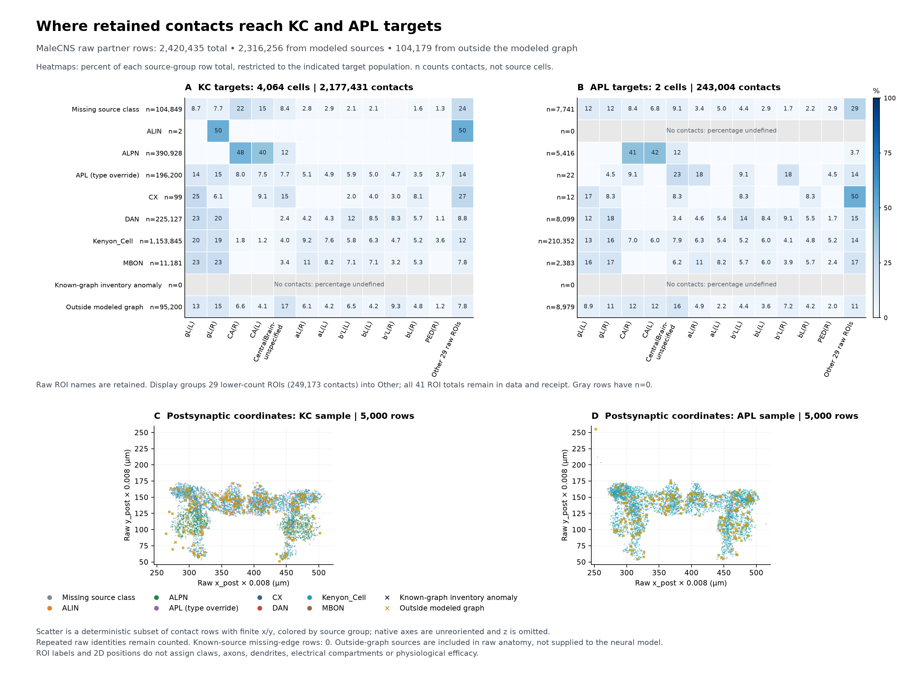

# KC inputs occupy different anatomical regions

The complete MaleCNS v1.0 synaptic-partner table has now been joined to all **4,064 KCs and two APL cells**. Its modeled-source subset reproduces **every one of the 836,650 retained directed edge counts**, totaling **2,316,256 contacts**, without filtering or deduplicating the selected rows. The [producer result](../validation/kc-apl-contact-location-results.json) passes 3,422 checks and the [independent rescan](../validation/kc-apl-contact-location-independent-review.json) passes 40,954 checks. This adds spatial evidence to the [earlier input inventory](pn-kc-apl-inventory.md); it does not assign electrical compartments or change the neural model.

The distinction is substantial. **87.665% of ALPN→KC contacts have CA(L/R) labels**, compared with **2.939% of KC→KC contacts**. **82.828% of KC→KC contacts have mushroom-body lobe labels**, with another **7.182% in PED(L/R)**. DAN→KC contacts are likewise concentrated in lobe labels. A single effective somatic current therefore collapses anatomically different input locations. That observation motivates a spatial and receptor-specific mechanism comparison, but does not determine the correct currents or justify deleting contacts.

## Complete source and selection

The [official public release](https://male-cns.janelia.org/download/) supplies both partner coordinates and `primary_post` neuropil labels. The downloader retained the exact v1.0/minconf-0.5 object, generation `1780494942562468`: **6,777,179,098 bytes**, public MD5 `58efcf712f8c4d4de5f2ad51e97def76`, local SHA-256 `959d8ef4173b35382a3e6acfaf5167c795b6d10b877572d146af04e1b487bc07`. The [acquisition receipt](../validation/malecns-synaptic-partners-acquisition.json) records successful checksum verification. Acquisition took 147.78 s; no additional compute or institutional access was required.

The actual Arrow schema contains int32 pre/post x/y/z, int64 partner IDs, float32 pre/post confidence, and a dictionary-encoded string `primary_post`. The reduction visits all **4,759 batches / 311,833,243 source rows**. It selects **2,420,435 rows** whose postsynaptic ID is one of the exact KC/APL targets. Each selected record retains all eleven source fields and its original absolute row ordinal, plus the explicit derived graph/target/edge/group/ROI indices.

Of these rows, **104,179 presynaptic bodies fall outside the 166,700-neuron modeled graph**: 95,200 contacts onto KCs and 8,979 onto APL. They are retained separately from known graph neurons whose class annotation is missing. They were not silently added as neurons, and their existence does not establish an additional identified neural cell population. No known graph source has an unexplained missing retained edge.

The selected raw records are stored in the ignored, reproducible 103.58 MB [Parquet artifact](../data/raw/pn-kc-apl-compartment/kc-apl-partners-selected.parquet), SHA-256 `33ecb419aaa4829ab2cf7dbe0fa0df51983dca5f4c951d43f33fe8caa5ecd329`. The compact [tracked arrays](../validation/kc-apl-contact-location-arrays.npz) retain all edge/ROI and target/group/ROI counts. The [frozen plan](../validation/kc-apl-contact-location-plan.json) binds the raw file, original graph and previously independently reviewed inventory.

## Descriptive distribution onto KCs

The following percentages use **all contacts from the stated source group onto KCs** as their denominator. No unspecified or other-labeled contacts are removed before normalization. The [descriptive summary](../validation/kc-apl-contact-location-descriptive-summary.json) lists each exact raw label assigned to the display bins and records that this grouping was made after the complete reduction.

| Modeled source group | Contacts onto KCs | CA(L/R) | Lobe labels | PED(L/R) | Unspecified labels | Other named ROIs |
|---|---:|---:|---:|---:|---:|---:|
| ALPN | 390,928 | 87.665% | 0.001% | 0.009% | 12.014% | 0.311% |
| KC | 1,153,845 | 2.939% | 82.828% | 7.182% | 4.047% | 3.004% |
| DAN | 225,127 | 0.761% | 90.663% | 2.095% | 2.391% | 4.091% |
| APL | 196,200 | 15.498% | 65.767% | 8.072% | 7.728% | 2.935% |

Here “lobe labels” means only the literal `aL`, `bL`, `a'L`, `b'L` and `gL` labels on both sides. “Unspecified” explicitly includes `CentralBrain-unspecified`, `<unspecified>` and both `Optic-unspecified` labels. All **41 observed raw labels** remain separate in the producer outputs. A `CentralBrain-unspecified` contact cannot simply be declared outside the calyx or assigned to a neighboring named region. The roughly 12% unspecified ALPN fraction is particularly relevant to that limitation.

Reciprocal APL connections are distributed across multiple regions. KC→APL has 210,352 retained contacts: **12.979% in CA**, **65.945% in lobe labels** and **9.973% in PED**. This is consistent with the need to consider distributed APL feedback, but shared neuropil membership alone does not establish local electrical coupling, the relevant branch distance, or a voltage-to-release law.

## Integrity and interpretation limits

Every selected partner identity—both body IDs plus all six coordinates—is unique: **zero duplicated full identities**. Repeated presynaptic locations paired with different postsynaptic sites were preserved. There are no null fields in this selected set. Presynaptic confidences range 0.699999988–0.991999984 and postsynaptic confidences 0.500001013–1.0; no selected confidence lies below 0.5, above one, or is nonfinite. Coordinates are preserved in native integer voxel units, with **0.008 μm per voxel**. No anatomical axis rotation was applied.

The reduction decodes ROI dictionaries separately for each batch; dictionary codes are not treated as globally meaningful. Exact checks cover all per-edge counts and the conservation of selected, modeled, outside-graph, target, source-group and ROI partitions. The source hashes are checked before and after processing. No failed count was repaired by deduplication or by changing the confidence threshold.

The independent reader uses a separate Arrow `index_in` selection and rescans all 311,833,243 raw rows. Every selected original field matches at its saved absolute row ordinal. It independently reconstructs the graph joins, direct CSR contact totals, all ROI/group/type arrays, duplicates and coordinate/confidence summaries. All 18 pinned inputs/outputs remain unchanged. The figure displays twelve literal ROI labels plus a declared group of the other 29, preserving their full data in its [receipt](../validation/kc-apl-contact-location-plot-receipt.json). Its coordinate panels are deterministic 5,000-row samples for each target population; they omit z and do not map compartments. A clipped initial colorbar and its source/receipt were retained before a layout-only correction; the final image was visually inspected.

This is an anatomical contact inventory, not a spatial simulation. Neuropil labels have coarser segmentation than the synapse coordinates, and they do not by themselves identify a KC claw, axonal branch, soma, active conductance, receptor, synaptic delay or membrane time constant. Contact percentages are also not the same as the previously measured nominal input-increment percentages: the latter depend on each source's actual emissions and the model's weight assumptions. Do not multiply those two summaries as if they were independent.

The [fixed Turner conductance reference](turner-kc-conductance.md), completed in parallel, supplies a reproducible effective synaptic response with approximate intended amplitudes. It still leaves rise-time differences and the >200 ms intrinsic somatic constraint unresolved. Neither that reference nor these contact locations alone identifies a full KC model.

The [new primary-source review](../research/24-kc-spatial-mechanism-constraints.md) identifies a directly relevant alternative to the generic transmitter sign assumption: adult γ-axon experiments show mAChR-B-dependent suppression of local calcium, acetylcholine release and dopamine-driven cAMP. These are reporter measurements, not a unitary voltage/EPSC kernel or a per-contact current law. The strongest direct functional evidence is γ-specific; it does not justify a pan-KC sign flip. The review also confirms the anatomical abbreviations while keeping the old Hemibrain glossary distinct from the current MaleCNS ROI masks.

The next scientifically useful comparison should test dependence on the implemented fast positive γ-lobe KC contribution, keeping calyx, other lobes, pedunculus and uncertain locations explicit. A causal removal of that assumed term would diagnose the existing model, not calibrate the biological replacement. Mixed-ROI neuron pairs need contact-aware handling so an intervention on their γ-lobe contribution does not also erase their other contacts. Preserve the anatomy; no GPCR kinetics are identified by this diagnostic. H1 remains unpromoted; no body, sensory, decoder, gain or neural default changed.
