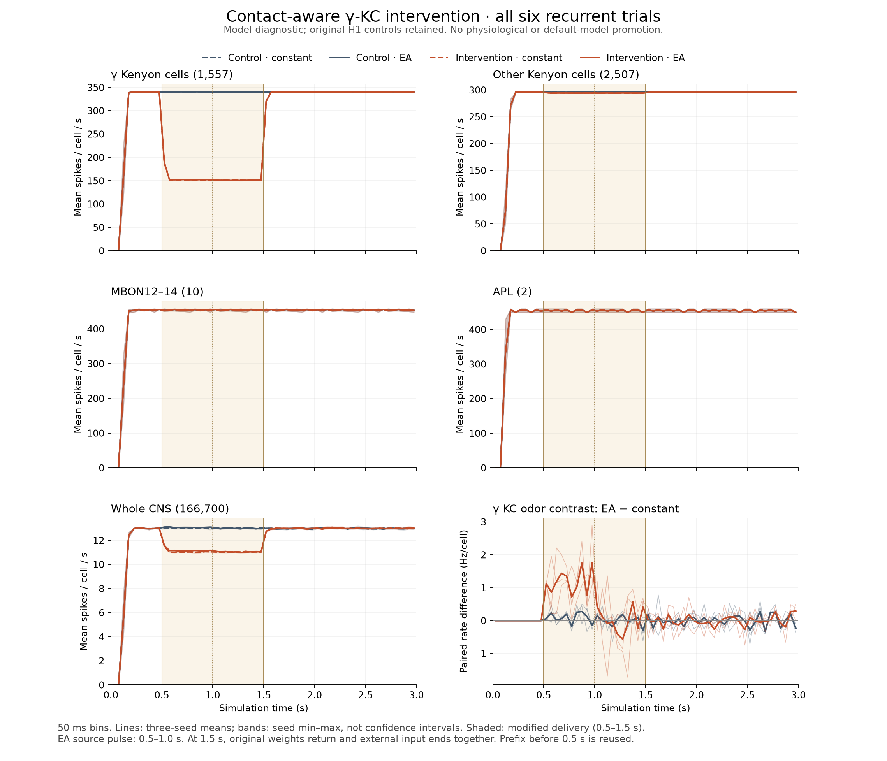

# γ-KC recurrence contributes strongly, but removing its fast term does not repair H1

The complete six-trial [contact-aware intervention](kc-gamma-intervention-plan.md) reduces γ-KC pulse firing by **54.17–54.53%**, from about **340 to 155 Hz/cell**. A small positive γ-KC odor contrast increases consistently across the three seeds. However, all γ KCs still fire during the pulse, APL and MBON12–14 remain at their refractory ceiling, DNg97 and DNp09 stay silent, and widespread activity persists after input withdrawal. H1 is **not promoted**.

The batch completed at **2026-09-05 22:34:13 UTC**, after 4,387.97 s (73.13 min). All six cases, immutable source/plan/result hashes and 9,205 referenced file records passed the initial completion check. No individual trial was interpreted while the batch ran. The completion heartbeat is now paused; do not restart this completed batch.

The lines show three-seed means in 50 ms bins. Bands show observed seed minima/maxima, not confidence intervals. The contrast panel additionally shows each paired seed. The shaded interval changes delivery weights only; restoration and withdrawal occur together at 1.5 s.

## What changed

This is an intervention on a model representation, not biological synaptic deletion. Exactly **414,095** literal γ-lobe contacts onto **1,557** annotated γ KCs contribute no fast positive term during 0.5–1.5 s. On affected neuron pairs, **46,992 other contacts retain their allocated contribution**. Anatomical contacts, original graph weights, inhibition, existing synaptic states and delayed queues remain intact. There is no invented negative receptor current or fitted GPCR kernel.

Each branch starts from its exact previously recorded H1 state at 0.5 s. Constant baseline and ethyl-acetate conditions reuse seeds 11–13 and the original external streams. These are previously examined simulations, not held-out seeds or independent animals. After restoration at 1.5 s, external input ends and the network continues to 3 s. No body or decoder runs.

## Combined response

Ranges below span all six cases. Pulse means use 0.5–1.0 s; population means include silent cells.

| Population | Control pulse Hz/cell | Intervention pulse Hz/cell | Interpretation |
|---|---:|---:|---|
| γ KCs, 1,557 | 340.224–340.369 | 154.700–155.992 | Large, consistent reduction; all 1,557 still active |
| Other KCs, 2,507 | 295.802–295.961 | 294.313–294.444 | Small recurrent effect outside the selected target population |
| All KCs, 4,064 | 312.853–312.919 | 240.832–241.362 | Broad excessive recruitment remains |
| APL, 2 | 454–455 | 454–455 | Every measured pulse ISI remains exactly 22 ticks |
| MBON12–14, 10 | About 454–455 | Same per-cell coarse rates | Every measured pulse ISI remains exactly 22 ticks |
| Whole CNS, 166,700 | 12.991–13.079 | 11.062–11.196 | Reduction during intervention does not remove later persistence |
| DNg97 and DNp09 | 0 | 0 | No restoration of these walking readouts |

The two largest γ subtypes both change: KCg-m pulse firing falls from 342.07–342.24 to 161.14–162.62 Hz/cell; KCg-d falls from 325.80–326.00 to 106.72–107.69. During the 1.0–1.5 s washout, all-γ firing remains 150.70–151.37 Hz/cell, with 1,416–1,423 of 1,557 γ cells active. This is not sparse physiological recruitment. γ and other KC pulse ISIs are **not** at the exact 22-tick ceiling; the persistent high KC rates must be distinguished from the literal ceiling behavior of APL/MBONs.

The matched γ-KC pulse contrast is consistently positive:

| Seed | Control EA − constant, Hz/cell | Intervention EA − constant, Hz/cell |
|---|---:|---:|
| 11 | +0.075787 | +1.239563 |
| 12 | +0.097624 | +1.111111 |
| 13 | +0.102762 | +1.243417 |

This is a real within-model contrast improvement, under 1% of the remaining γ pulse rate. It does not establish physiological coding. MBON12, MBON13 and MBON14 coarse pulse contrasts remain zero; FB5AB pulse contrasts change from +8/+12/+8 to +3/+9/−1 Hz/cell across seeds. Thus a γ improvement does not imply a reliably improved downstream navigation representation. Actual VM7d ORN coarse rates match their saved controls; PN responses remain highly amplified.

By the final 2.5–3.0 s window, γ means return to **340.197–340.292 Hz/cell**, with every γ cell active, and all-KC means are **312.917–313.011 Hz/cell**. Whole-network means remain **12.965–13.009 Hz/cell**, with 12,150–12,384 active cells in that window. The old controls also persist. Because restored delivery and external withdrawal coincide, this design cannot assign the rebound to either transition separately or demonstrate persistence under a permanently changed receptor model.

## Rate saturation hides changes in synaptic state

At the 1.0 s checkpoint, mean model p-state across the two APL cells drops from roughly 50,664–50,901 to 38,669–39,256; across the ten MBONs it drops from roughly 2,619–2,636 to 2,305–2,334. Their mean voltage at that checkpoint is still −52 mV and their coarse firing remains saturated. These are **model p-state units, not measured synaptic currents or membrane voltages**. h is retained separately and is not subtracted from p.

This provides a concrete caution for causal readouts: unchanged firing does not mean unchanged upstream influence. Here the internal state changes while the output rate sits at a model ceiling. Identical coarse rates and ISI summaries also do not prove every spike time is identical.

Voltage snapshots can mislead in the other direction. For seed 11 constant input at 1.0 s, all thirteen observed γ representatives are at the −52 mV reset value in the control, versus eight in the intervention. Their mean sampled voltage becomes **more positive**, from −52.000 to −50.033 mV, while population firing falls substantially. This is consistent with reduced reset occupancy; it is not a physiological improvement inferred from voltage appearance. The thirteen traces are an anatomical sample, not a full-population voltage summary.

## Verification and limits

- **State/delivery review:** 223,255 checks passed. It reconstructs all **30,564,383** postbranch spikes into counts, refractory histories and queues, and verifies **252,258,795** modified deliveries through global source/edge accounting. Ordered logged arrivals and every recorded p/h trace for all 73 observed cells agree bitwise with an independent conditional reconstruction. All six full checkpoints per case are checked.
- **Numerical review:** all **89,995** declared reference intervals across 3,000 chunks pass adaptive quadrature, independent ODE and order-64 checks. Maximum production-versus-quadrature error is 1.71×10⁻¹³ mV; maximum ODE-versus-quadrature error is 7.18×10⁻¹³ mV. No method errors, tolerance failures, threshold decision disagreements or conservative threshold ambiguities occur. The smallest sampled threshold margin is 1.36×10⁻⁹ mV.
- **Combined reduction:** 84,337 archive/array checks pass. A second whole-trial sorting implementation independently verifies all-cell counts and ISIs, every cohort's 50 ms bins/rates/active fractions, and matched contrasts with **4,778** additional checks.
- **Visual review:** the complete plot was rendered and inspected for readable axes, legends, interval labels and uncertainty wording.

Independent calculations were implemented and reviewed by the same root agent; no separate-person review is claimed. Conditional p/h reconstruction uses actual recorded source histories and is not a second full-network simulation. Full-population continuous voltage/p/h is not independently reconstructed between checkpoints. Numerical correctness does not establish receptor identity, physiological amplitudes, response timing or behavior.

| H1 promotion criterion | Result here |
|---|---|
| Numerical bound and reference accuracy | Pass for the specified checks and sampled intervals |
| Physiological response amplitudes and timing | Unresolved; no measured γ electrical/release kernel was fitted or validated |
| Meaningful stimulus contrasts | Small γ contrast improves; saturated MBON contrast remains absent |
| Robustness across seeds | Direction of γ reduction/contrast increase repeats in all three historical seeds |
| Improved full-network dynamics without uncontrolled persistence | Fails; off activity and saturated APL/MBON output persist |

The next useful work is local mechanism and measurement alignment, including inspecting the retained public γ-KC reporter datasets and their time axes, and keeping APL's unresolved graded release mechanism explicit. Do not extend this into another whole-network gain sweep or treat broader edge removal as receptor calibration.

## Artifacts

The [numerical receipt](../validation/kc-gamma-intervention-numerics-results.json), [state/delivery receipt](../validation/kc-gamma-intervention-independent-review.json), [combined analysis](../validation/kc-gamma-intervention-analysis-results.json), [independent analysis check](../validation/kc-gamma-intervention-analysis-review.json) and [compact findings](../validation/kc-gamma-intervention-findings.json) pin their exact inputs and outputs. [Derived insights](../research/26-kc-gamma-recurrent-findings.md) separate measured model effects from hypotheses.

The 169,647,779-byte conditional reconstruction archive `validation/kc-gamma-intervention-independent-review-arrays.npz` remains locally available and is excluded from Git's large-file upload. Its full SHA-256 and descriptors are recorded in the tracked review receipt. Original run archives likewise remain local. The 7.7 MB analysis arrays, numerical rows, code, plans, receipts and figure are tracked. Reproduction requires the pinned raw/processed data and historical run archives; a Git clone alone is not the full dataset.
