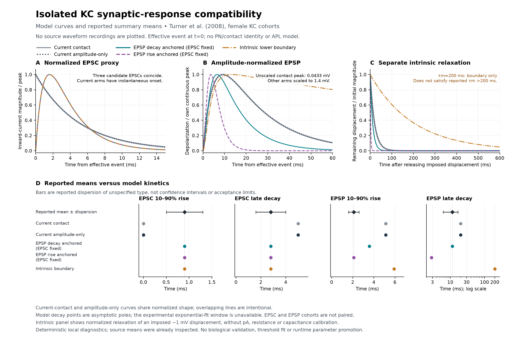

# KC synaptic timing requires more than a gain change

The complete five-arm [local assay](../validation/kc-synaptic-response-results.json) compares the unchanged current equations with three explicitly limited excitatory-response candidates. All arms were completed before interpretation. The producer passes 97 numerical checks and the [independent review](../validation/kc-synaptic-response-independent-review.json) passes 1,152 checks; this is not a biological validation or a runtime parameter selection.

Matching the reported excitatory-current kinetics and the reported voltage decay predicts a **3.576 ms voltage rise**, compared with the reported **2.1 ms** mean. Matching the voltage rise instead produces a **2.8 ms late decay**, compared with **11.5 ms**. Rescaling amplitude cannot remove this timing tradeoff in the declared model. The separate somatic time-constant constraint also remains unmet.

## Measurement and model

The [retained physiology review](../research/21-pn-kc-physiology-calibration.md) identifies Turner et al. (2008) as the source of the effective single-event targets. The recordings used female flies and different EPSP/EPSC cohorts; these are not male subtype-specific measurements. The [primary paper](https://www.bazhlab.ucsd.edu/wp-content/uploads/2014/04/JNeurophys2008.pdf) reports exponential fits to falling phases without identifying the exact fitting window. This assay conditionally interprets those decay summaries as asymptotic constants. Consequently, failure to match all central summaries is a conditional model result, not a statistical rejection of the recordings or of every possible cellular mechanism.

For the candidate, an effective excitatory event drives

\[
q(t)=e^{-t/\tau_d}-e^{-t/\tau_r},\qquad
\dot u=(Aq-u)/\tau_m.
\]

Here `u` is voltage relative to its baseline and `A` is an effective voltage gain. It does not identify pA, capacitance, receptor conductance, PN release, claws or contact strength. Setting the current tail to 2.8 ms and matching its 0.9 ms rise gives `τr = 1.001985 ms`. Each candidate then has one declared choice of membrane time constant. All non-contact arms have their single effective event scaled to a 1.4 mV peak. The [independent mathematical review](pn-kc-waveform-candidate-review.md) supplies the derivation and distinguishes this candidate from Turner's original conductance model.

The contact control uses the native float32 0.275 effective weight. One graph contact is not equivalent to the source's spontaneous event, so its small amplitude is not, by itself, an experimentally measured per-contact error. The amplitude-only control makes the timing comparison independent of that unknown mapping.

| Arm | EPSP peak, mV | EPSP rise, ms | EPSP late decay, ms | EPSC rise, ms | EPSC late decay, ms |
|---|---:|---:|---:|---:|---:|
| Reported means | 1.4 | 2.1 | 11.5 | 0.9 | 2.8 |
| Current nominal contact | 0.04331 | 5.1207 | 20 | 0 | 5 |
| Current, amplitude only | 1.4 | 5.1207 | 20 | 0 | 5 |
| EPSP decay anchored, EPSC fixed | 1.4 | 3.5756 | 11.5 | 0.9 | 2.8 |
| EPSP rise anchored, EPSC fixed | 1.4 | 2.1 | 2.8 | 0.9 | 2.8 |
| Somatic lower boundary, EPSC fixed | 1.4 | 5.9079 | 200 | 0.9 | 2.8 |

Amplitude matching is parameter identification from a published mean, not successful independent prediction. The EPSP-rise-anchored membrane constant is 2.152876 ms; the 2.8 ms current tail then dominates its late voltage decay. No source dispersion was used as a confidence interval, a rectangular acceptance region, or a weight in a pooled fit. Gruntman's integration data were excluded from identification.

## Intrinsic properties stay separate

The source's somatic current-injection time constant is **strictly greater than 200 ms**. The existing 20 ms constant and both fast candidates fail that constraint. The 200 ms diagnostic is exactly the lower boundary; it does not pass the strict bound and is not a fitted cellular estimate. Its slow positive voltage tail illustrates the conflict with a short synaptic tail in this passive point-cell family.

The normalized current-step and relaxation traces use an engineering −1 mV asymptotic displacement. There is no measured conversion from the engine's effective current to pA, so input resistance and capacitance remain unidentified. Native threshold distance is 7 mV from native rest, or 13 mV from the source holding voltage, versus the reported 21.5 mV mean distance. The threshold was neither fitted nor applied to the candidate subthreshold equations. No APL parameter enters the assay.

The authors themselves suggested dendritic synaptic and possibly voltage-dependent conductances as an explanation for the separation between fast synaptic responses and slow somatic current responses. That is a mechanism lead, not a license to invent an identified compartment or channel parameter set. Their published effective passive model likewise uses a short membrane ratio; reproducing that model would not independently satisfy the somatic measurement.

## Numerical and event scope

All comparisons begin immediately after one prescribed postsynaptic event at time zero. There is no inferred presynaptic spike train or delay/release history. The unchanged `LIFNetwork` runs six isolated, zero-edge cells: zero-event, contact and amplitude-only cases at native rest and at the source's −58 mV holding voltage. A constant −6 effective current maintains the latter; simply initializing at −58 mV without holding current would introduce drift. Native threshold and refractory rules remain active and produce no spikes. Random states and pending queues remain unchanged.

The actual H1 event-free solver is also exercised at `h=0` and agrees with the native excitatory-only control. This does not retest the inhibitory bound or support H1 promotion. Candidate waveforms use exact matrix-exponential transitions. All five arms retain two-second traces at 0.1, 0.05 and 0.025 ms, with shared-time comparisons, closed-form response checks, area checks, positivity, zero-input controls and equal-pole limits. The largest producer voltage discrepancy from the analytic waveform is 4.790×10⁻¹² mV. Source and runtime hashes remain pinned in the [plan](../validation/kc-synaptic-response-plan.json).

Continuous peak and crossing metrics are distinct from sampled metrics. Secondary 80–20% and 50–10% falling-phase summaries expose decay-window sensitivity: the decay-anchored candidate has an 11.5 ms late pole but a 12.033 ms 80–20% equivalent constant. These summaries do not claim to reproduce the source's unspecified exponential-fitting protocol. Clamp traces represent normalized inward-current magnitude; no absolute current or conductance was inferred from the source's normalized panel.

The independent reader imports neither the producer nor the neural kernels. It solves the fixed systems with a separate DOP853 implementation, derives continuous metrics from dense-output roots, and checks all saved arrays, sampled metrics, finite/infinite response areas, zero/holding controls and source hashes. Its largest saved EPSP discrepancy is 6.764×10⁻¹² mV; normalized-current error is 7.614×10⁻¹². The retained native and H1 `h=0` arrays are bitwise identical. RNG/pending invariants are producer counters corroborated by the source, rather than independently reconstructed raw endpoint states. The figure was visually checked; an initial footer overlap and its source/receipt were retained before a layout-only correction. No network rerun was needed.

## Consequence for the single-fly model

The assay rules out treating an amplitude adjustment as a complete local timing calibration. It also prevents quietly assigning the observed synaptic decay to every intrinsic KC process. It does not prove a unique repair for the dense recurrent KC activity, identify a male PN→KC contact law, or validate a whole-network change.

The next useful mechanism comparison must separate the measured somatic and synaptic responses and retain both endpoints. A spatial or voltage-dependent candidate needs source-supported structure and a declared observation model; the [same-version contact data](../research/23-kc-contact-location-availability.md) can constrain input location but cannot supply membrane parameters. The published Turner conductance equations remain an available historical control. Do not compensate through APL strength, firing threshold, dopamine gain or a desired sparse fraction. H1 remains unpromoted, Eon integration remains cancelled, and the full single-fly milestones remain open.
