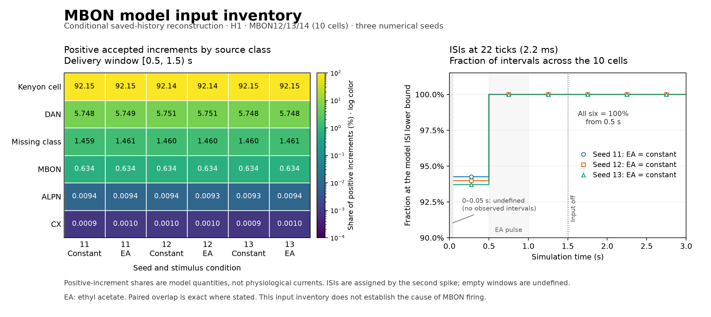

# What reaches the saturated MBONs?

Kenyon cells supply **92.144–92.149% of positive accepted synaptic increments** to MBON12–14 over the 0.5–1.5 s interval in all six saved H1 trials. This meets the [predeclared input-class selection rule](navigation-ladder-mbon-input-plan.md) for one targeted intervention. It establishes an input inventory in this model, not the cause of a particular spike or a physiological current measurement.

The audit covers ten exact MBONs, 9,484 incoming directed edges, 4,722 distinct presynaptic cells and 65,901 contacts. It uses the three-seed ethyl-acetate and constant-baseline trials already completed in the inhibitory panel. No new network simulation produced these results.

## Reconstructed state and numerical evidence

The [frozen execution plan](../validation/navigation-ladder-mbon-input-plan.json) was created before reading the six complete spike histories. Every recorded source spike delivers its retained float32 edge weight, promoted to float64, at emission tick plus 18. The reconstruction decays each synaptic state first, then adds individual arrivals in the original source/CSR order. H1 accepts arrivals during refractoriness and retains both states through spike reset. Positive effective-current state `p` and dimensionless inhibitory conductance `h` remain separate quantities.

All eight checkpoints per trial match bitwise. A [separate raw-archive reader](../validation/navigation-ladder-mbon-input-independent-review.json) independently reproduces every element of the six `(30001, 10)` `p` arrays and six `h` arrays, as well as all 48 checkpoint state/count/pending comparisons. It passes 178,371 checks after the producer's 37,180 checks. A differently grouped convolution agrees within `1.82e−12` for `p` and `1.43e−14` for `h`; that approximate comparison is separate from the bitwise ordered reconstruction.

Continuous MBON voltage was not recorded in the original panel. These reconstructed synaptic states are conditional on its saved recurrent spike history; no voltage solver, new spike generation, gain fitting or intervention ran during the audit.

## Input composition and loss of output contrast

The next largest positive contribution comes from the annotated dopaminergic-neuron class, at about 5.75%; missing-class cells supply about 1.46%, MBONs about 0.634%, and ALPN/CX contributions are smaller. These are the simulator's fast signed point-synapse assumptions. In particular, the dopamine-class contribution is not a measured fast excitatory dopamine current.

From 0.5 s onward, every observed within-cell MBON interspike interval is exactly 22 ticks (2.2 ms), including all three withdrawal windows. Intervals are assigned by their second spike and carry across window boundaries; the initial empty window is undefined. Matched EA/constant outputs remain identical across seeds, as established by the previous [exact-spike comparison](navigation-ladder-timing.md). Kenyon-cell input also persists after external input withdrawal. None of these observations alone establishes autonomous activity, a biological memory mechanism or a unique circuit defect.

The first figure had a legend/footer overlap. Its [original receipt](../validation/navigation-ladder-mbon-input-plot-receipt.json) and image are retained; [v2](../validation/navigation-ladder-mbon-input-plot-receipt-v2.json) corrects only the layout and was visually inspected.

## One selected intervention

The rule selects 8,236 positive original CSR edges from annotated Kenyon cells to these ten MBONs. The proposed experiment suppresses only their deliveries during `[5000,15000)` ticks, or 0.5–1.5 s. It does not clear existing synaptic state or pending spikes. All other projections, inhibitory inputs, parameters and external streams remain as recorded in the plan.

The [experiment protocol](navigation-mbon-intervention.md) branches six trials from the exact saved 0.5 s checkpoints. It adds continuous MBON voltage/p/h recording, then follows each altered recurrent history through 3 s, including restoration of the selected deliveries after 1.5 s. The [completed combined results](navigation-mbon-intervention-results.md) and independent reviews show a reversible model contribution: MBON12/14 become silent, MBON13 retains high firing, and robust odor contrast is not recovered. This does not select H1 or identify a physiological fix.

The [results](../validation/navigation-ladder-mbon-input-results.json), [edge table](../validation/navigation-ladder-mbon-input-edges.csv) and [arrays](../validation/navigation-ladder-mbon-input-arrays.npz) retain every per-edge count, per-source emission count, class/transmitter rollup, selected spike and reconstructed state. The negative [ORN→PN depression calibration](orn-pn-depression-calibration.md) remains unchanged and unpromoted.
