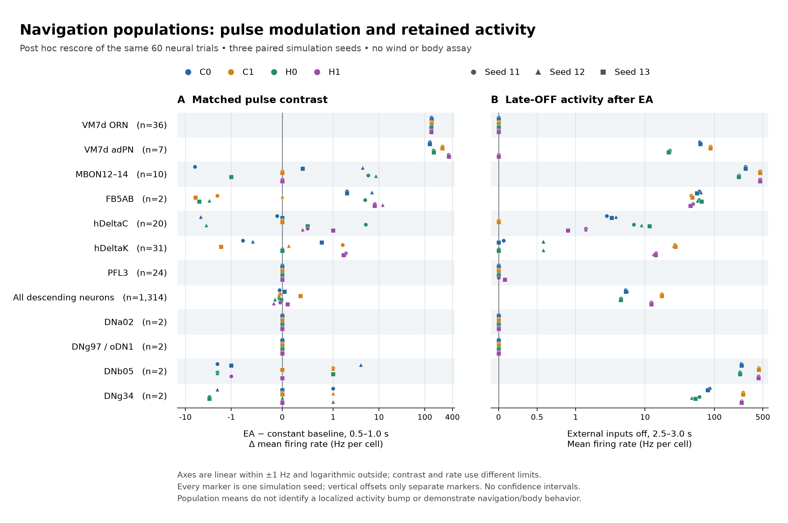

# Navigation populations in the completed inhibitory panel

The first [navigation-ladder rung](navigation-ladder-plan.md) is complete: the existing 60 trials were re-scored at 34 named, overlapping cohorts containing 1,649 distinct neurons. **The immediate VM7d PNs are strongly recruited; the full descending population is active; several selected walking populations remain quiet.** This changes which boundaries deserve investigation, but does not identify one biological cause of failed navigation.

This is a post-hoc analysis of the same four arms, five conditions and three seeds as the [inhibitory factorial](inhibitory-recurrent-panel-results.md), not 60 additional experiments. No neural model, decoder or body ran during this reduction. The imposed input is one VM7d ORN class, with no wind, hunger manipulation or natural concentration-to-rate encoding.

## Measurements and scope

The [frozen readout plan](../validation/navigation-ladder-readout-plan.json) pins the final [anatomical manifest](../validation/navigation-ladder-anatomy.json), original panel and 60 terminal checkpoints. Counts were previously independently reconstructed from all raw spikes. The [readout JSON](../validation/navigation-ladder-readouts.json) retains per-cohort counts, rates, active fractions, maxima and matched contrasts; [the array artifact](../validation/navigation-ladder-readouts.npz) preserves every selected cell and its final state. Population means include silent cells. Overlapping groups must not be summed into a larger population.

EA means the ethyl-acetate-labeled imposed rate schedule: 11 Hz external events per source for 0–0.5 s, 149 Hz for 0.5–1.0 s, 11 Hz for 1.0–1.5 s, then zero. Constant controls keep 11 Hz until 1.5 s. These are external event rates; all rates below use actual emitted spikes. The pulse window is **[0.5, 1.0) s** and late off is **[2.5, 3.0) s**. Ranges span seeds 11–13, not confidence intervals. The three seeds are simulation replicates, not animals.

## What the wider observations show

**1. Failure to recruit the immediate PNs is not the explanation for this input.** Seven VM7d adPNs have a large positive EA-versus-constant pulse contrast in every arm and seed. The earlier single-edge subthreshold calculation did not measure convergence of the full ORN ensemble or recurrent input. It cannot justify raising ORN→PN gain until walking appears.

| Arm | Actual source pulse rate, Hz/cell | VM7d PN pulse rate, Hz/cell | PN EA minus constant, seeds 11 / 12 / 13, Hz/cell | PN late-off rate, Hz/cell |
| --- | ---: | ---: | ---: | ---: |
| C0 | 145.278–150.056 | 216.000–219.429 | +128.000 / +124.000 / +128.000 | 61.429–63.714 |
| C1 | 145.778–150.889 | 375.429–379.429 | +240.571 / +236.571 / +242.571 | 87.714–88.286 |
| H0 | 145.056–149.944 | 212.286–215.143 | +154.857 / +152.857 / +156.286 | 22.000–22.857 |
| H1 | 144.889–149.944 | 365.143–369.714 | +326.857 / +326.857 / +332.857 | 0 |

These are model response magnitudes, not evidence that the PN gain is physiological. A recurrent population spike response is not a unitary EPSP or a synaptic-depression measurement.

**2. Persistent descending activity is hidden by the narrow walking readout.** The anatomical DN superclass contains 1,314 cells. During EA, 185–189 DNs fire in C0, 208–217 in C1, 180–187 in H0 and 157–161 in H1. DNb05 and DNg34 remain active long after the imposed input ends. This does not make them validated alternative velocity commands.

| Population | C0 late off | C1 late off | H0 late off | H1 late off |
| --- | ---: | ---: | ---: | ---: |
| All annotated DNs | 5.259–5.569 | 17.406–17.527 | 4.356–4.505 | 12.318–12.353 |
| DNb05, 2 cells | 244–251 | 438–440 | 235–239 | 432–433 |
| DNg34, 2 cells | 80–85 | 260 | 47–61 | 245–247 |
| DNg97, 2 cells | 0 | 0 | 0 | 0 |
| DNp09, 2 cells | 0 | 0 | 0 | 0 |

All entries are EA-trial Hz per cell. DNg97 and DNp09 emit no spikes anywhere in the 60-trial dataset. DNa01, DNa02 and PFL3 have zero EA-pulse counts in all arms and seeds, but are **not silent throughout the complete dataset**: their total counts across all conditions/windows are 65, 12 and 72 respectively. No claim about reflected steering can be made without directional input and registered coordinates.

**3. A flat population mean can coexist with substantial activity at upstream stages.** The ten MBON12–14 cells in C1/H1 each emit 227 or 228 spikes during the half-second EA pulse, equivalent to 454 or 456 Hz. Their individual pulse counts exactly equal the matched constant controls in every seed. These rates approach the model's 2.2 ms refractory limit; half-open finite windows can yield 456 Hz without violating the interspike bound. Zero count contrast does not establish zero temporal information.

| Population | H1 EA pulse, Hz/cell | H1 EA minus constant, seeds 11 / 12 / 13, Hz/cell | H1 late off, Hz/cell |
| --- | ---: | ---: | ---: |
| LHAD1b2 family, 19 cells | 12.105–12.526 | +3.789 / +3.474 / +4.000 | 8.632–8.947 |
| LHCENT3, 2 cells | 394–395 | +10 / +11 / +10 | 383–384 |
| MBON12–14, 10 cells | 454.4 | 0 / 0 / 0 | 454.2–454.6 |
| FB5AB, 2 cells | 54–63 | +8 / +12 / +8 | 44–49 |
| hDeltaC, 20 cells | 1.7–1.9 | +0.5 / +0.4 / +1.0 | 0.9–1.4 |
| hDeltaK, 31 cells | 15.677–16.065 | +1.871 / +1.806 / +1.677 | 13.290–14.387 |
| PFNa, 58 cells | 8.414–8.759 | +0.069 / +0.241 / +0.241 | 8.414–8.897 |
| PFL2, 12 cells | 0.833–2.000 | −1.000 / −0.667 / 0 | 1.000–2.167 |
| PFL3, 24 cells | 0 | 0 / 0 / 0 | 0–0.083 |

H1 is shown here because the PN/MBON off-response dissociation makes it a useful diagnostic case, not because it passes a promotion gate. All four arms, all conditions and every seed remain in the machine-readable result. Neither LHAD1b2 family selection nor this stimulus establishes an attractive-value code. There may be multiple parallel/recurrent routes between these cohorts.

**4. Persistent activity need not include persistent firing in the stimulated class's immediate PNs.** H1 VM7d ORNs and adPNs are silent during the final half second while MBON12–14, LHCENT3 and some DNs remain active. This observation places sustained firing outside those particular PNs at that time. It does not establish which loop maintains it, exclude other PN classes, or demonstrate a self-sustaining MBON circuit. The separate no-input and source-output-blocked controls establish dependence on the initiating source outputs, not on a unique subsequent route.

## Consequences for the next intervention

The [completed timing diagnostic](navigation-ladder-timing.md) reuses exact timestamps from six H1 trials, EA and matched constant across the three seeds. PN recruitment is sustained through the pulse, and FB5AB retains a varying contrast. Independent comparison finds identical entire recorded spike sequences for each matched MBON12/13/14 subgroup: these cells carry no spike-output contrast for this particular stimulus pair and seeds, including below the 25 ms bin scale. This is a finer view of existing evidence, not a new experiment or proof of a universal information loss. PFL3's zero EA-pulse count already excludes a hidden pulse-window burst; additional binning cannot reveal spikes that were not emitted.

The first physiological local comparison targets the available **female VM2 ORN→PN normalized uEPSC protocol**. The subsequent [Fig. 8F extraction](orn-pn-depression-digitization.md) retains 40 mean estimates and 37 resolved bars; the [conditional comparison](orn-pn-depression-comparison.md) finds that the existing fixed scalar reference follows the 15 Hz shape but retains too much amplitude at 20/50 Hz. Its rat-cortex parameters are not validated fly parameters; normalization remains conditional, and neither VM2 nor DM4 evidence directly calibrates male VM7d. The seven-window readout cannot itself detect synaptic depletion or presynaptic inhibition.

No global gain sweep, blind substitution of active DNs into the decoder, central heading assignment or natural-hunger claim follows from these results. The [assay evidence note](../research/19-navigation-ladder-assay-evidence.md) separates still-air ON/OFF behavior, wind-guided orientation and state manipulation. Future stage clamps must distinguish imposed events from emitted spike-time clamps and support conditional sufficiency rather than unique failure localization.

## Provenance and validation

The reduction passes 886 consistency checks. An [independent reader](../validation/navigation-ladder-readouts-independent-review.json) passes 4,031 checks: all 692,580 selected count values and 296,820 final-state values agree with the 60 checkpoints, and all 34 cohort metrics and 408 matched-contrast records are recomputed. The final anatomy has 2,070 checks and independently joined 947 selected neuron pairs to original contact rows. A metadata correction added the ten midline DNs to convenience side partitions; their membership and all numerical readouts were unchanged. Initial anatomy/readout artifacts and the [correction receipt](../validation/navigation-ladder-readout-metadata-correction.json) are retained. The corrected numerical NPZ is byte-identical to the initial NPZ.

| Artifact | SHA-256 |
| --- | --- |
| Final anatomical manifest | `6020e73f80a552b960df5f042de619543bc6717a2c3d6ac1611b90a9b08908e9` |
| Readout plan | `0935e1c627e7c3ef661685698707af89572b8ffa3e51c3fc96330f10e2d2d2f4` |
| Readout JSON | `0bd0f559b206d247cdaea268490cd21d7a4ff7a808c3437ae137f7b916886291` |
| Per-neuron NPZ | `6123b8dfa77cab6fbbbd4e43aab287bc66757000b22132735f55e2f5a85b0d00` |

Potential mechanisms above are hypotheses about this simulator. No new biological discovery, calibrated navigation behavior, or promotion of H1 is claimed.
