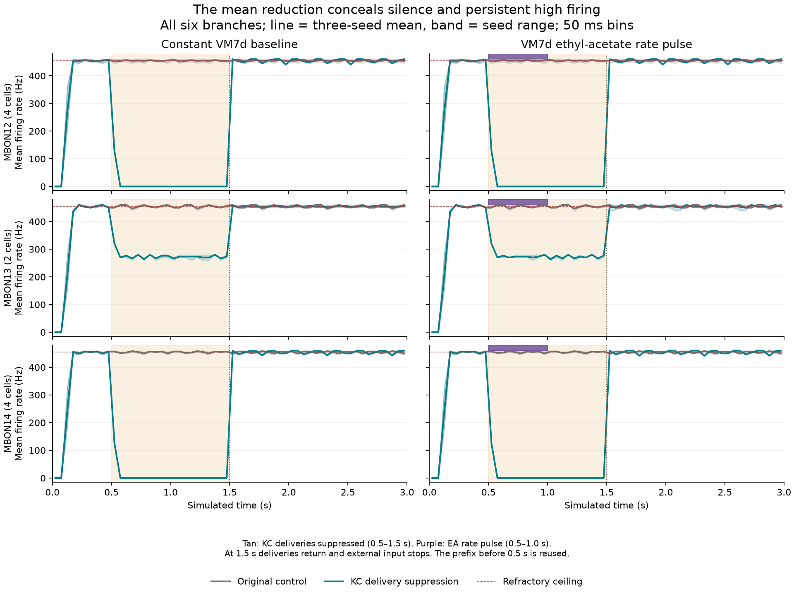

# KC delivery causes MBON saturation, but suppression does not restore physiology

Completed 2026-09-05. All six branches, independent delivery/state review, numerical references and combined outcome review passed. The completion heartbeat is paused. The [execution plan](navigation-mbon-intervention.md) remains an isolated diagnostic: H1 is not promoted, and no neural/body default changed.

Suppressing the selected KC→MBON deliveries has a large, reversible effect, with a different outcome in each MBON type. MBON12 and MBON14 stop firing after the initial transient. MBON13 continues firing at hundreds of spikes per second. The odor contrast remains negligible, and restoration brings the cells back to the refractory ceiling while the external input is off. This establishes a causal contribution of KC delivery to the model's saturation; it does not establish a physiological correction.

## Fixed experiment and scope

The six new branches use H1, seeds 11–13, and matched constant-baseline/ethyl-acetate conditions. Each restores the original full checkpoint at 0.5 s, including queued delayed spikes and the original random input stream. The prefix before 0.5 s is reused, not resimulated.

Only 8,236 selected positive KC→MBON12–14 edges are suppressed at delivery times in `[0.5,1.5)` s. Suppression does not clear accumulated synaptic state, remove queued source spikes, block other projections, or change inhibition. The EA input-rate pulse occupies `[0.5,1.0)` s, followed by baseline-rate washout to 1.5 s. At 1.5 s the selected deliveries resume and external input stops in both conditions. All 166,700 neurons continue to evolve through 3 s; no body runs.

The original six completed trials are the controls. This is a narrow VM7d rate assay, not a reconstruction of a broad ethyl-acetate sensory ensemble, concentration transduction, or natural navigation.

## Combined outcomes

All ranges below span the six completed runs. These are cell-type means except where explicitly called individual-cell rates.

| Readout | Original controls | KC-delivery suppression | Meaning |
|---|---:|---:|---|
| Ten-MBON mean rate, 0.5–1.0 s | 454.4 Hz | 65.2–66.2 Hz | Large mean reduction hides different cell-type failures |
| MBON12 mean rate, 1.0–1.5 s | Near 454.5 Hz | 0 Hz | All four cells become silent |
| MBON13 mean rate, 1.0–1.5 s | Near 454.5 Hz | 271–273 Hz | Both cells retain high firing; individual rates are 252–290 Hz |
| MBON14 mean rate, 1.0–1.5 s | Near 454.5 Hz | 0 Hz | All four cells become silent |
| Ten-MBON mean rate, restored/input-off windows | Near 454.5 Hz | 454.0–455.4 Hz | Saturation returns |

During the pulse, MBON12/14 means are 12–13 Hz, but this is a short residual-state transient, not a sustained physiological spontaneous state. Individual MBON13 pulse rates are 258–296 Hz. The [50 ms traces and synaptic-state overview](../validation/navigation-mbon-intervention-figure.png) show positive state `p` falling and recovering; `p` is not membrane voltage.

For seeds 11, 12 and 13 respectively, the intervention's EA-minus-constant pulse contrast averaged over the ten MBONs is **+0.2, 0, 0 Hz**. This corresponds to one additional spike in one MBON for seed 11, with no additional population spikes in the other seeds. The original controls have zero contrast. This does not provide robust odor-contrast recovery. In contrast, the VM7d PN population still distinguishes the imposed input: intervention pulse means are about 365–369 Hz under EA and 38–42 Hz under constant input.

Every within-cell MBON ISI in the original controls is 22 ticks after 0.5 s. In the intervention's 1.0–1.5 s interval, none of the remaining MBON13 intervals is exactly 22 ticks; MBON12/14 have no spikes and therefore no defined ISI fraction. After 2 s, all observed MBON intervals are again exactly 22 ticks. Short finite-window rates can slightly exceed the long-run 454.5 Hz ceiling through boundary counting; this does not mean a refractory violation.

Whole-network persistence is essentially unchanged. During 1.5–3 s, each intervention branch emits **3,245,147–3,250,366 spikes**, with paired changes from its control between **−0.158% and +0.171%**. The whole-population mean remains around 13 Hz, averaging many silent cells with a smaller active population; it is not a typical single-cell rate. DNg97 and DNp09 remain silent in every post-branch window. Scattered PFL3 spikes do not establish a directional code, and no motion was tested.

## Independent evidence

| Check | Result | Retained evidence |
|---|---|---|
| Complete batch | Six of six, no errors; 4,406.65 s wall time | `runs/20260905T185111580463Z-navigation-mbon-intervention/results.json` |
| Raw state/delivery review | 223,187 checks; exact MBON p/h histories, 36 full checkpoints, inputs, queues, and 15,523,537 suppressed deliveries | [Review](../validation/navigation-mbon-intervention-independent-review.json) |
| Numerical references | 44,998 distinct intervals across all 3,000 chunks; no missing samples, method errors, threshold ambiguities or decision disagreements | [Numerical results](../validation/navigation-mbon-intervention-numerics-results.json), [lossless rows](../validation/navigation-mbon-intervention-numerics-rows.jsonl.gz) |
| Outcome reduction | 51,151 checks; original/reviewer/raw counts and p/h agree | [Frozen analysis plan](../validation/navigation-mbon-intervention-analysis-plan.json), [results](../validation/navigation-mbon-intervention-analysis-results.json), [compact arrays](../validation/navigation-mbon-intervention-analysis-arrays.npz) |
| Independent outcome comparison | 1,933 checks plus 72 archive checks; per-cell/cohort counts, carried ISIs, bins and all paired contrasts agree | [Outcome review](../validation/navigation-mbon-intervention-analysis-independent-review.json) |

Numerical reference maxima are 7.816×10⁻¹⁴ mV for production versus adaptive quadrature, 2.132×10⁻¹⁴ mV for order 32 versus 64, and 7.248×10⁻¹³ mV for independent ODE versus quadrature, all within the frozen tolerances. This validates the retained reference intervals; it is not an independent integration of every neuron at every tick. The raw review separately covers the saved global bound/invariant counters. The recorded global minimum is −74.096627 mV; selected post-step MBON voltages range approximately −55.80 to −45.00005 mV. Original controls lack continuous MBON voltage, so no matched voltage comparison is claimed.

The [reducer source review](../validation/navigation-mbon-intervention-analysis-source-review.json) found and resolved a provenance-link guard before execution. All sources/inputs remained unchanged during the executed reductions. Both figure layouts were visually inspected. Runtime code and viewer behavior were not changed, so the existing runtime test suite was not rerun for this analysis-only milestone.

## Interpretation and next boundary

The intervention distinguishes input contribution from physiological sufficiency. KC deliveries sustain saturation in all three MBON types under this model, and continued network activity supplies drive again after restoration. Remaining inputs can maintain high MBON13 firing without the selected positive KC deliveries; these results alone do not identify which retained inputs are responsible or validate their transmitter-to-receptor mapping.

The lower ten-cell mean is therefore a misleading promotion criterion. It combines silence with persistent high firing, lacks repeatable odor contrast, and leaves global persistent activity intact. H1 fails the physiological and recurrent promotion gates despite passing this experiment's numerical checks.

The [source-reviewed calibration note](../research/20-kc-mbon-functional-calibration.md) supplies compatible constraints and preparation limits. Its Huang source workbooks reproduce the named MBON measurements, but female head-fixed broad-odor responses are not exact expected outputs of this male narrow-VM7d assay. Honegger's sparse fraction refers to reliable calcium responses, not any-spike recruitment, and cannot be installed as a universal 5% rule. The 3,957 audited presynaptic KCs are a selected anatomical subset, not an established denominator for every KC population.

Proceed with the [PN→KC/APL local calibration plan](pn-kc-apl-calibration-plan.md), beginning with a bounded read-only inventory and saved-input audit before a new local experiment. Keep the negative ORN→PN depression fit unpromoted. The cancelled Eon body integration, global E/I gain sweeps and motor-gain fitting remain outside this next step.
