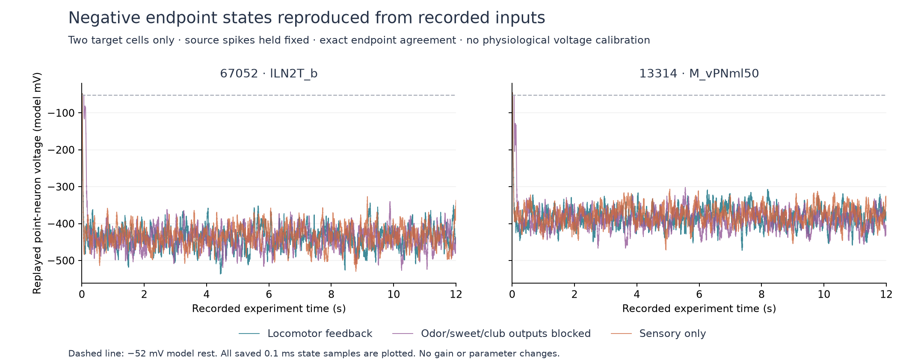

# Recorded-input replay of two negative-voltage cells

The two-cell replay reproduces **all six pairs of endpoint voltage and synaptic state bit-for-bit** across the three saved 12-second conditions. It also reproduces every recorded spike from the selected cells and their last-spike ticks. All **58 checks pass**. The negative values are consistent with the retained graph weights, source spike history, delay and source LIF equations; no correction or parameter change was needed to reconstruct them.

This is conditional numerical accounting. The replay neither regenerates source spike trains nor evaluates how the recurrent network would change after a perturbation. It does not establish biological causes, calibrated membrane potentials, or a natural behavioral response.

The [plan](../validation/negative-voltage-replay-plan.json) was frozen before replay, SHA-256 `5e474e043a4c302a4694ac7b0e87db0bfce6f9de1d4a4213ae484e27399914a1`. The [research script](../scripts/negative-voltage-replay.py) imports no `fruitfly` simulator and runs only two target-state recurrences. [Results](../validation/negative-voltage-replay-results.json) retain every check and the largest source-type contributions. No full graph or body was rerun. Earlier artifacts and all pinned inputs remain unchanged.

## Recorded evidence and exact replay

The input comes from the [completed full-neural rolling experiment](../validation/flybody-rolling-loop/results.json), original plan SHA `3e5ca3ca6c91bbd240ff2530d351fd010dc5001e19078e2270a95022449c2498`. Each condition retains a lossless ordered spike stream, 6,000 coupling-interval journal records, and the full final neural checkpoint. This replay verifies all framed spike blocks against journaled hashes, exact 0.1 ms event stamps, and 2 ms block boundaries. It reads 10,524,467, 10,441,248 and 10,523,447 recorded events respectively, retaining 1,162,471, 1,150,881 and 1,168,156 events from sources with a direct edge to either target. A source event can affect both targets.

Every actual ordered input list was checked: **neither target occurs in any list**, including zero-rate members. Their current drive is zero and refractory interval remains 22 neural ticks. Thus replay requires no reconstruction of unrecorded Poisson draws into these targets. Source output blocks are resolved from the declared sensory groups, recorded all-sensory-blocked flag and total blocked-cell count at every interval, then checked against the checkpoint mask. The blocked condition masks exactly 296 odor/sweet/club source neurons; motor readout mutes do not block neural transmission.

The source reset sets voltage to −52 mV, synaptic state to zero, and last-spike tick to `−2**60`. The initial journal corroborates zero elapsed neural activity and uniform −52 mV voltage, but does not independently serialize an initial full synaptic-state array; its zero initialization is grounded in the pinned reset source. The final checkpoint contains both full arrays.

At each neural tick, the replay follows the original order:

1. For targets outside their refractory interval, integrate voltage and decay synaptic state using the source's exact coefficients for membrane/synaptic time constants 20/5 ms. Both states remain frozen during refractory ticks.
2. Apply the strict `v > −45 mV` threshold; a newly firing target is unavailable for the remainder of the tick.
3. Deliver recorded presynaptic spikes after 18 ticks (1.8 ms), preserving source order. Skip blocked source outputs, reject delivery to unavailable targets, and add each accepted float32 edge weight to the target's float64 synaptic state.
4. Reset both voltage and synaptic state for targets that fired.

Targets' spikes are predicted from the replayed state and checked against the recording. Recorded source events, including any selected target's self/cross contribution, remain external replay inputs. No observed target spike is forced into its state. Relevant events still awaiting delayed delivery at 12 seconds also match the final checkpoint's pending ring in source order.

## Selected cells and endpoint agreement

The [incoming-edge inventory](../validation/negative-voltage-replay-incoming-edges.csv) retains all direct edges, including silent sources and zero model weights. Cell 67052 (`lLN2T_b`, acetylcholine annotation) has 2,260 incoming edges and 27,830 contacts. Cell 13314 (`M_vPNml50`, GABA annotation) has 435 edges and 7,247 contacts. A target's own transmitter does not determine its incoming edge signs: those follow each presynaptic neuron's declared transmitter-to-sign rule. Actual graph indices, neuron IDs, source types/classes, NT labels, contacts, float32 weights and weight bytes are retained.

| Condition | Cell | Final v (model mV) | Final g (effective mV) | Recorded and replayed spike stamps |
|---|---:|---:|---:|---|
| Locomotor feedback | 67052 | −445.293524 | −553.013172 | None |
| Locomotor feedback | 13314 | −376.277758 | −235.203665 | 14.0 ms |
| Sensory outputs blocked | 67052 | −453.451235 | −533.087815 | None |
| Sensory outputs blocked | 13314 | −429.309462 | −659.981517 | None |
| Sensory only | 67052 | −336.917743 | −0.951107 | None |
| Sensory only | 13314 | −333.662065 | −385.761001 | 11.7 ms |

Table entries are rounded for display; the comparisons use raw float64 bytes. Cell 67052 never spikes. Cell 13314 has one early spike in two conditions, with 8 or 6 subsequent incoming events rejected while the target is unavailable; no such rejection occurs in the blocked condition. The source-blocked condition excludes 4,251 potential deliveries to 67052 and 599 to 13314. Beyond-horizon counts are retained separately, not assigned to accepted or blocked transmission before delivery.



The [plotter](../scripts/negative-voltage-replay-plot.py) reads saved arrays only; its [receipt](../validation/negative-voltage-replay-plot-receipt.json) records input/output hashes. All 0.1 ms state samples are plotted. These axes are source-model units, not a physiological membrane-voltage calibration.

The replay reconstructs a minimum of −536.7385 mV for cell 67052 in the feedback condition. That is a target-state reconstruction on the 0.1 ms grid. It is distinct from the original full-network extrema recorded only every 2 ms, whose lowest retained value was −532.5811 mV; the replay does not create a newly observed full-network state.

## Accepted signed input balance

An accepted increment is a jump in the synaptic effective-voltage state. Its cumulative sum over 12 seconds is neither instantaneous voltage nor integrated electrical charge: each event is subsequently filtered by decay, membrane integration, and possible reset. Positive and negative events are retained separately; zero-weight events count as accepted updates with zero magnitude.

| Condition | Cell | Accepted positive events | Accepted negative events | Accepted zero-weight events | Positive jump sum (×10⁶ model mV) | Negative jump sum (×10⁶ model mV) |
|---|---:|---:|---:|---:|---:|---:|
| Locomotor feedback | 67052 | 431,332 | 142,561 | 59,036 | 1.997003 | −2.925399 |
| Locomotor feedback | 13314 | 420,565 | 143,648 | 28,370 | 2.032329 | −2.829411 |
| Sensory outputs blocked | 67052 | 422,691 | 141,092 | 58,311 | 1.965372 | −2.892533 |
| Sensory outputs blocked | 13314 | 416,023 | 142,301 | 28,084 | 2.002807 | −2.808785 |
| Sensory only | 67052 | 435,619 | 142,684 | 59,067 | 2.009852 | −2.929506 |
| Sensory only | 13314 | 422,041 | 143,916 | 28,493 | 2.044956 | −2.828564 |

Accepted inhibitory events are less numerous but have larger cumulative magnitude. Counts alone therefore do not describe the balance. The [feedback](../validation/negative-voltage-replay-locomotor_feedback-edge-balance.csv), [blocked](../validation/negative-voltage-replay-locomotor_sensory_block-edge-balance.csv), and [sensory-only](../validation/negative-voltage-replay-sensory_only-edge-balance.csv) tables include every edge's classification and signed sums, including the last 100 ms and last second.

Across all conditions, the largest inhibitory source types for 67052 are GABA `lLN2F_b` and `il3LN6`; those for 13314 are GABA `lLN2P_a` and `lLN2P_b`. In sensory-only, the first pair contributes 83.17% of accepted negative increment magnitude to 67052; the second pair contributes 92.93% to 13314. This ranking describes the saved event history, not a silencing experiment.

The four strongest-type source cells onto 67052 in sensory-only are explicit:

| Source ID | Type | Contacts | Signed edge weight (effective mV) | Accepted source events |
|---:|---|---:|---:|---:|
| 10169 | lLN2F_b | 606 | −166.650009 | 3,779 |
| 10515 | lLN2F_b | 633 | −174.074997 | 3,662 |
| 10473 | il3LN6 | 397 | −109.175003 | 3,613 |
| 523591 | il3LN6 | 767 | −210.925003 | 3,673 |

Type/NT/sign aggregates, including substantial acetylcholine excitation, are retained for [feedback](../validation/negative-voltage-replay-locomotor_feedback-type-balance.csv), [blocked](../validation/negative-voltage-replay-locomotor_sensory_block-type-balance.csv), and [sensory-only](../validation/negative-voltage-replay-sensory_only-type-balance.csv). Unassigned source types remain labeled instead of being dropped.

## Contributions remaining at the endpoint

An additional calculation attributes the endpoint to accepted input events under the fixed recorded history. Events before a target's last reset contribute zero. For a retained accepted jump `w` at delivery tick `d`, there are `n = 119999 − d` subsequent integration steps. Its contributions are

\[
g_{end}=w e^{-n\Delta t/\tau_s},\quad
(v-v_{rest})_{end}=w\frac{\tau_s}{\tau_m-\tau_s}
\left(e^{-n\Delta t/\tau_m}-e^{-n\Delta t/\tau_s}\right).
\]

No accepted event occurs inside the final refractory interval and no later reset exists, which makes this expression valid for these retained endpoint contributions. The independently accumulated totals agree with replayed `v−rest` and `g` to at most `1.31e−12` model mV; the exact replay itself has zero endpoint error.

| Condition | Cell | Positive contribution to v−rest (model mV) | Negative contribution to v−rest (model mV) | Net offset from −52 mV |
|---|---:|---:|---:|---:|
| Locomotor feedback | 67052 | 836.439310 | −1229.732834 | −393.293524 |
| Locomotor feedback | 13314 | 844.037336 | −1168.315094 | −324.277758 |
| Sensory outputs blocked | 67052 | 828.744066 | −1230.195301 | −401.451235 |
| Sensory outputs blocked | 13314 | 841.111693 | −1218.421156 | −377.309462 |
| Sensory only | 67052 | 876.535154 | −1161.452897 | −284.917743 |
| Sensory only | 13314 | 865.349320 | −1147.011385 | −281.662065 |

This decomposition shows why a near-zero final `g` need not imply a near-rest voltage: the 20 ms membrane state retains earlier filtered input even when the 5 ms synaptic state has changed. It also shows that removing an inhibitory source would not simply add its tabulated contribution to the observed voltage: such a change could alter spikes, resets and the recurrent source history, none of which is recomputed here.

The source equations add signed current-like state independently of membrane voltage and contain no inhibitory reversal potential. With the retained weights and spike history, accepted negative increments can therefore sustain these large negative model values. This mathematical observation does not validate those values as fly electrophysiology or identify which additional biophysical mechanism should be introduced. The audit supplies reproducible quantities for a separately specified model comparison, with no gain recommendation.

Reproduction uses every pinned source/data file hash and the preserved recordings. The plan's `git_head` is the pre-experiment base; the newly written replay script is identified by its own exact hash and was committed afterward:

```sh
.venv/bin/python scripts/negative-voltage-replay.py --prepare
.venv/bin/python scripts/negative-voltage-replay.py --run
.venv/bin/python scripts/negative-voltage-replay-plot.py
```

Use a clean checkout without these generated receipts; commands refuse to overwrite them. Each condition's NPZ contains full target trajectories, per-tick signed increments, recorded relevant source indices/ticks, and every accepted delivery tick/edge-row index, sufficient for independent reconstruction. This author wrote the producer and its internal checks; separate review can provide additional implementation assurance. No mismatch occurred in this execution; an unexpected input-proof exception would be retained separately rather than silently repaired.
