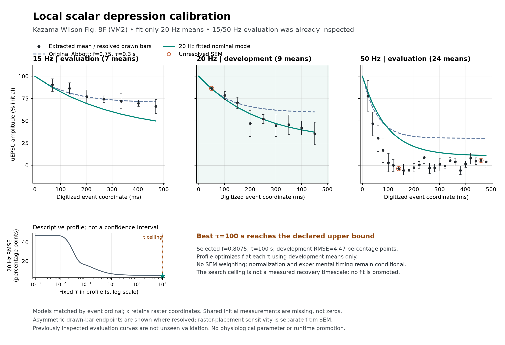

# Local depression calibration: recovery-bound and transfer limits

Fitting the nine resolved 20 Hz means improves that development curve, but the constrained optimum reaches the **100 s engineering search ceiling**. A separately frozen [boundary check](orn-pn-depression-shape-boundary.md) finds a compatible recovery time of **103.865 s**, improving development RMSE by only **0.00306 percentage points**. Both fits worsen the 15 Hz evaluation and still retain too much of the 50 Hz response. These conditional parameters do not establish physiological recovery kinetics and are not suitable for runtime promotion.

This is a standalone calibration of the scalar efficacy model, not a full neural-network or body experiment. The [frozen plan](../validation/orn-pn-depression-calibration-plan.json) preserves the same fully recovered initial state, 28 baseline events at 7 Hz, declared baseline-to-test gap, and first-test-event normalization as the [fixed reference](synaptic-depression-reference.md). Only the nine noninitial 20 Hz means enter the objective. The 15/50 Hz curves were already inspected and are evaluation-only for this fit; they are not unseen biological validation.

## First bounded execution

The model emits pre-event efficacy, multiplies it by `f` after each event, and recovers exponentially toward one between events. It fits `f∈[0,1]` and `τ∈[0.001,100] s`, optimizing `(f, ln τ)` without fitting gain, initial state, phase or experimental uncertainty. These finite bounds are numerical search choices, not physiological priors. Exact finite baseline history is retained instead of replacing four seconds of stimulation by steady state.

An independent imperative event recurrence agrees with the closed form in 270 boundary/interior/rate/positive-gap cases before plan creation, with maximum normalized/absolute difference `6.02e−12`. Nominal curves remain positive, monotone and discretely convex; negative or rebounding figure means are retained as observations rather than forced into those mathematical constraints.

The 30 deterministic optimizer starts all terminate successfully. Twenty-five reach the same best development SSE within `1e−6`; the five starting at very short recovery converge to the nearly flat null. Their different outcomes remain in the result. A 121-point logarithmic recovery profile independently minimizes `f` with a 201-point grid and local refinements, including endpoint-adjacent intervals. It finds no lower development objective than the selected constrained fit. This is numerical search coverage, not a proof of a unique global physiological solution.

| Quantity | Constrained result |
| --- | ---: |
| Per-event retention `f` | 0.8074986873 |
| Recovery `τ` | 100 s, at upper search bound |
| First-test model efficacy | 0.0097671019 |
| Effective 20 Hz normalized floor | 0.2653092055 |
| Effective 20 Hz per-event decay | 0.8070950389 |
| Development SSE | 179.5027164 percentage-points² |

The implied initial efficacy is a model quantity on an arbitrary fully recovered scale. The figure's percent-initial amplitudes do not measure that absolute efficacy. Transferring the fitted multiplier into a graph would therefore introduce an uncalibrated strength change even if the normalized response were satisfactory.

## Evaluation with parameters held fixed

| Rate and role | Fixed-reference RMSE | Constrained fitted RMSE | Last fitted amplitude | Last extracted mean |
| --- | ---: | ---: | ---: | ---: |
| 15 Hz, evaluation | 3.01 | 12.17 | 49.75% | 66.24% |
| 20 Hz, development | 14.76 | 4.47 | 37.21% | 35.53% |
| 50 Hz, evaluation | 30.60 | 21.20 | 11.15% | 4.06% |

RMSE is unweighted percentage points of initial amplitude. Last events retain their source-specific ordinals, not a common 500 ms endpoint. Resolved SEM and raster-placement uncertainty remain distinct; the data share cells and normalization, and no confidence intervals or significance claims are made.

The sampled recovery profile stays within one percentage point of the best RMSE from about 2.61 s through the imposed 100 s ceiling. This is a declared numerical-resolution diagnostic, not a confidence interval. The local Jacobian singular values in coordinates `(f, ln τ)` are 111.95 and 12.82; these describe local numerical sensitivity, not biological parameter certainty.

A separately declared infinite-recovery limit, fitted to the same development points only, gives `f≈0.88153` and RMSE 5.34 percentage points. For fixed positive `f`, finite 28-event conditioning yields first-test efficacy approaching `f^28`, and the normalized train approaches `f^n`. The exact `f=0`/infinite-recovery corner has different limiting behavior. This limit is recorded as a diagnostic, not selected as a synapse model.

The completed development-only [shape-boundary check](orn-pn-depression-shape-boundary.md) fits `b+(1−b)q^n`, then maps the selected shape back through the same finite conditioning schedule. It detects one compatible inverse with `f=0.8082894819`, `τ=103.8653912 s` and first-test efficacy `0.0095944309`. Development RMSE is 4.46290 percentage points; fixed-parameter evaluation RMSE is 12.38813 at 15 Hz and 21.17165 at 50 Hz. The small improvement resolves the search-ceiling concern without resolving cross-frequency transfer. Finite search coverage does not prove global optimality or inverse uniqueness. The original bounded fit and its evaluation are retained without amendment.

This figure shows the original 100 s constrained fit. The separate boundary result above was not substituted into its saved curves.

## Phase and biological transfer

With the fitted parameters held fixed, positive baseline-to-test gaps of 1/140, 1/28, 1/14, 3/28 and 1/7 s keep 28 baseline events within the four-second episode. These are hypothetical schedule choices; none is inferred from the raster. Across those scenarios, RMSE ranges from 8.97–12.17 at 15 Hz, 4.47–5.31 at 20 Hz and 21.20–22.35 at 50 Hz. No phase is fitted or selected using an evaluation curve.

A normalized regular train has shape `b+(1−b)q^n`. Thus the data primarily constrain an effective floor and decay. Mapping them to retention/recovery depends on finite conditioning history and phase. Adding an unknown phase would add a third unknown to those two shape quantities; normalization/pooling in the primary paper also remains unresolved. The present two-parameter point is conditional on the chosen preparation model.

The [conditioning-history source check](orn-pn-depression-conditioning-history.md) establishes the disconnected antennal preparation and four-second 7 Hz train, but finds no Fig. 8-specific complete-recovery criterion or inter-train interval. The supplement's 30 s interval describes individual uEPSC collection and cannot be reassigned to these conditioning/test trains. Thus the fully recovered starting state is an additional unresolved assumption, especially consequential for the approximately 104 s fitted recovery time.

The target is female VM2 unitary-current amplitude, not male VM7d spikes, whole-cell voltage, presynaptic inhibition, release probability or navigation. The separate S8 recovery protocols cannot be used as an exact quantitative check until their history/normalization support a compatible comparison. No learned value enters `fruitfly/neural.py`, the sensory encoder, decoder or body.

## Artifacts

The [calibration source](../scripts/calibrate_orn_pn_depression.py), [results](../validation/orn-pn-depression-calibration-results.json), [predictions](../validation/orn-pn-depression-calibration-predictions.csv), [recovery profile](../validation/orn-pn-depression-calibration-profile.csv) and [arrays](../validation/orn-pn-depression-calibration-arrays.npz) retain every optimizer outcome and the fixed evaluation/phase scenarios. Source and runtime hashes were unchanged across the first successful execution.

The [independent calibration review](../validation/orn-pn-depression-calibration-independent-review.json) passes 689 checks, including a separate 60-digit event recurrence and saved profile/objective verification. The [independent boundary review](../validation/orn-pn-depression-shape-boundary-independent-review.json) passes 274 checks, verifying all saved profile/inverse points and mapped predictions without rerunning fitting or root search. These checks establish numerical consistency, not physiological acceptance.

The [plot receipt](../validation/orn-pn-depression-calibration-plot-receipt.json) preserves a post-write path-joining error and the subsequent independent hash verification. The first figure was retained without regeneration; no fit or prediction changed.

## Next causal measurement

Retain this as a negative calibration result. Further parameter fitting requires compatible absolute-amplitude and recovery-history constraints, rather than selection against the already inspected evaluation curves. In parallel, advance the navigation ladder through the [presynaptic-input audit](navigation-ladder-mbon-input-plan.md) for saturated MBON12–14 in the existing matched H1 trials. Cognate PNs stop after odor withdrawal while MBON outputs remain active; that observation motivates an input inventory, but does not identify the sustaining mechanism. Reconstruct the conditional synaptic states from exact saved events and require checkpoint agreement before proposing a bounded intervention. Continuous MBON voltage was not recorded, and nominal input weights alone must not be described as causal voltage contributions.
