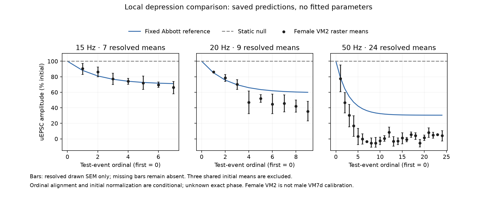

# Local VM2 depression: conditional comparison with a fixed reference

The saved scalar depression reference follows the extracted 15 Hz response fairly closely, but retains substantially more amplitude than the drawing at 20 and 50 Hz. It improves on a static-amplitude null in all three descriptive comparisons. **This supports testing local temporal transfer; it does not validate the reference parameters for a fly or show that adding depression will repair navigation.**

The [Fig. 8F extraction](orn-pn-depression-digitization.md) supplies 40 noninitial mean estimates from female VM2 PNs in Kazama & Wilson (2008). A 7 Hz, four-second baseline precedes the 500 ms test. The three shared initial means remain unresolved, and six individual SEM spans remain missing. The comparison reads [predictions saved before this extraction](synaptic-depression-reference.md): Abbott's rat-cortex reference has per-event retention `f=0.75` and recovery `τ=0.3 s`. No parameter, absolute gain or initial state was fitted here, and no neural/synapse simulation was rerun.

## Matching and uncertainty

The [comparison plan](../validation/orn-pn-depression-comparison-plan.json) was frozen after independent extraction review and before computing residuals. Frequency and test-event ordinal align 8/10/25 source rows with the saved 15/20/50 Hz predictions. Excluding each unresolved initial point leaves 7/9/24 estimates. Source times remain unsnapped in the row table; there is no inferred experimental pulse phase.

Normalization is conditional. The paper labels the ordinate “% initial” without specifying the complete per-cell/per-trial denominator and pooling operation. The reference divides each train by its first test-event efficacy after a declared baseline/event phase. The apparent match at test onset does not recover the experimental operation. The results below are consequently a normalized-shape comparison under that alignment, not a goodness-of-fit test of an exact experimental reproduction.

| Test frequency | Compared means | Fixed reference RMSE | Static null RMSE | Fixed reference mean signed error |
| --- | ---: | ---: | ---: | ---: |
| 15 Hz | 7 | 3.01 | 24.79 | −0.09 |
| 20 Hz | 9 | 14.76 | 47.34 | +11.23 |
| 50 Hz | 24 | 30.60 | 93.99 | +29.41 |

Errors are **percentage points of initial amplitude**, with residual = prediction minus extracted mean. Metrics are unweighted and reported separately by frequency. The source points share six cells and normalization; they are not independent biological samples. No p-values, SEM-based weights, pooled significance or confidence intervals are computed.

At the last plotted event, the drawing gives approximately 66.24%, 35.53% and 4.06% at 15/20/50 Hz respectively; the fixed reference gives 71.17%, 59.96% and 30.49%. These events occur near 469.58, 450.57 and 480.04 ms in the source, not at a common 500 ms endpoint. Negative near-zero graphical means at 50 Hz are retained as drawn, not clipped or interpreted as negative conductance.

Drawn error endpoints are preserved asymmetrically around the extracted marker centers. Missing bars remain absent. The separate conservative Cartesian envelopes for reference RMSE are 2.12–4.05, 13.72–15.82 and 29.37–31.84 percentage points. These cover pointwise declared raster-placement intervals; shared calibration anchors couple points, so the extrema need not correspond to an attainable joint axis calibration. They are neither biological confidence intervals nor certified total extraction-error bounds.

## What this changes

The fixed rat reference's frequency-dependent residual is a useful local target. A later bounded calibration can use the previously designated 20 Hz development curve, then report 15/50 Hz evaluation without refitting those curves. Those figures have already been inspected: the split is prospective for fitting, not unseen validation. Exact normalization, baseline/test phase and parameter identifiability must remain explicit. Figure 9 charge and S8 recovery provide separate later constraints once their protocols support a compatible comparison.

This result does not reject all scalar depression models, identify release probability, or calibrate a presynaptic inhibitory mechanism. It also does not supply a male VM7d transfer function: sex, glomerulus, preparation and measured quantity differ from the [H1 spike diagnostic](navigation-ladder-timing.md). Keep the local model outside the full network until it reproduces declared local observables and its transfer assumptions are tested. Neither H1 nor any new depression parameter is promoted.

## Reproducible artifacts

[The comparison script](../scripts/compare_orn_pn_depression.py) reads the frozen observation/prediction files, preserving all 43 rows in [the output table](../validation/orn-pn-depression-comparison-rows.csv). [Results](../validation/orn-pn-depression-comparison-results.json) retain per-frequency residual summaries and source/output hashes. The extraction passed 177 checks and its independent raster/data review passed 1,887 checks. A [separate comparison review](../validation/orn-pn-depression-comparison-independent-review.json) passes 358 checks, matching all rows and scalar-recomputing the residual summaries/envelopes within 1e−12 percentage points. The comparison figure was visually inspected after execution.

The source observations are approximate figure summaries, not newly recorded physiology. The new contribution here is a reproducible model-data comparison and a narrower next calibration target; no biological discovery is claimed.

The subsequent [development-only calibration](orn-pn-depression-calibration.md) and [recovery-ceiling check](orn-pn-depression-shape-boundary.md) are complete. Fitting 20 Hz under the declared finite history gives a conditional recovery time near 104 s but does not resolve the 15/50 Hz discrepancies. The original fixed comparison remains unchanged, and no parameter is promoted into the neural simulation.
