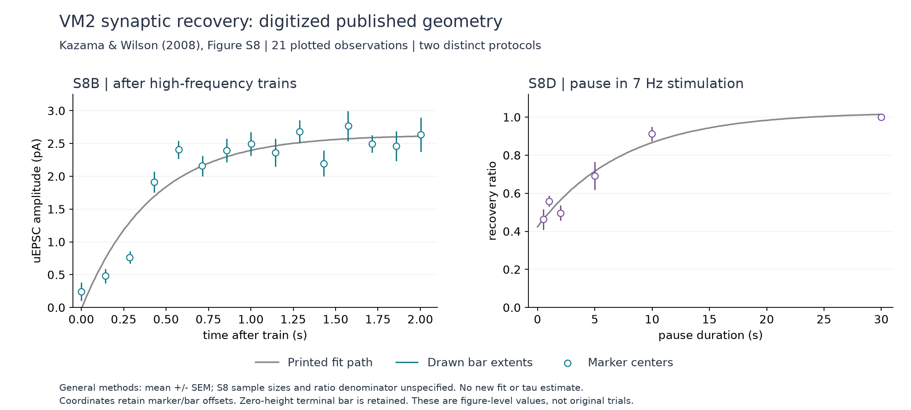

# Figure S8 recovery data extracted from PDF vectors

The extraction retains **21 plotted observations** from Kazama and Wilson (2008) Supplement Figure S8: 15 in panel B and 6 in panel D. Each observation includes its marker center, vertical error-bar endpoints, their small positional differences, and source object indices. It also retains all **400 vertices** of the two printed fit paths, 200 per panel. **137 extraction checks pass.** No biological curve was fitted, no time constant was estimated, and no neural model was run.

These are values derived from a published graph, not original cell or trial data. The [point table](../validation/orn-pn-recovery-points.csv), [printed-fit table](../validation/orn-pn-recovery-printed-fit.csv), [axis calibration table](../validation/orn-pn-recovery-calibration.csv), [original selected vector geometry](../validation/orn-pn-recovery-geometry.json), and [results receipt](../validation/orn-pn-recovery-results.json) are retained separately. The [plot](../validation/orn-pn-recovery-digitization.png) is drawn from those tables and embeds no original paper image. Its [receipt](../validation/orn-pn-recovery-plot-receipt.json) pins its inputs and output. The plot was visually inspected against Figure S8; labels, curves, marker positions, and bars agree at the displayed scale.



The [extraction plan](../validation/orn-pn-recovery-plan.json) was frozen after inspecting the source and before computing observation values, SHA-256 `ee55fbcd9a4c1ceab5ad22de237dca40eec3ae452656980fdeb46c389d92ea09`. It pins the [script](../scripts/extract_orn_pn_recovery.py), both source PDFs, parser versions, and selected raw geometry. The supplement's SHA-256 is `b2903a4914cff0f556fa643e7aed111d74722ba840093b3a0ac6d81ccd07132a`; the main paper's is `fb1d77bef1a95ca5274e57eeb7aae3be45f4d80dc972b40718fc62d4da2ddbe6`. Both match the existing source files.

The source page is supplement PDF index 13 (page 14), measuring 612 by 792 PDF points. `pdfplumber 0.11.9` with `pdfminer 20251230` finds 163 curve objects and 1,325 text characters. The retained geometry uses x measured from the left and `top` measured downward from the top, in PDF points. The extraction saves unmodified parser coordinates and full path/control-point arrays; its precision is the precision of this PDF representation, not experimental precision.

| Panel | Labeled x-tick curve indices | Labeled y-tick curve indices | Marker fill indices | Error-bar indices | Printed fit |
|---|---|---|---|---|---|
| S8B | 117, 116, 114: 0, 1, 2 s | 113, 112, 111, 109: 0, 1, 2, 3 pA | 133, 135, ..., 161 | 132, 131, ..., 118 | Curve 1, 200 vertices |
| S8D | 86, 85, 84, 82: 0, 10, 20, 30 s | 81, 80, 78: 0, 0.5, 1 | 93, 95, ..., 103 | 92, 91, ..., 87 | Curve 0, 200 vertices |

Each circular marker has a fill object followed by an identical stroke path. The pair is one observation; the stroke duplicate is not counted as another data point. Marker centers are the midpoints of their bounding boxes. Each assigned error bar must be the unique nearest vertical path in x, within 0.2 PDF points, and its midpoint must also lie within 0.2 points of the marker center. Observed maximum marker/bar offsets are 0.06446 points horizontally and 0.06787 points vertically in B, and 0.055665 / 0.083495 points in D. The table preserves the offsets in both PDF and axis units.

Coordinates are converted by the straight line through the first and last labeled ticks on each axis. Intermediate ticks provide calibration residuals; they are not used to fit a new mapping. Maximum absolute residuals are:

| Panel / axis | Residual in PDF points | Residual in axis units |
|---|---:|---:|
| B / time | 0.047355 | 0.00083737 s |
| B / amplitude | 0.0323867 | 0.00112579 pA |
| D / pause | 0.0345033 | 0.00996224 s |
| D / ratio | 0.000485 | 0.00000499 |

For D, the actual zero-ratio tick is at `top = 567.38281` points. The horizontal baseline lies at `570.98242`, corresponding to approximately **-0.037033** under that calibration. Substituting the baseline for the labeled zero would change all derived ratios. The extraction uses the labeled ticks and retains the baseline as a diagnostic. B's baseline and zero tick coincide.

No time value was rounded to a presumed nominal stimulus time. For example, the first and last B marker centers map to 0.0002762 and 2.0016749 seconds. D's centers are shown below, rounded only for this display; the CSV preserves the full values.

| D marker time (s) | Recovery ratio | Drawn lower endpoint | Drawn upper endpoint |
|---:|---:|---:|---:|
| 0.507819 | 0.462791 | 0.407403 | 0.516462 |
| 1.006899 | 0.558599 | 0.529794 | 0.587403 |
| 2.004773 | 0.496373 | 0.455718 | 0.538023 |
| 4.998403 | 0.691931 | 0.617283 | 0.765435 |
| 9.987781 | 0.913170 | 0.874484 | 0.950619 |
| 30.000141 | 1.000080 | 1.000000 | 1.000000 |

The terminal D error path has exactly zero height, while its marker center is approximately 0.0000804 above that path in ratio units. Consequently its stored `upper_extent_from_marker` is slightly negative. This is a drawing offset, retained rather than clipped or symmetrized. A zero-height drawn path does not establish zero sampling uncertainty or prove which measurement was used as the normalization denominator. The plot draws bars at their own x coordinates and endpoints, separately from marker centers.

All printed fit segments are represented as cubic paths whose first control point equals the preceding endpoint and whose second control equals the final endpoint. Their geometric loci are straight segments, so exporting the ordered endpoints preserves the complete printed path. The caption calls these exponential fits, but this extraction neither refits nor recovers their parameter sets. The 400 curve vertices are rendering coordinates, not 400 biological observations. D's printed curve rises slightly above ratio one, and neither it nor its final marker was forced to one.

The supplement's S8 caption and its full experimental-method pages (PDF indices 1-4), together with the main paper's methods (index 10), establish the context and gaps:

- Recordings are from VM2 PNs. The main study used adult female flies aged 2-7 days, somatic whole-cell recordings, and minimal antennal-nerve stimulation to recruit a single presynaptic ORN axon. This is not a measurement from the male connectome or a calibration of point-neuron model voltage.
- B reports absolute uEPSC amplitude after 50-200 Hz trains. S8A illustrates a 200 Hz, 500 ms train and repeated subsequent probes, but the caption does not establish that every B condition used that duration, nor specify the exact probe frequency or pooling across train frequencies. The extraction does not infer those quantities from apparent marker spacing.
- D concerns a pause between periods of 7 Hz stimulation. Its caption reports a 7.5 s fitted recovery time constant. That value is a source statement for this protocol, not a newly inferred parameter; B has no printed fitted constant. Exact pre-pause conditioning duration and the recovery-ratio denominator are not specified in the inspected caption/methods.
- The main paper's general Data Analysis convention is mean +/- SEM across experiments. S8 does not state a separate error-bar definition, sample size, per-point n, trial identities, or covariance. The tables label the general-methods basis and leave sample sizes empty. Counts of plotted markers are not counts of independent experiments. The general low-frequency collection counts elsewhere in the supplement must not be assigned to these panels.

The CSV also includes marker/error stroke half-widths expressed in axis units as graphical sensitivity quantities. These and the tick residuals describe the drawing, not biological confidence intervals or a validated digitization-error bound. They should not be added to the published error bars or used to invent a raw-data likelihood. Preserve the two protocols, missing normalization information, and dependence among plotted summaries in any later comparison. No pooling or recovery-time inference is part of this extraction.

Reproduction uses two existing interpreters because the bundled Python has `pdfplumber`, while the project environment has `matplotlib`:

```sh
/Users/bernardo/.cache/codex-runtimes/codex-primary-runtime/dependencies/python/bin/python3 scripts/extract_orn_pn_recovery.py --prepare
/Users/bernardo/.cache/codex-runtimes/codex-primary-runtime/dependencies/python/bin/python3 scripts/extract_orn_pn_recovery.py --extract
.venv/bin/python scripts/extract_orn_pn_recovery.py --plot
```

Use a clean checkout without the generated extraction receipts; each mode refuses to overwrite its outputs. The checks include source/parser/script/geometry hashes, marker deduplication, bar pairing, calibration residuals, coordinate reprojection, path completeness, monotonic time order, and exact CSV scalar round-trips. No runtime, model, bibliography, or shared research index was changed by this task.
