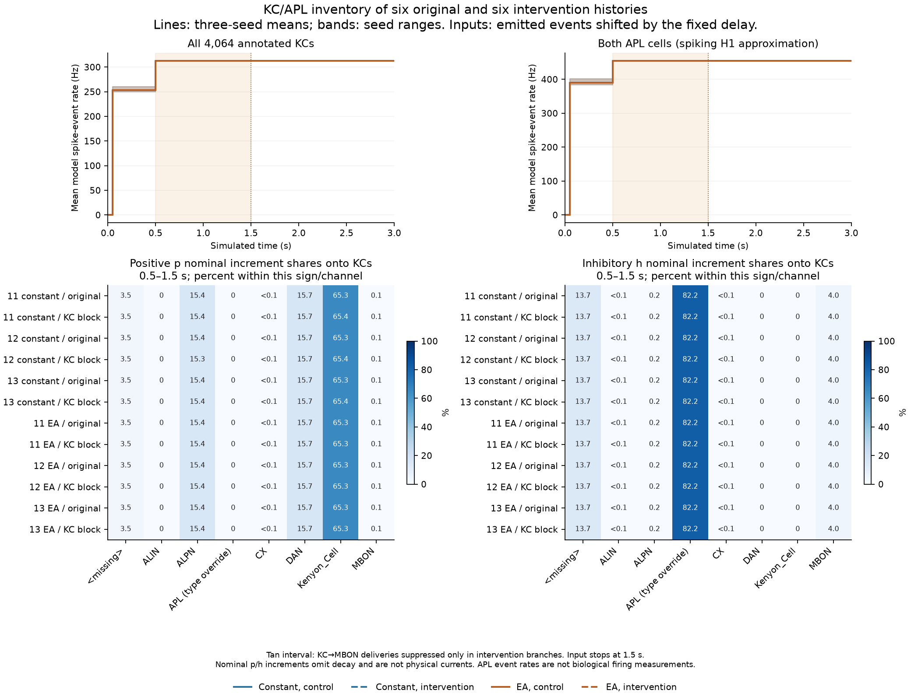

# Dense KC recurrence and an uncalibrated APL approximation

Completed 2026-09-05. The bounded [inventory plan](../validation/pn-kc-apl-inventory-plan.json) reduced all six original H1 histories and all six KC→MBON intervention histories together. An [independent review](../validation/pn-kc-apl-inventory-independent-review.json) passes 492,343 checks. No model was run or fitted, and no defaults changed.

Almost the entire annotated KC population remains active at about 313 Hz. The previously studied MBON-presynaptic subset did not create that conclusion through selection: the 107 excluded KCs also fire at about 307 Hz. In the current model, KC sources supply about 65.3% of positive increments onto KCs, and generic fast positive dopamine-class inputs supply about as much as ALPNs. APL supplies most inhibitory increments, but its H1 representation emits events near the spiking ceiling. These findings make PN-only gain fitting an incomplete calibration strategy; they do not identify a unique causal repair.

## Population and structural scope

The [identity review](../validation/pn-kc-apl-identity-review.json) verifies the raw/processed annotations, graph IDs and exact selectors. `class == "Kenyon_Cell"` gives **4,064 KCs**; `type == "APL"` gives **two APL cells**. KC `subclass` is missing, so subdivisions use the 15 observed primary type strings. KC/APL/ALPN `rootSide` is missing; reported soma sides are not inferred projection laterality. APL has a missing class annotation and is separated by an explicit type override only in the derived source grouping.

The prior **3,957 KC→MBON12–14 presynaptic cells** and the **107-cell complement** remain separate groups. All **686 ALPNs** are retained as an anatomical population; **314** contact KCs and **344** contact the KC/APL target union. A type-name regex would lose valid ALPNs. The 252 visual-projection neurons with KC contacts are a separate group, and none of the 27 annotated SEZPNs has a direct KC contact in this retained graph.

All **836,650 directed pairs / 2,316,256 contacts** onto the 4,066 KC/APL targets are retained, including inputs outside the named circuit. Counts below restrict the postsynaptic population to KCs:

| Source population | Directed pairs onto KCs | Contacts onto KCs | Per-KC distinct-source count, median [range] |
|---|---:|---:|---:|
| ALPN | 22,586 | 390,928 | 6 [0–39] |
| KC | 642,933 | 1,153,845 | 149 [5–516] |
| APL | 4,633 | 196,200 | 1 [0–2] |
| All sources | 830,465 | 2,082,231 | See retained per-cell inventory |

There are 252 KCs with no retained ALPN input and one with no APL input. These counts do not establish which cells are olfactory or visual without the recorded type/connection identities. A directed source pair is not a claw, and a synaptic contact is not a unitary physiological event. The [cell table](../validation/pn-kc-apl-inventory-cells.csv) and [arrays](../validation/pn-kc-apl-inventory-arrays.npz) retain identities and per-cell counts.

## Complete-batch activity

From 0.5 s onward, full-KC mean rates range **312.840–313.040 Hz in controls** and **312.520–313.027 Hz in intervention branches**. Each half-second window has **4,063 or 4,064 active KCs**. Both APL model cells remain active at a mean of 454–455 Hz in every post-branch window, with identical coarse counts between each original/intervention pair. Finite-window counts can slightly exceed the long-run 454.5 Hz ceiling without violating the 22-tick refractory interval.

The matched KC pulse EA-minus-constant mean differences for seeds 11, 12 and 13 are −0.0659, −0.0404 and −0.0123 Hz in controls, and +0.0389, +0.0369 and +0.0541 Hz after KC→MBON suppression. These small differences sit on a roughly 313 Hz background. They do not establish useful odor coding, sparse recruitment or biological response amplitudes.

Nearly all KCs also exceed their earlier 0.05–0.5 s mean during the pulse in both conditions. This reflects the startup-to-sustained change and illustrates why a positive pulse-minus-baseline rate difference alone cannot be called odor recruitment. The exact matched condition contrasts, spike counts and source histories are retained; they do not implement the repeated-trial calcium criterion in the literature.

## Nominal input accounting

For each source and window `[L,H)`, delayed-event counts are computed as emitted counts in that window plus events still pending at L minus events still pending at H. The producer obtains those boundary tails from exact saved spikes during the preceding 18 ticks. The reviewer independently obtains them from full checkpoint queues. This avoids a new network run and correctly handles the delivery-window boundaries.

The table reports shares of summed nominal increments over 0.5–1.5 s onto all KCs, spanning all twelve histories. Positive `p` and inhibitory `h` are separate model channels and are never subtracted or compared as the same physical unit. These sums omit decay and do not reconstruct continuous voltage or physiological currents.

| Source grouping | Positive `p` share | Inhibitory `h` share |
|---|---:|---:|
| KC | 65.269–65.363% | 0% |
| DAN | 15.692–15.742% | 0% |
| ALPN | 15.350–15.412% | 0.153% |
| APL, explicit type selection | 0% | 82.178–82.202% |
| Missing class, excluding APL | 3.487–3.496% | 13.680–13.706% |
| MBON | 0.055–0.132% | 3.961–3.962% |

The smaller CX/ALIN contributions and transmitter-resolved totals remain in the [results](../validation/pn-kc-apl-inventory-results.json). Every selected incoming edge is disjoint from the KC→MBON suppression mask; all saved source-block masks are false. Thus the inventory captures the changed recurrent histories without directly suppressing KC/APL inputs. It does not establish the correctness of fast dopamine excitation, global APL release, or any other receptor assumption.

## Validation and limits

The producer passes 2,634 checks and completes in 7.69 s. The independent reader checks 96 full boundary archives, the original CSR/metadata, all twelve final count arrays, all saved target boundary v/p/h values, pending-derived tails, nominal input/sign/contact sums and matched contrasts. Its largest per-array floating difference is 7.276×10⁻¹²; a regrouped inhibitory sum differs by at most 7.916×10⁻⁹, within the declared 10⁻⁷ absolute plus 10⁻¹² relative arithmetic tolerance. Integer counts are exact. Source pins remain unchanged, and the figure was visually inspected.

The two APL cells repeatedly sample at their reset voltage in the retained late checkpoints while producing near-ceiling events. Those snapshots are not evidence of healthy resting physiology. Continuous KC/APL voltage was not reconstructed, and the inventory creates no new biological observation or unseen validation case.

## What changes next

Three mechanisms must remain distinct: the effective excitatory response of a KC, its numerous KC/recurrent and neuromodulatory inputs, and local graded APL feedback. This inventory identifies contributions under the current model; it does not prove that removing recurrent contacts or dopamine would be a biological correction. Changing PN gain alone could also alter network initiation, so the input shares do not establish its causal insufficiency in every new condition.

The next bounded calculation is the [source-defined KC single-event EPSP/EPSC compatibility assay](../research/21-pn-kc-physiology-calibration.md). Compare the unchanged local model with the measured effective synaptic amplitude/timing and separately expose the somatic current-response constraint. Do not fit threshold or APL strength to a desired sparsity percentage, or interpret the effective event as one graph contact. This tests a local transfer law before selecting a recurrent repair.

The [APL review](../research/22-apl-local-feedback-constraints.md) supports a nonspiking, spatial feedback candidate, but does not provide the required voltage/calcium/release/conductance conversion. The [contact-location availability note](../research/23-kc-contact-location-availability.md) identifies public data for a later same-version spatial join; neuropils alone are not electrical compartments or claws. Preserve both limitations rather than hide them in a gain fit. H1 remains unpromoted, the Eon integration remains cancelled, and the broader single-fly milestones remain incomplete.
