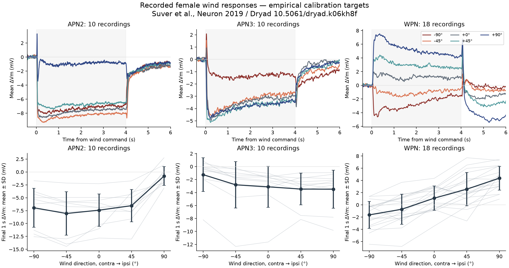
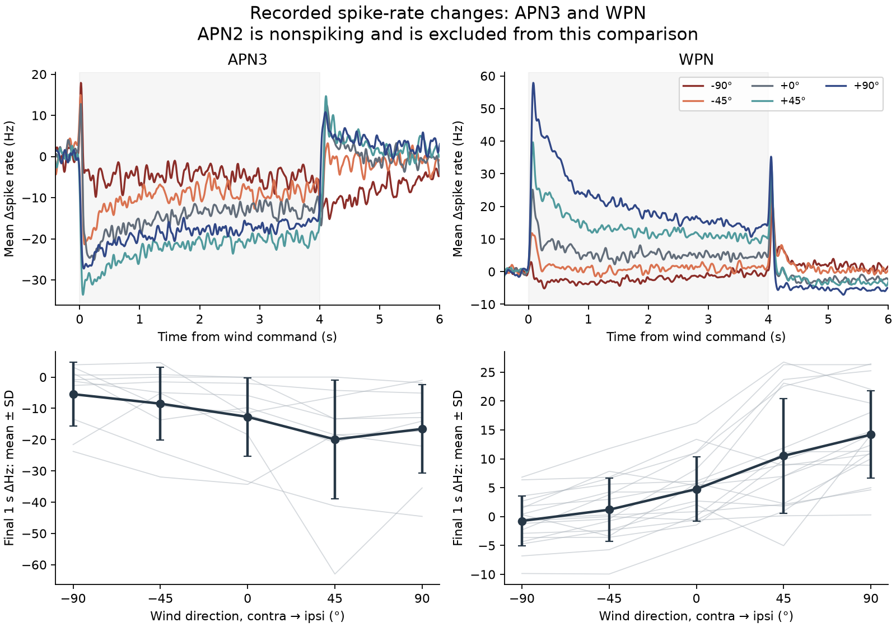

# Reconstructed wind-neuron recording targets

The original Suver et al. recordings now provide verified experimental voltage
and spike-rate targets. This is a reconstruction of recorded data, **not a
simulation match**. The recordings were from adult females; correspondence
between those cells and MaleCNS candidate types remains putative, as documented
in [the anatomical audit](wind-neural-mapping.md).

## Provenance and exact members

The user-supplied `DATA_SETS_SuverEtAl2019.7z` is the
[Suver Dryad dataset, DOI 10.5061/dryad.k06kh8f](https://doi.org/10.5061/dryad.k06kh8f),
released under CC0. The whole archive was independently verified before selective
extraction: 9,477,291,049 bytes, SHA256
`4812e1f0a5d905b9269a40dc91a4894673c9a7ac1ca4591246adc07b61ac37e6`.

All selected members are under
`DATA_SETS_SuverEtAl2019/SuverEtAl2019_DATA/` inside the archive.

| Member | Use | Recordings / valid directional repeats |
|---|---|---:|
| `24C06_free.mat` | APN2, intact antennae, Figure 3 | 10 / 241 |
| `70G01_free.mat` | APN3, intact antennae, Figure 3 | 10 / 280 |
| `70B12_free.mat` | WPN, intact antennae, Figure 4 | 18 / 635 |
| `2017_01_05_E1.mat` | One raw APN2 example | One selected raw trace |
| `2017_04_28_E7.mat` | One raw APN3 example | One selected raw trace |
| `2016_10_07_E1.mat` | Raw WPN examples | Two selected raw traces |
| `readme.txt`, `readme_all_anterior.txt` | Dataset documentation | — |

The author source identifies these files explicitly in
[MakeFigure3.m](https://github.com/nagellab/Suveretal2019/blob/dc5180e4af6352f03f9a86b9f03185dba7926244/SuverEtAl2019_AllAnalysis/physiology_plotting_analysis/MakeFigure3.m),
[MakeFigure4.m](https://github.com/nagellab/Suveretal2019/blob/dc5180e4af6352f03f9a86b9f03185dba7926244/SuverEtAl2019_AllAnalysis/physiology_plotting_analysis/MakeFigure4.m),
and [load_figure_constants.m](https://github.com/nagellab/Suveretal2019/blob/dc5180e4af6352f03f9a86b9f03185dba7926244/SuverEtAl2019_AllAnalysis/physiology_plotting_analysis/load_figure_constants.m),
all pinned to commit `dc5180e4af6352f03f9a86b9f03185dba7926244`.
We inspected that code; no author code was vendored. The selected extraction is
37,449,159 bytes. Its local receipt stores the exact member names, CRCs, hashes,
tool version and archive hash in `data/raw/wind/neural/extraction-receipt.json`.

The processed files contain individual recording-averaged time traces and
individual repeat steady responses. They do **not** contain every repeat's raw
continuous voltage trace. The three raw files supply selected examples only.
The APN3 example's hard-coded side comment in the plotting constants and its
raw metadata do not agree; we do not use that exemplar to reassign population
laterality. Other antenna-removal, immobilization and optogenetic conditions are
present in the archive but were not included in this intact-antenna assay.

## Reconstruction protocol

Run from the repository root:

```sh
.venv/bin/python scripts/extract_suver_neural.py
.venv/bin/python scripts/audit_suver_neural_data.py
```

The extractor verifies the whole archive SHA256 and selects only the listed
members. The analysis verifies each extracted source hash against the receipt
and applies the following protocol:

1. Select MATLAB rows `2,4,6,8,10` from `indvVmTrace` and the corresponding
   population traces, as in the author's
   [MakeTracePairFigure.m](https://github.com/nagellab/Suveretal2019/blob/dc5180e4af6352f03f9a86b9f03185dba7926244/SuverEtAl2019_AllAnalysis/physiology_plotting_analysis/MakeTracePairFigure.m).
   Direction order is already aligned to the recorded cell: contralateral
   −90°, −45°, frontal 0°, +45°, ipsilateral +90°. Do not mirror a second time
   or interpret these labels as world heading.
2. Use the stored baseline-relative voltage in mV. Raw sampling was 10 kHz;
   `DSAMP=10` makes the saved traces 1 kHz. The wind command begins after one
   second and lasts four seconds. The 10,000 stored samples imply five seconds
   after the command ends; `postStim=4` in the MAT metadata disagrees with the
   actual trace length and the author constants (`postStim=5`).
3. For individual steady repeats, retain `indvTonicWindAvg` entries only where
   the matching `trialNums` entry is positive. Zero trial IDs mark padded slots;
   averaging their numeric zeros as observations can substantially bias a
   response. Average valid repeats within each recording, then average the
   recordings equally. This exactly reconstructs the saved
   `indvTonicWindAvg_meanCrossFly` and `avgWR` values to floating-point precision.
4. Define the steady response as the last second of wind relative to baseline.
   Averaging the corresponding saved time trace (3–4 seconds after command)
   agrees with the saved steady values within 0.00043 mV. The small difference
   is consistent with prior downsampling and inclusive MATLAB endpoints.
5. For APN3 and WPN, undo the plotting scale `SCALE_SR=0.3` on the saved
   spike-rate time traces. The saved `avgWR_SR` and repeat steady values are
   already unscaled ΔHz. Their valid-repeat means reproduce the saved means;
   the final-second time-trace means agree within 0.02 Hz. APN2 is experimentally
   nonspiking: generic spike-related fields in its MAT structure are excluded
   from physiological interpretation.
6. Display sample SD across recording means, with each recording also shown.
   The saved `errorVm` exactly matches that SD, not SEM. These figures show
   explicitly labelled ±SD; they are newly generated quantitative summaries,
   not attempts to reproduce every graphical scaling choice in the MATLAB
   publication code.

The MAT field `numFlies` counts recordings/cells here. The paper reports APN2:
10 cells from 8 flies; APN3: 10 cells from 10 flies; WPN: 18 cells from 17 flies.
These are not all independent animals, and repeated trials are not independent
biological replicates. Individual records and valid repeats are retained in
[the machine-readable report](../validation/suver-neural-responses.json).

## Measured intact-antenna targets

Values below are means across recordings. Angles are contra→ipsi in the author's
cell-relative frame. Voltage and spike rates are **changes from baseline**.

| Population / measure | −90° | −45° | 0° | +45° | +90° |
|---|---:|---:|---:|---:|---:|
| APN2 ΔVm, mV | −6.946 | −8.055 | −7.415 | −6.542 | −0.796 |
| APN3 ΔVm, mV | −1.247 | −2.811 | −3.122 | −3.466 | −3.491 |
| WPN ΔVm, mV | −1.633 | −0.713 | +1.108 | +2.578 | +4.376 |
| APN3 Δspike rate, Hz | −5.464 | −8.504 | −12.727 | −19.923 | −16.568 |
| WPN Δspike rate, Hz | −0.750 | +1.190 | +4.770 | +10.519 | +14.178 |





The first signed crossing of half the final population-mean voltage response is
35–48 ms after the wind command for APN2, 31–115 ms for APN3 and 52–89 ms for
WPN. This is a descriptive command-to-response measurement. It combines stimulus
delivery, antennal mechanics, upstream processing and intrinsic dynamics; it is
**not** a fitted membrane or synaptic time constant. Small steady responses make
this threshold timing particularly sensitive to transients and noise.

The selected intact-condition MAT baselines are −18.979 mV (APN2), −22.218 mV
(APN3) and −22.442 mV (WPN), before junction correction. The paper's pooled
baselines differ because its
[ComputeCellStats_SuverEtAl2019.m](https://github.com/nagellab/Suveretal2019/blob/dc5180e4af6352f03f9a86b9f03185dba7926244/SuverEtAl2019_AllAnalysis/physiology_plotting_analysis/ComputeCellStats_SuverEtAl2019.m)
combines multiple experimental conditions. Neither set should silently replace
the male model's resting potential. The estimated −13 mV liquid junction
correction affects absolute voltage, not these baseline-relative responses.
[Suver et al., Neuron 2019](https://pmc.ncbi.nlm.nih.gov/articles/PMC6533146/)

## Implications for a graded APN2 model

The evidence supports a nonspiking APN2 voltage state and a tonic release
mechanism that can decrease during hyperpolarization. It does not measure the
voltage-to-release curve, release baseline, saturation, calcium dynamics,
per-contact conductance or receptor kinetics. The optogenetic APN2→WPN response
was transient depolarization followed by hyperpolarization, which cannot justify
a single measured static positive gain. No release parameter or neuronal
time constant has been fitted here.

An [optional mixed backend](graded-model.md) now accepts an explicit `GradedPopulationSpec`
containing exact candidate IDs, membrane parameters and a separately labelled
release hypothesis. It should preserve incoming graph conductances, exclude
those cells from spike threshold/reset/refractory updates, and propagate a
nonnegative continuous release state through their actual outgoing contacts.
Its explicit release parameters are basal drive, voltage sensitivity, saturation
and first-order release decay; it uses the configured common graph delay. State
and specification are validated and checkpointed. The implementation's numerical
and full-graph smoke checks pass, but its illustrative parameters are not fitted
to these recordings and it is not enabled in a body/viewer configuration.

The first model comparison should stimulate the peripheral wind pathway and
compare predicted candidate APN2 ΔVm against held-out recordings, with the female
to male transfer stated. Clamping candidate APN2 voltage to these measured curves
would be an explicitly imposed assay boundary, not evidence that the graph
predicts APN2 physiology. Neither approach resolves putative WPN identity or
the unknown output mechanism of male LHPV6q1. The retained zero-sign edges remain
unchanged. See [the annotation and receptor audit](wind-neural-mapping.md).

Per-record time arrays are retained locally in
`data/derived/suver-neural-targets.npz`, with path, bytes and hash in the JSON
report; bulk arrays and original MAT files stay outside version control.
