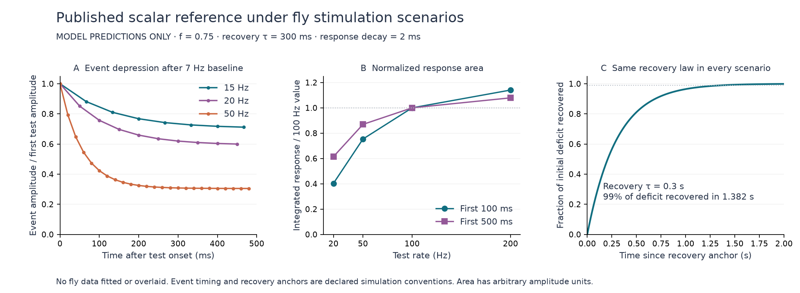

# Published scalar depression reference

The standalone implementation passes **79 numerical checks** with fixed reference parameters. A subsequent [independent review](synaptic-depression-reference-independent-review.md) passes 219 checks across all 56 saved arrays using 80-digit closed expressions. The saved fly-protocol outputs are **predictions from that reference model**, not fitted fly data or evidence of a physiological match. No graph was loaded, no brain or body ran, and no runtime integration or parameter promotion occurred.

Later update: the [Fig. 8F extraction](orn-pn-depression-digitization.md) and [conditional model-data comparison](orn-pn-depression-comparison.md) now supply a separate quantitative evaluation of these unchanged predictions. The fixed reference retains too much amplitude at higher frequencies. The original prediction record below remains unchanged in scope; its first-test-event normalization and event phase are declared conventions, not fully recovered experimental operations.

The [execution plan](../validation/synaptic-depression-reference-plan.json), SHA-256 `86ade63439b8b20fb169ae7d9ea6395102f43f054319cc2e7a83f2f80c52f174`, was frozen before any run. [Results](../validation/synaptic-depression-reference-results.json), [exact-event inventory](../validation/synaptic-depression-reference-events.csv), [array archive](../validation/synaptic-depression-reference-arrays.npz), and [normalized area table](../validation/synaptic-depression-reference-charge-predictions.csv) preserve the output. The [research script](../scripts/synaptic-depression-reference.py) imports no `fruitfly` module. All earlier files remain unchanged.

## Equation, source and units

[Abbott et al. (1997), printed page 223, notes 6, 7 and 10](https://huguenardlab.stanford.edu/220/varela1997a.pdf) gives a scalar efficacy model derived from rat cortex: between spikes, \(\tau\dot a=1-a\). Each event emits efficacy \(a^-\), then sets \(a^+=f a^-\). Its published example uses \(f=0.75\) and recovery \(\tau=300\) ms. The paper's separate synaptic conductance decay is 2 ms. These values reproduce that source; they are not Drosophila parameters. The PDF was read and its methods page visually checked; its hash and source URL are retained in the plan.

The implementation uses dimensionless efficacy and **seconds**. Recovery over a gap \(\Delta\) is evaluated analytically, with no integration timestep:

\[
a(t+\Delta)=1-[1-a(t)]e^{-\Delta/\tau}.
\]

For regular rate \(r\) in Hz, let \(d=e^{-1/(r\tau)}\). The source steady amplitude is \(A=(1-d)/(1-fd)\). Independently, the finite train follows \(a_n=A+(a_0-A)(fd)^n\), with the first event indexed zero. Checks compare this closed form with the imperative event implementation; they do not call the latter to manufacture expected amplitudes.

For visualization and normalized area only, a separately declared linear observation is \(h(t)=\sum_k a_k e^{-(t-t_k)/0.002}\), summed over past events. It combines the source's 2 ms response decay with linear superposition. This is an arbitrary-amplitude response proxy. It is not the male model's effective-mV synaptic state, a measured current in pA, or a full reproduction of Abbott's conductance-driven spiking network. A time integral has arbitrary amplitude-seconds; only same-window ratios are reported as dimensionless quantities.

## Numerical verification

Six regular trains of 256 spikes at 7, 15, 20, 50, 100 and 200 Hz agree with finite-train and steady-state expressions. The maximum absolute discrepancy over all checked comparisons is `5.052e−15`, below the frozen `1e−12` tolerance. Checks also cover read-before-decrement order, a second event at the same time, rejected backward time without state mutation, bounded/finite states, monotonic regular-train depression, exponential pause recovery, and nonmutating recovery queries. A separately labeled `f=1` null control checks static amplitudes; it is not used in any prediction.

Streaming response construction agrees with a direct convolution sum; streaming interval integration agrees with independently summed analytic kernel integrals. Source and earlier runtime-file hashes are unchanged after the run. This author implemented both the research model and its internal mathematical checks; those checks are not an external independent replication.

| Rate (Hz) | Fully developed regular-train efficacy |
|---:|---:|
| 7 | 0.709279 |
| 15 | 0.498846 |
| 20 | 0.420438 |
| 50 | 0.216151 |
| 100 | 0.119393 |
| 200 | 0.062991 |

## Fly-protocol predictions

The previously [specified proposal](../validation/orn-pn-transfer-depression-proposal.json) identifies female VM2 recordings in [Kazama & Wilson (2008)](https://doi.org/10.1016/j.neuron.2008.02.030). Figures 8D–F supply a 7 Hz, 4 s baseline followed by a 500 ms test; the plotted Figure 8F frequencies are 15, 20 and 50 Hz. Figure 9B displays 20, 50, 100 and 200 Hz traces, and panels C/D use first-100/500-ms charge normalized at 100 Hz. No numerical observations or error bars were digitized here. Consequently no residual, RMSE, goodness of fit, or biological pass/fail is reported.

We fix baseline events to `−4 + j/7` s, `j=0…27`, and test events to `j/r` s in `[0, 0.5)`. Thus the test includes an event at onset but none at 500 ms. This is a declared simulation phase, not recovered experimental pulse timing. Event fractions are retained as integer numerator/denominator pairs before float64 evaluation; a 0.1 ms waveform display grid does not quantize the efficacy dynamics.

| Test rate (Hz) | Test events | Last event (ms) | Last / first test efficacy |
|---:|---:|---:|---:|
| 15 | 8 | 466.667 | 0.711674 |
| 20 | 10 | 450 | 0.599591 |
| 50 | 25 | 480 | 0.304889 |
| 100 | 50 | 490 | 0.168330 |
| 200 | 100 | 495 | 0.088810 |

All first test events have efficacy 0.709278541 after the baseline. The ratios concern each train's last actual event, not an interpolated amplitude at 500 ms. Frequencies 100/200 Hz are included for Figure 9 predictions, not relabeled as measured Figure 8F conditions.

| Test rate (Hz) | First 100 ms area / 100 Hz area | First 500 ms area / 100 Hz area |
|---:|---:|---:|
| 20 | 0.403473 | 0.614383 |
| 50 | 0.753565 | 0.869310 |
| 100 | 1.000000 | 1.000000 |
| 200 | 1.140407 | 1.078767 |

Area integrates test-event responses analytically, including partial decay tails at window end. A secondary calculation includes residual pretest responses; the difference rounds to zero at saved float64 precision because the last baseline event precedes onset by 142.857 ms while the response decay is 2 ms. This does not prove experimental baseline subtraction is irrelevant. Unlabeled low-frequency coordinates from Figure 9C/D were not guessed or generated.



The [plot script](../scripts/synaptic-depression-reference-plot.py) reads saved arrays only. Its [receipt](../validation/synaptic-depression-reference-plot-receipt.json) records source and output hashes. The vector [SVG](../validation/synaptic-depression-reference-predictions.svg) is available for reuse with these qualifications.

## Recovery scenarios and remaining boundary

The [supplement's Figure S8](https://kazamalab.riken.jp/pdf/Neuron_Kazama%26Wilson_2008_supplement.pdf) distinguishes post-train recovery from recovery after a pause in ongoing 7 Hz stimulation. Important stimulus-history, normalization and probe details remain unextracted. The present calculation therefore declares explicit scenarios rather than claiming to reconstruct those measurements.

For a 500 ms train, we use 50 Hz (a stated range endpoint) and 200 Hz (the displayed train), each from either full recovery or a 7 Hz/4 s baseline. The recovery anchor is nominal train end at 500 ms; the last events occurred at 480 or 495 ms. A 1 ms grid over the following two seconds evaluates isolated potential probe amplitudes. These are independent single probes of the same recovery trajectory; the queries do not deliver repeated depressing events.

For a pause after 28 events at 7 Hz, the anchor is the **last baseline event**, and a 10 ms grid extends to 30 s. Probe amplitude is normalized to the model's fully recovered amplitude of one, rather than an inferred definition of the paper's recovery ratio. Immediately after that last event, efficacy is 0.531959; after 300 ms it is 0.827817 and after one second 0.983303.

Every scenario recovers the same fraction \(1-e^{-t/0.3}\) of its starting deficit: 63.2% after 300 ms and 99% after 1.381551 s. This common timescale is imposed by the model. It cannot independently support two different recovery mechanisms, and no comparison to the published fitted recovery constant is claimed here. The prospective evaluation panels remain unavailable as quantitative evidence until their points, uncertainties and measurement conventions have been extracted. No value was changed after seeing these predictions.

These scenarios omit stochastic release, receptor effects, presynaptic inhibition, morphology and sex-specific physiology. In particular, neither `1−f` nor the number of model events identifies vesicular release probability or anatomical release sites. Matching a scalar response shape would still not justify applying the reference to male ORN→PN edges or other glomeruli.

An exact primary-PDF copy is retained in `data/raw/orn-pn-physiology/abbott-1997.pdf`; its [acquisition receipt](../validation/synaptic-depression-reference-paper-acquisition.json) also identifies the original temporary path pinned in the experiment. That original path and the frozen plan remain unchanged. The paper is not redistributed in Git.

To reproduce with pinned input files in a clean checkout lacking the generated plan/results:

```sh
.venv/bin/python scripts/synaptic-depression-reference.py --prepare
.venv/bin/python scripts/synaptic-depression-reference.py --run
.venv/bin/python scripts/synaptic-depression-reference-plot.py
```

The commands refuse to overwrite receipts. A rerun's timestamps and Git identity can change hashes; compare the numerical arrays and source hashes. Existing evidence is preserved.
