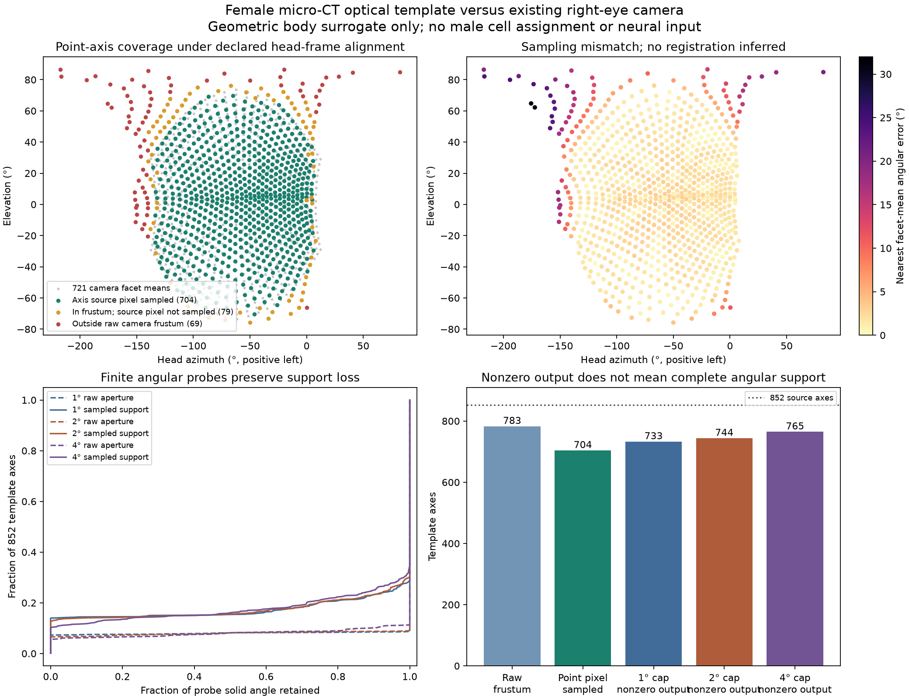

# Female optical template versus the actual right camera

The existing right-eye renderer does **not** cover the full extracted female optical template under the declared head-frame alignment. Of 852 template axes, 783 are in its raw camera frustum and 69 are outside. Existing facet resampling further limits small-target support. Reweighting the current 721 facets cannot recover directions that the camera never renders.

This is a geometric comparison of two surrogates: the female micro-CT optical template and the female-derived physical body from another specimen. Their canonical x-forward, y-left, z-up axes are identified without fitting a rotation or translation. It is not a measured specimen registration, a male angular assignment, or neural input. The [retinotopy feasibility audit](visual-retinotopy-feasibility.md) retains the unresolved MaleCNS anatomical anchors.

The comparison concerns far-field angular coverage. It does not map individual lens origins onto the body or reproduce their different parallax for a nearby object.

## Reproducible inputs and geometry

[The coverage script](../scripts/check_visual_template_coverage.py) reads the coherent [852-row optical map](../validation/visual-retinotopy/zhao-female-right-eye-directions.csv) and the [calibrated camera footprints](../validation/retina-rays/ray-footprints.npz), checking both against their provenance hashes. The map derives from Zhao et al. (2025), [*Eye structure shapes neuron function in Drosophila motion vision*](https://pmc.ncbi.nlm.nih.gov/articles/PMC12488493/), using the pinned author data described in the extraction receipt. No additional source download is required for this comparison.

The analysis uses the actual right camera-to-head rotation stored by the physical-camera audit, a 512×450 perspective image, and a 157° vertical field of view. It transforms template unit directions into that camera frame and computes their continuous raw image projections. Negative camera z is forward; pixel centres are at row/column plus 0.5. A direction is inside the raw frustum only when it points forward and projects within the image rectangle.

For point-axis support, a projected direction selects its containing raw pixel. That pixel contributes to the implemented retina only if it appears in the saved destination-to-source lookup within a facet mask. This distinguishes frustum visibility from actual sampling. It is a pixel-cell diagnostic, not the response of an infinitesimal biological photoreceptor or a rendered point source.

Source right-lens indices remain **one-based, 1–852**. Output camera facet indices are **zero-based, 0–720**. Raw pixels are flattened zero-based indices; `-1` means outside the frustum. A nearest facet is reported even for an unsupported direction, strictly as a distance diagnostic; it is not an accepted correspondence.

## Results

| Quantity | Result |
|---|---:|
| Template axes within raw camera frustum | 783/852, 91.90% |
| Axes outside the raw frustum | 69/852, 8.10% |
| Axes whose containing raw pixel is sampled by a facet | 704/852, 82.63% |
| Inside-frustum axes whose raw pixel is not sampled | 79 |
| Nearest facet-mean angular error, all axes | median 1.954°, 95th percentile 12.886°, maximum 31.404° |
| Nearest facet-mean error, inside-frustum axes | median 1.868°, 95th percentile 3.753°, maximum 10.521° |

The excluded directions cluster around posterior and dorsal boundaries; 49 of the 69 outside-frustum axes have absolute conventional azimuth above 120°. The plot keeps posterior azimuth continuous across −180° by displaying some angles below −180°. It does not change the stored vectors or original source angles.

The lookup samples 77,040 distinct raw pixels out of 230,400, with repeated source pixels retaining repeated weights. This flat pixel count is **not** a percentage of spherical field of view: angular area is highly nonuniform in a wide perspective image, and many omitted pixels are outside the facet mask's useful region.



## Finite target probes and explicit support loss

Uniform spherical caps of radius 1°, 2° and 4° were predeclared as numerical probes. They are not measured acceptance angles or proposed photoreceptor kernels. For each template axis, the script reports two separate calculations:

1. **Geometric support:** equal-solid-angle cap samples are projected into raw pixel cells. The fractions outside the camera frustum and inside the frustum but never sampled by a facet remain separate. Their sum is total support loss.
2. **Pixel-centre response:** the cap selects actual raw pixel-centre rays. The original lookup and facet denominators predict the resulting achromatic facet response, retaining duplicate samples and black-padding denominators. These are analytic predictions using the already verified renderer geometry, not additional rendered trials.

| Diagnostic cap radius | Axes with any facet response | Zero-response axes | Zero response despite axis inside raw frustum | Mean geometric support retained across axes |
|---|---:|---:|---:|---:|
| 1° | 733 | 119 | 50 | 82.69% |
| 2° | 744 | 108 | 39 | 82.62% |
| 4° | 765 | 87 | 20 | 82.45% |

Geometric pixel-cell integration and pixel-centre rendering are different discretizations. For example, at 2° one cap has nonzero geometric support but no selected pixel-centre response. Wider targets can produce a response through an edge while most of their angular support remains missing. Nonzero output therefore does not establish adequate optical coverage.

The coarse quadrature uses 32×128 equal-area samples per cap, and the final calculation uses 64×256. Maximum absolute changes in the retained fractions are 0.00916, 0.01044 and 0.01154 for the three radii; their 95th-percentile changes are below 0.00164. These are numerical sensitivity measurements, not a strict error bound. Threshold counts near a support fraction boundary should be interpreted with that resolution.

For diagnostics, nonzero vectors of facet responses are divided by their row sums to form unit-sum weights. Rows with no response remain all zero. The CSV separately retains the original response sum, both loss components and total geometric loss. **Unit-sum normalization does not restore missing light or justify ignoring those losses.** The sparse matrices remain under `data/derived/visual-template-coverage/`, with dimensions, index conventions and hashes recorded in the results; they are not used by any runtime decoder.

## Implication and artifacts

The existing renderer supports a substantial central subset of the female optical template. Covering all released template axes requires changing the optical acquisition or explicitly declaring a restricted field. An isolated comparison of wider or multiple camera views would be a defensible next engineering step; moving axes to whichever current facet is closest would conceal missing coverage. No camera, facet mask or runtime default was changed here.

No additional rendering was performed. The calculation relies on the stored calibration, whose exact lookup was checked against the installed Retina implementation and whose projection was verified against 14 rendered targets. The calibration's independent review adds peripheral target checks. The present audit does not test radiometry, UV spectra, body occlusion, graded phototransduction, male receptive fields or behavioural consequences.

This script additionally checks that the installed lookup still equals the calibrated array and compares five synthetic 2° cap images, at source lens indices 1, 200, 395, 600 and 852, against the actual upstream fisheye-plus-facet pipeline. These check the sparse response calculation, not a new 3D rendering or fitted optics.

```sh
.venv/bin/python scripts/check_visual_template_coverage.py
```

- [Results and provenance hashes](../validation/visual-template-coverage/results.json)
- [Per-template-axis CSV](../validation/visual-template-coverage/female-right-template-coverage.csv)
- [Coverage plot](../validation/visual-template-coverage/coverage.png), visually inspected
- [Camera calibration method](retina-ray-calibration.md)

The serialized template, camera footprint and sparse-weight files use numeric arrays without pickled Python objects. All source sex labels and index conventions are retained; no MaleCNS ID appears in the coverage mapping.
