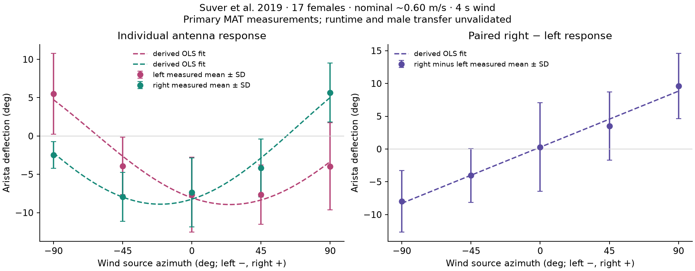

# Wind calibration: measured antenna response, limited domain

The completed primary archive was checksum-verified on 2026-09-05 UTC. [data/wind-calibration.json](../data/wind-calibration.json) now contains source measurements from **17 paired flies**, our fitted curves, and held-out-fly errors. These calibrate a descriptive steady-state antenna response in one experimental preparation. Male transfer, joint registration, other wind speeds and neural input gains remain unvalidated; `runtime_usable` therefore remains false pending explicit adapter/domain decisions.

## Sources and access receipt

- Suver et al. (2019), *Encoding of Wind Direction by Central Neurons in Drosophila*, Neuron 102:828–842.e7, [DOI 10.1016/j.neuron.2019.03.012](https://doi.org/10.1016/j.neuron.2019.03.012), [primary manuscript and Methods](https://pmc.ncbi.nlm.nih.gov/articles/PMC6533146/).
- [Dryad dataset DOI 10.5061/dryad.k06kh8f](https://datadryad.org/dataset/doi:10.5061/dryad.k06kh8f), published 2019-04-02, version 1. The dataset API and browser explicitly identify **CC0-1.0**, distinct from the publisher's article license and the analysis repository's absent license.
- `DATA_SETS_SuverEtAl2019.7z`: **9,477,291,049 bytes**; published MD5 **e1ff6c0c61077b7777ccd83395f92477**, verified exactly. Archive SHA256 **4812e1f0a5d905b9269a40dc91a4894673c9a7ac1ca4591246adc07b61ac37e6**. The saved [metadata receipt](../data/raw/wind/metadata-receipt.json) hashes the local metadata records; the [extraction receipt](../data/raw/wind/extraction-receipt.json) records archive and member hashes.
- Initial access failure: [normal archive download](https://datadryad.org/downloads/file_stream/82268) returned HTTP 403 to direct requests; the metadata-advertised [API download](https://datadryad.org/api/v2/files/82268/download) returned HTTP 401. Browser inspection of the internal downloads page was rejected by browser URL policy; no workaround was attempted. The user subsequently downloaded the archive normally and supplied the local file.

The completed archive is at `/Users/bernardo/Downloads/DATA_SETS_SuverEtAl2019.7z`. Partial `.crdownload` content was never parsed. It has **314 members, six solid blocks, 9,487,974,267 bytes uncompressed**. Only the selected members were extracted, totaling **2,495,899 bytes** for the three MAT files. The archive remains in Downloads and raw extraction stays under ignored `data/raw/wind/`; no 9 GB object belongs in Git.

The user also supplied `/Users/bernardo/Downloads/nihms-1524477.pdf`: 42 pages, 2,314,355 bytes, SHA256 `f6d3fdd234c0a48ab42a21dcebceb26c1699e1a1d6f937371566144b23168009`. The [paper receipt](../data/raw/wind/paper-receipt.json) records the local source; the copyrighted PDF is not copied into the repository. Figure 2 was visually checked on PDF page 28, and the quantification method on page 18.

## Measurements and their limits

Figure 2 uses adult **females, 2–7 days old**, tethered in an anterior mount. Five source azimuths are −90° (left), −45°, 0° (front), +45°, +90° (right). Wind lasts 4 s. Methods report **59.57 ± 1.4 cm/s**, measured across six probe placements. Figure 2E/F averages **17 flies**; displacement is steady-state minus baseline arista angle, using five frames in each interval at 60 Hz. Trials are averaged within each fly before averaging across flies. The time-series example excludes a block containing active antenna movements. These are passive arista deflections, not free-walking male joint mechanics. [Primary Methods and Figure 2](https://pmc.ncbi.nlm.nih.gov/articles/PMC6533146/)

Keep wind **source direction** distinct from the air-velocity vector: they differ by 180°. Do not apply a degree/radian or left/right conversion by visual intuition. Our runtime registration remains unvalidated. Neither rear-field responses, elevation, male stiffness, nor scaling to other speeds follows from this dataset. An arista displacement also does not specify a JON firing-rate gain.

## Exact source fields

The authors' [analysis repository](https://github.com/nagellab/Suveretal2019/tree/dc5180e4af6352f03f9a86b9f03185dba7926244) is pinned to commit `dc5180e4af6352f03f9a86b9f03185dba7926244`. No license file is present. Its code is inspected as a primary analysis reference; it is not vendored into the simulator.

| File | Evidence and use |
|---|---|
| `all_anterior.mat` | Verified `traces.leftDeflect_indvAvgs` and `rightDeflect_indvAvgs`, each 17×5, all finite. Their means exactly reproduce `*_crossFlyAvgs`; experiment IDs and both paired arrays are retained in the small versionable JSON. |
| `Anemometer_2018_03_23.mat` | Six individual 11×10,000 traces; `samplerate=10000`, `DSAMP=10` gives 1000 Hz. Authors plot MATLAB rows [2,4,6,8,10] from `avgVmTrace` and label them cm/s. Source values are already converted; do not add the unrelated `avgVm` voltage baseline. |
| `antTracking_2017_01_05_E1.mat` | 60 Hz, `preStim=1`, `stim=4`; both average angle arrays 5×600; raw left/right arrays 5×600×10. Source counts retain 7 left and 8 right example trials. This is one fly, separate from the 17-fly hand-tracked endpoint dataset. |

The complete original figure additionally loads `2017_01_05_E1_Video_43_trackData` for a hand-tracked example. The selected three-file acquisition is sufficient for the requested aggregate calibration, not a reproduction of every Figure 2 panel.

The deposited `readme_all_anterior.txt` independently confirms the 17×5 per-fly matrices and the direction convention (1=−90°, 5=+90°); `readme.txt` confirms the anemometer's selected row indices. These source readmes were extracted with the neural calibration subset under `data/raw/wind/neural/`, with their own hash receipt. Some intermediate cells have length 18; they are not substituted for the explicitly retained 17-fly matrices.

An analysis discrepancy must remain explicit: the paper's Figure 2 legend says ±SD, while `MakeTuningCurveFigure.m` computes `nanstd` then plots **± SD/2** in its shaded bands. Our output reports full sample SD and SEM separately; it does not relabel that plotting band as a confidence interval. The code subtracts right minus left **within each fly**, preserving pairing. The paper's plotted sign is negative for headward deflection, positive for movement away from the head.

## Reproducible acquisition and fitting

Use [scripts/acquire_wind_data.py](../scripts/acquire_wind_data.py). Archive operations require `py7zr==1.1.3`; metadata uses stdlib, fitting uses NumPy/SciPy, and plots use Matplotlib. Dependencies are now declared in the project's `research` extra and lockfile.

```sh
uv sync --extra research --extra test --extra morphology
.venv/bin/python scripts/acquire_wind_data.py metadata
.venv/bin/python scripts/acquire_wind_data.py inspect --archive /path/to/DATA_SETS_SuverEtAl2019.7z
.venv/bin/python scripts/acquire_wind_data.py extract /path/to/DATA_SETS_SuverEtAl2019.7z
.venv/bin/python scripts/acquire_wind_data.py summarize
.venv/bin/python scripts/acquire_wind_data.py fit
.venv/bin/python scripts/acquire_wind_data.py plot
```

If an authorized HTTP download later becomes accessible, `inspect --url URL` uses the existing range reader, requires exact HTTP 206 byte ranges, limits a request to 8 MiB and total inspection to 16 MiB by default. It never falls back to downloading the whole archive. No authenticated URL or token should be recorded in versioned output. Use local `--archive` for private or expiring URLs.

Local extraction first verifies the published byte count and MD5, computes SHA256, then extracts only the three exact, unambiguous regular-file members. A solid archive may require decompressing preceding data internally; only selected members are written, never the whole uncompressed corpus. Member paths, sizes, CRC values and SHA256 hashes are recorded. The script refuses path traversal, symlinks and selected members above 2 GiB.

The fitting command requires all three real MAT files, their checksum-verified extraction receipt and the `17 × 5` paired shape. It verifies that computed per-fly means reproduce source means before fitting. Unexpected schema fails closed. It retains pairing, full observations, measured means, sample SD, SEM, residuals, five-mean R² and leave-one-fly-out prediction errors. Refit from the JSON's 17×5 arrays is also possible without downloading the full archive again. No extrapolation, velocity scaling, neural mapping or male transfer is marked validated.

Validation includes actual archive MD5/SHA256, member hashes and CRC metadata, matching source averages, successful real-data fits, and a visually inspected scientific plot. An earlier artificial miniature archive tested selection/rejection only. Missing source data or changed extracted hashes fail before replacing calibration results.

## Derived quantitative results

The following are **our descriptive least-squares summaries**, not new experimental measurements. For each antenna, `a + b cos(theta) + c sin(theta)` produces deflection in degrees with theta in radians. The paired difference uses `a + b theta`, with theta in degrees.

| Curve | Coefficients [a,b,c] or [a,b] | R² of five means | Leave-one-fly-out RMSE |
|---|---|---:|---:|
| Left | [0.694410, −8.748024, −4.039133] | 0.9722 | 4.9328° |
| Right | [1.411040, −9.652533, 3.610637] | 0.9753 | 3.6819° |
| Right − left | [0.279895, 0.0950606] | 0.9900 | 5.2523° |

Each held-out fold fits the mean of 16 flies and predicts the remaining fly's five observed deflections. This measures within-preparation prediction error, not male or out-of-domain validity. The attractive population-mean R² must not obscure substantial individual variation. The linear difference is an analysis summary; an adapter returning two antenna angles should calculate their difference consistently from those returned angles.



For velocity, our explicit final-one-second window `[4,5)` s gives **58.2328 cm/s**, sample SD **1.1619 cm/s** across the six placement means, versus the paper's 59.57 ± 1.4 cm/s. Individual placement values and each direction's mean are retained in JSON. The source average trace exactly equals the six individual trace averages. The −1.3372 cm/s difference is recorded, not hidden or resolved by arbitrary rescaling; the publication's exact velocity summary window is not recovered. `velocity_m_s=0.582328...` denotes our deposited-data window; `paper_nominal_velocity_m_s=0.5957` is separately preserved. The angular fit itself does not use a velocity-dependent law.

Default arena wind is 2 mm/s, roughly 290–300 times slower than this assay. A future adapter should abstain outside the explicitly supported speed/azimuth domain, or label any extension as a new uncalibrated assumption. This extraction provides no measured spring constant, time constant, per-cell firing law, male-specific correction, or courtship-sound response.

## Optional runtime reference and provenance checks

`MeasuredAntennaReference` is a quasistatic descriptive reference, not a joint command or neural input. It is disabled by default. The male reference configuration explicitly opts into applying the female curve; non-boolean values such as the string `"false"` are rejected. Default gates permit only frontal ±90° azimuth, horizontal speed within ±5% of the deposited-data window mean, and elevation within ±5°. The speed/elevation tolerances are declared engineering choices, not empirically validated response laws. Outside a gate, the estimate is `None` with a reason, never zero or an extrapolated gain.

The loader verifies archive identity and recomputes the two fitted coefficient vectors from the retained 17×5 paired matrices. Its primary-observation fingerprint was independently calculated from the extracted MAT: prefix `Suver2019-paired-arista-v1` followed by a NUL byte, five angles as little-endian float64, then left and right matrices in C order as little-endian float64, then compact ASCII JSON experiment IDs. SHA256 is `605b8ea5ba6899cb329713cef4f350fa684c67bd931888b430ec0c3ec219e029`. This prevents changed observations or gains from retaining the primary-data label. Anemometer final-window means have a separate fingerprint after rounding to 1e-9 cm/s to tolerate numerical summation differences. Narrative notes may change; each run still records the current full artifact hash.

Physical frame regression checks use retained MuJoCo head geometry and the actual left-minus-right antenna landmark vector. The imported fixed head body is fused out by the compiler; its missing body ID must never be used as NumPy index −1. A prior draft wind-only frame calculation had that bug; it was corrected before release. Antenna body IDs are retained and valid, so the odor sensor positions were not affected. The updated tests verify distinct sensor IDs, lateral alignment, frontal wind direction, actual body-origin Jacobian velocities, empirical domain abstention, boolean sex-transfer intent, and artifact consistency.
