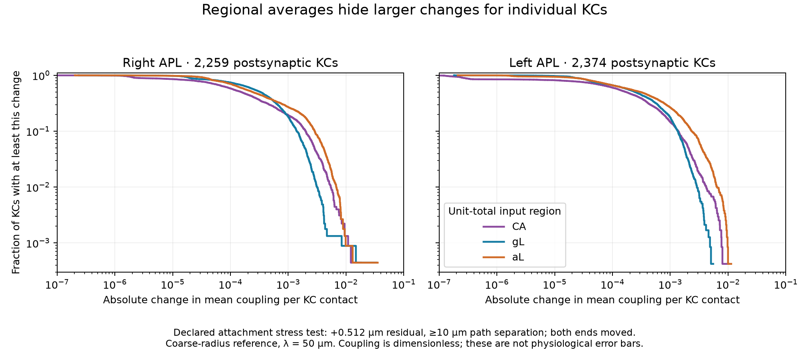

# Nearby-branch sensitivity of male APL coupling

Completed 2026-09-05 UTC. The full 48-probe static batch passes and preserves the preceding spatial control. It tests a concrete ambiguity left by [nearest-segment attachment](30-male-apl-skeleton-geometry.md): points close in physical space can lie far apart along the reconstructed arbor. The resulting alternatives are sensitivity scenarios, **not anatomical corrections or estimated error probabilities**.

## Frozen perturbation

For every retained distinct contact coordinate, search all native skeleton segments for a projection that is:

- in the same connected component as its original projection;
- no more than **0.512 µm farther from the contact** than the nearest projection;
- at least **10 µm away along the forest path** from the original projection.

Choose the eligible projection with smallest residual distance, breaking exact ties by segment index. If no projection qualifies, retain the original. The residual envelope equals one 64 × 8 nm coarse-grid interval from the skeleton metadata, used as a declared stress magnitude. It is not a measured attachment error bound. The 10 µm path threshold is an engineering definition of a nonlocal displacement. It does not identify biological branch boundaries. Cross-component alternatives are excluded; missing-fragment uncertainty is not tested here.

The [implementation](../scripts/apl_attachment_sensitivity.py) uses an exhaustive candidate bound based on segment midpoints, followed by exact projections and vectorized forest distances. Both original and alternative attachments are inserted into one shared forest. Geometry, taper, contact identity, source mass and attenuation scales are therefore fixed across arms; only source/output attachment maps change.

The [frozen plan](../validation/apl-attachment-sensitivity-plan.json), SHA-256 `c77584893598c56e9d49c797c74f8c70717168158affd4546961559453304398`, specifies two APL cells, constant-diameter/coarse-radius metrics, CA/gL/aL unit-total input footprints and a 50 µm reference parameter. Four arms—nearest control, output reassignment only, source reassignment only, both—produce **48 probes including 12 controls**. Inputs are the same regional contact selections as the [previous static batch](31-male-apl-spatial-operator.md), not sparse odor ensembles or measured KC activity. All eligible sites move deterministically in an alternative arm; no probability distribution is inferred.

## Verification and retained artifacts

A synthetic branching/disconnected example checks all node-pair distances, projected-point distances and candidate selection against scalar brute-force enumeration. It exercises three envelopes, repeated chunk boundaries, cases with no alternative and close points on different components. The focused test passes. The real-cell batch independently enumerates every segment at eight fixed-seed contact points per cell and checks the selected alternative and eligible count against scalar path calculations.

All four nearest-control metric/cell fields reproduce the saved previous batch at every output and footprint, with maximum absolute error **3.89 × 10⁻¹⁶**. Physical/electrotonic length totals, unit input mass, component membership, eligibility bounds and nonnegative bounded output checks pass. The complete run took **8.00 seconds**. No neural process was launched.

The [batch results](../validation/apl-attachment-sensitivity-results.json) and [9.74 MB arrays](../validation/apl-attachment-sensitivity-arrays.npz) retain every alternative, eligible count and output field. Array SHA-256: `d59074c6897bc955c5c796d48479e165fc3655fe83c8cd77352cdc965ed70af6`. The [separate saved-array reduction](../scripts/summarize_apl_attachment_sensitivity.py) reproduces all **432 scalar summaries** within 10⁻¹⁴ before aggregating signals by postsynaptic KC. Its [KC results](../validation/apl-attachment-sensitivity-kc-summary.json) preserve target identity and contact counts.

## What changed

| APL cell | Distinct coordinates with an alternative | KC→APL contacts affected | APL→KC contacts affected | Median path displacement, affected APL→KC contacts |
|---|---:|---:|---:|---:|
| Right, 10540 | 21,648 / 140,331 | 17,641 / 108,338 (16.28%) | 10,253 / 95,542 (10.73%) | 40.07 µm |
| Left, 10977 | 20,863 / 135,011 | 16,672 / 102,014 (16.34%) | 10,902 / 100,658 (10.83%) | 40.95 µm |

For affected output contacts, the median additional Euclidean residual is only 0.261/0.263 µm, while the 95th-percentile path displacement is 186.30/245.02 µm. Thus small residual differences can correspond to large topological differences. Repeated release locations share the same alternative but retain all polyadic partner rows.

Across the 36 noncontrol probes, signed changes in the global contact-weighted mean stay between approximately **−0.403% and +0.426%**. That aggregate stability does not establish stable individual outputs: the largest absolute site change reaches **0.263** in dimensionless coupling under unit-total input. Opposite changes can cancel in a mean, and most sites are unchanged in the output-only arm.

Per-KC aggregation reduces many local differences, but not all. For example, right APL→KC **142848** has three retained contacts. Under the coarse-radius aL footprint with both maps reassigned, its mean coupling falls from **0.07114 to 0.03581**, despite a global mean change of only **+0.178%** for that same case. This sparse contact count is essential context; this is one APL's mean signal per contact, not the KC's total physiological inhibition. Targets receiving either APL are counted separately, and the two sets overlap.

With both maps reassigned and coarse radii, the 95th-percentile absolute per-KC changes range from **0.00176 to 0.00409** across the six cell/footprint combinations. These quantities have unit-input coupling units, not voltage, calcium, GABA concentration or firing-rate units. Equal-weight KC summaries and contact-weighted population summaries answer different questions.

The [plot script](../scripts/plot_apl_attachment_sensitivity.py) reads only the closed batch. The final figure was visually inspected. It displays equal-weight KC survival curves of absolute change for each APL separately, not confidence intervals or independent biological replicates.

## Consequence for the local feedback model

The reference can now carry both attachment maps into a subsequent declared local assay. A physiological fit should not compensate for a few fragile paths by adjusting a single release gain. Broad spatial averages alone cannot validate sparse KC feedback; prospective comparisons should retain per-KC or per-site outcomes and both attachment scenarios. This one envelope, threshold and length parameter does not bound all anatomical uncertainty. It does not justify choosing the alternative map as the default.

The next substantive missing piece is temporal/observation calibration, rather than another global gain sweep. A source follow-up inspected the existing Amin XML and the authors' [spatial-code repository](https://github.com/aclinlab/amin-et-al-2020) and [calcium-imaging repository](https://github.com/aclinlab/calcium-imaging). The [source-lead receipt](../validation/apl-timecourse-source-leads.json) pins the repository inventories and `runAPL.m`. No author code was executed or incorporated into our implementation.

Amin Fig. 5/6 display APL-calcium and KC-inhibition time courses under 0.75 mM ATP /10 ms puffs; Fig. 4 uses a different 1.5 mM /100 ms protocol and must not be pooled. The already inspected Fig. 7 workbook contains the spatial summaries. This access step did not identify a raw time-trace export; the calcium-imaging inventory is software, and the Amin MAT contents remain uninspected. Those MAT files and, if needed, the published plotted time courses are concrete next leads for a reporter-level comparison. Calcium-reporter dynamics still must not be silently equated with voltage or release kinetics.

No physiological parameter was fitted or promoted. H1 remains experimental, Eon body integration remains cancelled, and the single-male simulation milestones remain active and incomplete.
