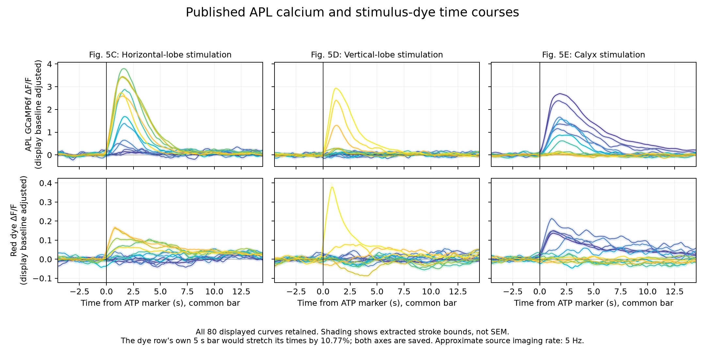

# APL calcium and stimulus-dye timing reference

Completed 2026-09-05 UTC. This step recovers all **80 displayed mean traces** in Amin et al. Fig. 5C–E: 40 APL GCaMP6f curves and their 40 red-dye counterparts. It supplies a temporal observation reference for the next local-model comparison. It does not recover individual-fly recordings, identify release kinetics or change the neural runtime.

## Source and physiological limits

The source is [Amin et al. 2020](https://elifesciences.org/articles/56954), the retained official PDF `data/raw/apl-local-feedback/amin-2020.pdf`, SHA-256 `11d2b9feca23aa0823b70e023cda2959bea37029b394635adf4be33dfd81a213`. PDF page 8 contains Fig. 5; page 7 explains the temporal interpretation. Both relevant pages were inspected, including a rendered full Fig. 5 page. The existing primary XML provides captions, cohort sizes and methods.

Fig. 5 stimulates APL with 0.75 mM ATP, a 10 ms puff at 12.5 psi, using VT43924-GAL4.2>GCaMP6f,P2X2 flies. Calcium and co-ejected red dye are measured over spatial segments. The red baseline includes mb247-dsRed. Horizontal- and vertical-lobe conditions report 10 neurons from 6 flies each; the calyx condition reports 6 neurons from 4 flies. These are source cohorts, not independent samples represented by our interpolated coordinates. The experiment is not male-specific physiological calibration.

The authors explicitly state that approximately **5 Hz imaging cannot resolve millisecond propagation**. They also attribute the longer calyx response partly to slower ATP clearance, as seen in the dye signal. A temporal fit that treats the 10 ms pressure command as the entire neuronal input would confound persistent ATP exposure with cellular kinetics. Dye fluorescence is a stimulus-spread proxy, not a measured ATP concentration or P2X2 current. GCaMP6f is a calcium reporter, not a direct voltage or release measurement.

Fig. 4 uses a different 1.5 mM /100 ms stimulation protocol and is not pooled with these traces. Fig. 6 measures downstream KC responses and remains a separate observation boundary; its plotted curves are not extracted in this step.

## Author MAT inspection

The [acquisition receipt](../validation/apl-timecourse-mat-acquisition.json) records two files from the pinned [author repository](https://github.com/aclinlab/amin-et-al-2020). Both downloads match their repository byte counts and Git blob SHA-1, with additional SHA-256 hashes retained:

- `apl200607.mat`: 24,305,457 bytes, containing a MATLAB `APLskel` class object.
- `aplmanualSkel200303.mat`: 1,198,024 bytes, containing a MATLAB `skeleton` class object.

SciPy's variable listing initially fails on the opaque class representation. `loadmat` succeeds and exposes the class metadata, while properties remain packed in opaque MATLAB workspace data. No author code or object method was executed. This inspection does not establish that hidden properties lack traces; it establishes that neither file directly supplied an accessible raw time-series table. The source-code workflow inspected previously concerns connectome geometry. The published figure is therefore the usable temporal reference acquired here.

## Extraction and calibration

The PDF stores each displayed trace as a filled outline of a colored stroke. The [extractor](../scripts/extract_apl_timecourses.py) retains the original curve index and RGB color, flattens the few cubic edges, and intersects each outline with vertical lines. The center between lower/upper graphical boundaries supplies the displayed curve estimate. Original PDF x/y coordinates and both boundaries remain saved.

There are 13 calcium/dye color pairs in Fig. 5C, 14 in 5D and 13 in 5E. Color rank is retained as plot order, without asserting an independently verified segment-to-connectome mapping. The common x grid spans −4.5 to 14.5 s in 0.1 s increments relative to each panel's ATP marker. It is an interpolation grid that oversamples the reported imaging rate, not a recovered acquisition clock or 191 independent observations.

The figure contains a material horizontal calibration ambiguity:

| Printed bar | PDF length | Implied horizontal scale |
|---|---:|---:|
| Calcium row, “5 s” | 12.462 pt | 2.4924 pt/s |
| Dye row, “5 s” | 11.250 pt | 2.2500 pt/s |

The dataset retains **two time coordinates**: a common calcium-bar scale for the aligned panels, and literal row-specific scales. The latter multiplies dye times by **1.1077333**, stretching them by 10.77%. Neither interpretation is silently declared the true acquisition time. This graphical discrepancy must be carried into any dye-to-calcium delay comparison.

The vertical bars imply 7.1175 pt per unit ΔF/F for calcium (200% bar) and 65.07 pt per unit ΔF/F for dye (20% bar). Each curve is adjusted by its own mean plotted baseline over the common-bar interval −4 to −1 s. That is an explicit extraction convention, not knowledge of the original fluorescence baseline. Negative observations are retained. The saved lower/upper ΔF/F envelopes also include uncertainty in baseline stroke position. **These are graphical bounds, not SEM, biological variability or a complete digitization-error model.**

## Verification and artifacts

The [final extraction plan](../validation/apl-timecourse-extraction-plan.json), SHA-256 `6af3ba8d416e1116ea7ace48341e263879db16f7b805880aaf05c27fa346ec0c`, pins the PDF, XML, extractor, curve/scale/marker indices, grid and tolerances. Two focused tests check analytic rectangle/cubic intersections and exact inclusion of the declared baseline/summary endpoints.

All **720 reference sections** agree with independent analytic line/cubic intersections and doubled curve subdivision within **0.000102 pt**, below the declared 0.001 pt tolerance. This establishes numerical extraction accuracy for the selected graphical objects, not the validity of the printed axes or physiological interpretation.

Review caught floating-point grid values that could exclude intended endpoints from closed-interval summaries in the first extraction. The [correction receipt](../validation/apl-timecourse-extraction-correction.json) retains the original artifact hashes and local copies. The grid is now rounded to its declared decimal precision before masks; the complete small extraction was repeated. No failed or superseded neural experiment was restarted.

The [final results](../validation/apl-timecourse-extraction-results.json) and [trace dataset](../validation/apl-timecourse-traces.json) retain all 15,280 interpolation positions, original coordinates, bounds, baseline conventions and both clocks. Dataset size is 2,379,222 bytes, SHA-256 `22a1a66911a2a3d263142a0ad20d82a97fa9f9d4c7a8e23a58a24bb5dae5eaba`. Peaks and signed 0–12 s areas are descriptive summaries of the plotted mean; area divided by peak is not a fitted decay constant.

The [reconstruction plot](../scripts/plot_apl_timecourses.py) was visually compared with the full source figure. It reproduces the regional shapes and retains the longer calyx calcium/dye tails. Colored shading denotes the extracted stroke envelope. No biological error bars were reconstructed.

## Consequence and next comparison

There is now an accessible paired stimulus-proxy/reporter time reference, in addition to the male static spatial operator and attachment sensitivity scenarios. The next candidate must explicitly account for the time-varying stimulus proxy rather than assigning all post-puff persistence to an APL membrane or release state. Compare any declared dye-driven response model under both graphical clocks, preserve the source baseline uncertainty and use a complete fixed condition set.

Any model fitted to these traces is initially a **reporter-level model**. A successful fit cannot by itself identify voltage, presynaptic calcium, GABA release or inhibitory conductance. A poor simple-filter fit could implicate an inadequate dye-to-drive mapping, receptor adaptation, reporter dynamics or other missing mechanisms; it would not isolate a neuronal mechanism. The existing KC reporter/source-cohort access gap is unchanged.

No physiological parameters are fitted or promoted here. The neural engine, decoder and body remain unchanged. H1 remains experimental, Eon body integration remains cancelled, and the single-male milestones remain incomplete.
