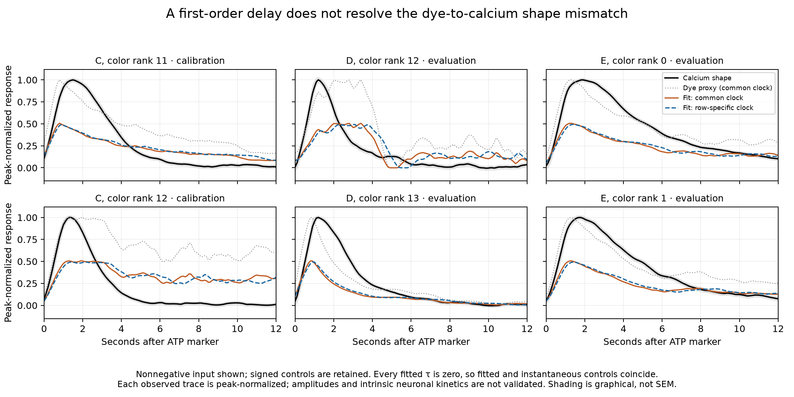

# Dye-driven APL reporter filter: completed comparison

Completed 2026-09-05 UTC. The fixed comparison finds that adding a first-order low-pass filter to the declared dye proxy does not improve the calibration objective. All four assumptions favor the explicitly included **τ = 0 instantaneous limit**, while the calcium-shape mismatch remains substantial. This is a negative result for this particular stimulus-to-reporter mapping, not evidence for instantaneous APL physiology.

## Model and calibration boundary

The input is the [previously extracted paired dye/calcium reference](33-apl-timecourse-extraction.md) from Amin Fig. 5. The model solves `τ dy/dt = u(t) - y(t)` with initial output zero at the ATP marker, then predicts `g y(t)`, with nonnegative gain `g`. At τ = 0 it explicitly uses the instantaneous input. The driver is piecewise linear between the supplied dye knots; no pre-stimulation state is inferred.

Two clock interpretations and two proxy definitions give four assumption sets:

- common calcium-bar time versus literal row-specific time, retaining the 10.77% dye-clock difference;
- signed baseline-adjusted dye versus nonnegative dye knots, rectified before interpolation.

The signed case is an algebraic control, not a claim that negative dye fluorescence means negative ATP. Original negative measurements remain in the source artifact in both cases.

Each dye input and each calcium target is normalized by its own positive peak over 0–12 s. **This comparison tests normalized shapes, not absolute amplitudes.** Evaluation target peaks enter that declared normalization. There is one shared gain and one shared time constant per assumption set, not separate adjustable gains for each evaluated trace.

Only horizontal-lobe panel C color ranks **11 and 12** enter the optimizer. Vertical-lobe panel D ranks **12 and 13**, and calyx panel E ranks **0 and 1**, are the four designated evaluation pairs. The other 34 color pairs are secondary diagnostics. Selection follows declared terminal plot ranks, not the largest observed response. It does not assert an independently validated anatomical segment-to-male-connectome correspondence.

The published traces had already been inspected. “Evaluation” means excluded from fitting, not blind or previously unseen data. Spatial traces from a shared source cohort are correlated; the 0.1 s extraction grid is not a collection of independent samples. No p-values or likelihood confidence intervals are calculated.

## Implementation, frozen plan and one invalid normalization

The [filter implementation](../scripts/apl_reporter_filter.py) integrates the linear forcing exactly between input knots and requested observation times. It uses a stable series for small step/τ ratios. Two focused tests compare against independent quadrature, subdivision, the instantaneous limit, nonnegative bounds and the analytic gain solution.

The [final plan](../validation/apl-reporter-filter-plan.json), SHA-256 `16fcc81fe7f1af3e151e4921530acec8b15a878fee693dac96cf0d51f0cab443`, pins data and code before the completed comparison. A positive τ grid from 0.001 to 100 s locates candidate minima; bounded refinement tests interior minima. The instantaneous limit is an additional candidate. Gain is profiled analytically against the two calibration traces only. An independently fitted instantaneous gain-only control uses those same traces.

The first attempt stopped during input preparation, before any fit, because panel E dye rank 10 has no positive post-marker peak: its maximum is **−0.002193 ΔF/F** relative to the chosen baseline. Positive-peak normalization is undefined. The [initial plan, code and failure record](../validation/apl-reporter-filter-initial/failure.json) are retained. The explicit amendment marks that secondary pair unscorable under both clocks; calibration and evaluation pairs are unchanged. No amplitude was invented to force a score.

The full condition inventory has **320 prediction slots**: four assumptions × two models × 40 pairs. **312 predictions** complete, with **eight unscorable slots** for that one secondary pair. All assumptions completed before interpretation. Each scored assumption/model contains two calibration, four evaluation and 33 secondary pairs.

## Combined results

| Clock | Input proxy | Selected τ | Shared gain | Calibration normalized RMSE | Evaluation normalized RMSE |
|---|---|---:|---:|---:|---:|
| Common | Signed | 0 s | 0.50663 | 0.26129 | 0.24836 |
| Common | Nonnegative | 0 s | 0.50663 | 0.26129 | 0.24826 |
| Row-specific | Signed | 0 s | 0.49431 | 0.26262 | 0.24676 |
| Row-specific | Nonnegative | 0 s | 0.49431 | 0.26262 | 0.24669 |

Gains operate on separately peak-normalized proxies and are not physical synaptic strengths. The fitted low-pass and instantaneous control predictions coincide because the selected time constant is zero. Positive time constants do not improve the declared calibration objective; the 0.001 s candidate already has a larger error. The experiment cannot resolve millisecond kinetics in any event, given the source imaging rate and graphical timing uncertainty.

The plots show a concrete problem: several calcium responses fall much faster than their local normalized dye proxy. The fitted gain compromises between undershooting calcium peaks and overshooting later tails. A first-order delay cannot fix this particular joint shape mismatch. Different local proxy gains, nonlinear ATP/P2X2 transduction, adaptation, spatial stimulus mixing and calcium-reporter dynamics remain possible explanations; this comparison does not distinguish them.

Graphical input bounds were passed through the same fitted filter and compared with calcium stroke bounds, using fixed central-curve normalization peaks. Overlap covers roughly **9.9–10.3%** of calibration-grid positions and **40.9–42.8%** of evaluation-grid positions. These are conditional graphical-envelope diagnostics, not biological coverage probabilities or statistical rejection levels. Parameter uncertainty and uncertainty in normalization peaks are not included.

The secondary set also reveals poor conditioning of peak normalization for weak dye signals. Its signed-proxy pooled error can be much larger than its nonnegative counterpart; for the row-specific clock the normalized RMSE is 3.60 versus 0.415. Small positive peaks can amplify negative baseline noise. These secondary numbers must not be interpreted as equally reliable physiological observations or used to tune the full network.

The [figure script](../scripts/plot_apl_reporter_filter.py) shows the six designated pairs with nonnegative input under both clocks. It was visually inspected. Signed controls and all secondary predictions remain in the saved results.

## Verification and retained evidence

The [complete results](../validation/apl-reporter-filter-results.json) retain profiles, gains, case metrics and the unscorable disposition. The [1.90 MB arrays](../validation/apl-reporter-filter-arrays.npz) retain all normalized observations, graphical bounds, drivers and predictions. Array SHA-256: `bf3132ec5c989cc7d6964fe7145618f81e5e12b9ee2d5767541cdbc367fff842`.

A [separate review](../scripts/review_apl_reporter_filter.py) reproduces **1,896 scalar summaries** from saved arrays and independently solves all eight gain-only boundary fits by least squares. Maximum gain discrepancy is **2.23 × 10⁻¹⁶**. It also verifies that saved predictions equal gain times driver at the observed τ = 0 boundary. The [review receipt](../validation/apl-reporter-filter-review.json) pins both result and array hashes. Numerical correctness is separate from biological validity.

## Consequence for the simulation

This result closes the direct linear dye-to-calcium filter test without assigning an APL time constant. Do not install τ = 0, reinterpret the gain as release efficacy, or keep adjusting a generic delay until the figure looks plausible. The single-male runtime still lacks identified graded APL electrical and release dynamics.

The next useful model step is to separate stimulus transduction and reporter dynamics using independent source constraints, then declare a candidate for local feedback. ATP/P2X2 stimulation is an experimental input mechanism, not the natural KC→APL synapse. A source-supported receptor/reporter decomposition or natural-input APL response constraint is needed before claiming that an added adaptive or nonlinear term identifies APL physiology. Preserve the male spatial operator and both attachment scenarios for subsequent local assays; no further geometry sweep or full-network gain sweep is implied.

No neural batch ran, and no neural, sensory, decoder or body default changed. H1 remains experimental; Eon body integration remains cancelled. The full single-male goal remains active and incomplete.
